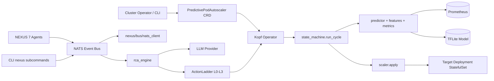
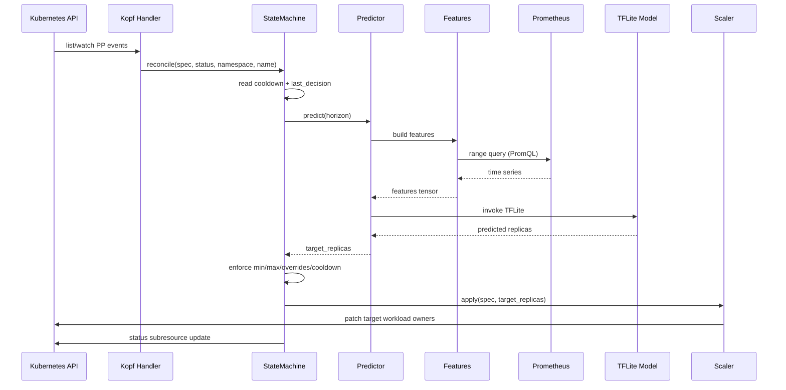
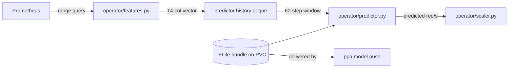
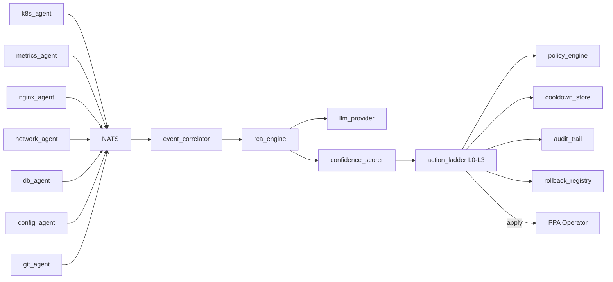

# Architecture

This document is a maintainer-oriented map of PPA + NEXUS. It explains the
runtime boundaries, reconciliation flow, prediction pipeline, agent
architecture, governance model, NATS event bus, and verification strategy.

For installation, cluster setup, and user-facing CLI usage, see
[README.md](README.md) and [CLAUDE.md](CLAUDE.md). This file focuses on where
behavior lives in the codebase and how contributors should extend it.

## System Overview

PPA + NEXUS is a Kubernetes-resident autoscaling system. Two planes cooperate in
one process boundary:

- **PPA (Predictive Plane)** — a [Kopf](https://kopf.readthedocs.io) operator
  that reconciles `PredictivePodAutoscaler` (PP) custom resources, queries
  Prometheus for current load, runs an LSTM model to forecast replicas, and
  applies scaling decisions to the target workload.
- **NEXUS (Control Plane)** — a FastAPI service plus seven monitoring agents
  that detect failures, perform LLM-powered root cause analysis, and govern
  healing decisions through an ActionLadder (L0–L3). NEXUS owns *decisions*
  about PPA scaling; PPA owns *execution* of them.

There are four runtime surfaces:

- **Kopf operator** (`ppa operator build|deploy` → `src/ppa/operator/main.py`) —
  reconciles PP CRDs in cluster.
- **NEXUS server** (`nexus server start` → `src/nexus/server.py`) — exposes a
  FastAPI control plane for status, governance, and admin endpoints.
- **CLI tooling** (`ppa add|train|run|deploy|push|init|status|...`) — manage
  PP resources, training data, models, and operator lifecycle from outside the
  cluster.
- **NATS event bus** (optional, `src/nexus/bus/nats_client.py`) — transports
  agent signals and NEXUS governance messages between processes.



## Package Boundaries

The installable wheel is declared in [pyproject.toml](pyproject.toml); it ships
two console scripts — `ppa` and `nexus` — that each dispatch into their
respective source tree.

**PPA — `src/ppa/`** owns the predictive plane:

- [src/ppa/operator/](src/ppa/operator/) — Kopf operator entrypoint, state
  machine, predictor, scaler, model bundle, prometheus client, features
  builder.
- [src/ppa/domain/](src/ppa/domain/) — pure-Python state types and scaling
  invariants. No I/O.
- [src/ppa/common/](src/ppa/common/) — shared feature spec, types, PromQL
  helpers, constants. Single source of truth for column names.
- [src/ppa/runtime/](src/ppa/runtime/) — out-of-cluster scaler regeneration
  for local development.
- [src/ppa/infrastructure/](src/ppa/infrastructure/) — Kubernetes and
  Prometheus client wrappers.
- [src/ppa/config.py](src/ppa/config.py) — centralized configuration; the
  only place that reads `os.environ`.
- [src/ppa/cli/](src/ppa/cli/) — Click/Typer console entrypoint and
  subcommands.

**NEXUS — `src/nexus/`** owns the control plane:

- [src/nexus/agents/](src/nexus/agents/) — agent base. Seven concrete
  agents: `k8s_agent`, `metrics_agent`, `nginx_agent`, `network_agent`,
  `db_agent`, `config_agent`, `git_agent`.
- [src/nexus/reasoning/](src/nexus/reasoning/) — RCA engine, LLM provider
  abstraction, orchestrator, incident correlator, confidence scorer.
- [src/nexus/governance/](src/nexus/governance/) — ActionLadder, policy
  engine, cooldown store, rollback registry, audit trail, runbook executor.
- [src/nexus/predictive/](src/nexus/predictive/) — predictive-plane
  consumers: prescaler, anomaly detector, traffic model.
- [src/nexus/integration/](src/nexus/integration/) — notifier, self-heal
  config, token store, dashboard, SDK ingest.
- [src/nexus/learning/](src/nexus/learning/) — feedback loop, outcome
  store, runbook advisor.
- [src/nexus/bus/](src/nexus/bus/) — NATS client and incident-event
  payload definitions.
- [src/nexus/observability/](src/nexus/observability/) — Prometheus
  metrics, status API.
- [src/nexus/telemetry/](src/nexus/telemetry/) — log shipper integrations.
- [src/nexus/sdk/](src/nexus/sdk/) — language SDKs (`python/`, `js/`).
- [src/nexus/server.py](src/nexus/server.py) — FastAPI control-plane
  application; lifecycle owned here.
- [src/nexus/cli/](src/nexus/cli/) — `nexus server start` and related
  admin commands.

[tests/](tests/) contains tiered coverage — unit (`tests/unit/`),
integration (`tests/integration/`), end-to-end (`tests/e2e/`),
plus shared fixtures and snapshots. [deploy/](deploy/) holds K8s
manifests (CRD, operator deployment, RBAC, ServiceMonitor, OPA, demo).
[model/](model/) ships pre-trained `.tflite` artifacts checked into the
repo for the default PP. [docs/](docs/) is the contributor-perspective
documentation tree; ARCHITECTURE.md (this file) lives one level up by
convention.

The main ownership rule: shared forecasting/reasoning primitives belong
in `ppa/common/` or `nexus/reasoning/`. Agent modules, provider-specific
modules, and operator modules should not duplicate type or column
definitions. Cross-plane coupling goes through the `nexus/bus/` event
contract — agents must not import from `ppa/`.

## Customer-Facing Contract

PPA + NEXUS optimize for cluster-resident autoscaling workflows, not for
internal compatibility. The behavior that must be preserved is that these
user-facing surfaces run correctly against real Prometheus and real
Kubernetes clusters:

- The `PredictivePodAutoscaler` CRD: spec fields users can declare
  (target workload ref, metric source, horizon, model selector, cooldown,
  override intervals) and the resulting target replica sets — see
  [deploy/crd.yaml](deploy/crd.yaml) for the source of truth.
- The `ppa operator build|deploy` lifecycle: building the operator image,
  applying the CRD, RBAC, and operator deployment, and watching rollout.
- The `ppa model push` command (`ppa` CLI): delivering a baked TFLite
  bundle + training CSV to the operator's `ppa-models` PVC and regenerating
  the feature scalers in a loader pod, plus operational inspection.
- The reconciliation loop: given a Prometheus metric and a PP spec, the
  operator must produce a target replica count within the configured
  horizon, respecting cooldown, min/max bounds, and override intervals.
- Drift-triggered retraining: concept drift detected by the predictor
  ([src/ppa/operator/predictor.py](src/ppa/operator/predictor.py)) surfaces
  `retrainingRecommended` in CR status; the actual retrain/export/qualification
  runs in the centralized model plane, not in the PPA operator image.
- NEXUS governance: failure signals detected by any of the seven agents
  must lead to a governed ActionLadder outcome — never an out-of-band
  write to a workload owned by PPA.
- The `nexus server start` lifecycle and its FastAPI control-plane
  endpoints (`/health`, `/status`, `/metrics` at minimum).
- Optional NATS wiring: when configured, agent signals must propagate to
  the RCA engine, governance must apply, and audit entries must be
  written under [src/nexus/governance/audit_trail.py](src/nexus/governance/audit_trail.py).

Internal modules, class designs, helper APIs, route implementations, and
tests are not stable contracts. Refactors may replace or remove them when
doing so simplifies the system, improves correctness, or matches these
architecture boundaries better. When a test primarily encodes an obsolete
internal shape, update the test to assert the customer-facing behavior
instead. Features, compatibility shims, fields, or helper paths that do
not serve one of the surfaces above are not product requirements and
should be removed rather than preserved.

## Design Pressure And Refactor Targets

The current package boundaries are intentional, but several modules still
carry large orchestration responsibilities. Treat these as refactor
targets, not as new places to add unrelated behavior:

- [src/ppa/operator/state_machine.py](src/ppa/operator/state_machine.py)
  coordinates reconcile entry, normalization, predictor invocation,
  scaler application, and cooldown bookkeeping. New behavior belongs in a
  smaller, named stage, not as a new branch in `run_cycle`.
- [src/ppa/operator/predictor.py](src/ppa/operator/predictor.py) owns both
  metric shape and model invocation. The `MetricsProvider` seam — and the
  decoupling of features from inference — is the worked refactor; see
  [[ppa-operator-architecture-refactor]] for the decided shape. New
  prediction strategies should plug into the seam, not be branched in.
- [src/ppa/cli/commands/](src/ppa/cli/commands/) has grown to many
  subcommands. Each is a thin Click/Typer entrypoint, but shared argument
  parsing, k8s client setup, and progress reporting are scattered across
  them. New commands should reuse [src/ppa/cli/core/](src/ppa/cli/core/),
  not copy boilerplate.
- [src/nexus/server.py](src/nexus/server.py) owns the FastAPI lifespan
  alongside the route registrations. Resource construction (NATS client,
  agents, RCA engine, governance, runbook executor) belongs behind a
  smaller factory so that test setup and `nexus server start` share one
  construction path.
- [src/nexus/reasoning/rca_engine.py](src/nexus/reasoning/rca_engine.py)
  is the heaviest NEXUS module. LLM-provider interaction, prompt
  assembly, response parsing, and incident classification belong in
  separate modules so that adding a new provider or classification
  category has one owner.
- [src/nexus/governance/](src/nexus/governance/) modules — `policy_engine`,
  `cooldown_store`, `rollback_registry`, `runbook_executor` — are
  intentionally split; new governance rules belong in the policy engine,
  not as branches in ActionLadder explosion logic.

## Runtime Startup And Lifecycle

Console scripts are registered in [pyproject.toml](pyproject.toml):

- `ppa` → [src/ppa/cli/__main__.py](src/ppa/cli/__main__.py).
- `nexus` → [src/nexus/cli/main.py](src/nexus/cli/main.py).

The operator and NEXUS server have distinct lifecycles because one is
Kopf-managed and the other is a FastAPI/Uvicorn process.

**Operator**

[src/ppa/operator/main.py](src/ppa/operator/main.py) is the operator
entrypoint. It declares Kopf handlers via `@kopf.on.create`,
`@kopf.on.update`, and similar decorators on PP custom resources, plus
timers (`@kopf.on.timer`). On startup it:

- loads `get_config()` (cached from `ppa.config`),
- registers Prometheus client metrics,
- starts the metric scrape loop,
- begins the reconciliation loop on a fixed interval,
- shuts down gracefully on SIGTERM by draining in-flight reconciles and
  closing the Kubernetes client.

The operator holds a process-lifetime singleton
[`StateMachine`](src/ppa/operator/state_machine.py); the operator and
the local `ppa run` CLI share this singleton via process import.

**NEXUS server**

[src/nexus/server.py](src/nexus/server.py) builds the FastAPI
application. Its lifespan:

- constructs the `ProviderRegistry`-equivalent (here a `NexusRuntime`
  holding the NATS client, agent registry, RCA engine, policy engine,
  audit trail, runbook executor, cooldown store);
- starts background tasks for periodic governance sweeps and NATS
  reconnect;
- registers routers (status, metrics, admin);
- on shutdown drains background tasks, closes NATS, and flushes audit
  entries.

`nexus server start` is the production entrypoint; tests drive the same
`create_app()` factory.

## Configuration Model

[src/ppa/config.py](src/ppa/config.py) is the single configuration source
for both the operator and NEXUS-adjacent Python code. It defines:

- **Feature columns** — `QUERIED_FEATURES`, `TEMPORAL_FEATURES`,
  `FEATURE_COLUMNS`. Schema-identical across training, export, and
  inference. (v3: `normalized_rps` and `latency_normalized` replace the
  v2 names.)
- **Path constants** — `PROJECT_DIR`, `DATA_DIR`, `MODEL_DIR`,
  `TRAINING_DATA_DIR`, `CHAMPION_DIR`, `ARTIFACTS_DIR`, `DEPLOY_DIR`.
- **Env-cached config** — `Config.from_env()` is called once and cached
  in `_global_config`; `get_config()` returns the singleton. Tests use
  `set_config()` and `reset_config()`.
- **Network constants** — `PROMETHEUS_URL`, `PROMETHEUS_PORT`,
  `GRAFANA_PORT`, plus NATS/JetStream URLs read lazily by NEXUS.

The contract is: *only* [src/ppa/config.py](src/ppa/config.py) reads
`os.environ`. Domain code, operator code, agent code, and CLI commands
must import the constants they need from `ppa.config` rather than read
env vars directly.

Cluster-side configuration uses K8s conventions:

- The PP CRD spec sources its values from
  [deploy/crd.yaml](deploy/crd.yaml) examples.
- RBAC and ServiceMonitor manifests at
  [deploy/rbac.yaml](deploy/rbac.yaml) and
  [deploy/operator-servicemonitor.yaml](deploy/operator-servicemonitor.yaml).
- Per-target Prometheus URL, model selector, and cooldown live on the PP
  CRD spec; the operator reads them per reconcile.

NEXUS-controlled settings (LLM provider credentials, NATS URL, audit
store URL, cooldown windows) are read from environment variables seeded
into `Config.from_env()`; secrets are sourced from
[deploy/nexus/](deploy/nexus/) using Kubernetes Secrets — never
hardcoded. The `prometheus-api-client` and NATS client configurations
follow the same single-source rule.

## Reconciliation Flow

The PP operator reconciles every `PredictivePodAutoscaler` resource on a
fixed interval plus event-driven updates via Kopf. Entry is in
[src/ppa/operator/main.py](src/ppa/operator/main.py); orchestration is
in [src/ppa/operator/state_machine.py](src/ppa/operator/state_machine.py).



Key invariants:

- The metrics shape (PromQL, feature ordering) is owned by
  [src/ppa/operator/features.py](src/ppa/operator/features.py); predictor
  consumes, never recomputes.
- The state machine is the only place that enforces
  min/max/cooldown/overrides and writes back to the PP status
  subresource. Predictor never writes scale.
- The scaler writes via the appropriate controller (Deployment,
  StatefulSet) owner ref — never directly mutates arbitrary workload
  specs.
- Cooldown lives in
  [src/nexus/governance/cooldown_store.py](src/nexus/governance/cooldown_store.py)
  when NEXUS is in the loop, or in the operator's in-process map when
  NEXUS is not.

Audit ownership:

- Reconciliation runs always emit structured trace events through the
  state machine; recoverable failures raise typed exceptions that the
  operator translates into `status.conditions` updates rather than
  crashlooping the pod.

## Prediction Pipeline

The prediction layer has three owners:

- [src/ppa/common/feature_spec.py](src/ppa/common/feature_spec.py) —
  column names, ordering, schema validation. Schema-identical across
  train, export, and inference.
- [src/ppa/operator/predictor.py](src/ppa/operator/predictor.py) — runtime
  inference. Loads the TFLite bundle + feature scalers, runs the LSTM call,
  and postprocesses the normalized output to a predicted req/s.
- [src/ppa/operator/model_bundle.py](src/ppa/operator/model_bundle.py) —
  versioned TFLite bundle resolution (model/scaler/metadata + checksums),
  decoupled from the training pipeline that produced the bundle.

The data path is:



The pipeline that produces a TFLite bundle (data export → LSTM train → Keras
→ TFLite → qualification) is no longer part of the PPA image; the bundle is
baked in the centralized model plane and delivered to the `ppa-models` PVC.

Critical rules:

- Feature columns are immutable at runtime. Adding a feature is a
  coordinated change in `ppa/common/feature_spec.py`, the centralized
  training plane, and the predictor feature builder.
- TFLite is the only model format the operator accepts. The operator never
  invokes the Keras runtime; it loads the baked bundle from the PVC.
- Champion selection, retrain, export, and qualification live in the
  centralized model plane — not in the PPA image. `resolve_model_bundle`
  picks up a new bundle version on change, under the same cooldown as live
  scaling decisions.
- Concept drift surfaced by the predictor advertises
  `retrainingRecommended` in CR status; the retrain itself is triggered
  from the centralized model plane, not from a CronJob inside PPA.

## NEXUS Agent And Governance Architecture

NEXUS is composed of three cooperating subsystems: *agents* (signal
detection), *reasoning* (RCA), and *governance* (decision + action).

**Agents — [src/nexus/agents/](src/nexus/agents/)**

The seven concrete agents each implement
[`base_agent.py`](src/nexus/agents/base_agent.py):

- `k8s_agent.py` — watches K8s resources for unexpected state changes.
- `metrics_agent.py` — queries Prometheus for anomaly thresholds.
- `nginx_agent.py` — proxies / ingress behavior; 5xx, latency.
- `network_agent.py` — DNS, connectivity, latency between internal
  services.
- `db_agent.py` — connection pool, lock waits, query latency.
- `config_agent.py` — drift between manifests and live state.
- `git_agent.py` — recent commits and registry changes correlated with
  incidents.

Agents emit typed `IncidentEvent` payloads onto NATS; the schema lives
in [src/nexus/bus/incident_event.py](src/nexus/bus/incident_event.py).
Agents must not import from `ppa/`. They subscribe and publish via
[src/nexus/bus/nats_client.py](src/nexus/bus/nats_client.py) only.

**Reasoning — [src/nexus/reasoning/](src/nexus/reasoning/)**

- `rca_engine.py` — receives incident events, correlates them via
  `event_correlator.py`, and produces a root-cause hypothesis.
- `llm_provider.py` — provider-neutral LLM abstraction. Install the
  provider extra: `[gemini]`, `[openai]`, `[anthropic]`, or `[llm]` for
  all three. **Gemini is the default.** Provider selection is config-only;
  agent code stays abstract.
- `confidence_scorer.py` — gates LLM output against a configured
  threshold before any action ladder is consulted.
- `incident_cluster.py` — deduplicates and clusters correlated events
  into a single incident for governance consumption.

The RCA engine is the only module that talks to the LLM. Agents and
governance modules see structured `RootCauseResult` objects, never raw
LLM output.

**Governance — [src/nexus/governance/](src/nexus/governance/)**

- `action_ladder.py` — L0 (observe), L1 (soft-mitigate), L2
  (remediate), L3 (escalate/freeze). The ladder is a state machine; a
  hypothesis below confidence threshold escalates, not retries.
- `policy_engine.py` — declarative rules: which actions are permitted
  per resource class, per cooldown, per blast radius.
- `cooldown_store.py` — backoff windows per resource; LLM-driven scaling
  actions must respect existing cooldowns or wait them out.
- `rollback_registry.py` — historical record of applied actions and
  their outcomes; rollback is the symmetric inverse of an action.
- `audit_trail.py` — every governance decision is written here
  immediately after emission, never batched.
- `runbook.py` / `runbook_executor.py` — declarative runbooks applied
  for L1/L2 actions; failures always degrade to L3.



### Adding An Agent

1. Extend [src/nexus/agents/base_agent.py](src/nexus/agents/base_agent.py).
2. Place the concrete implementation in
   [src/nexus/agents/](src/nexus/agents/) with a clear name.
3. Subscribe and publish only via
   [src/nexus/bus/nats_client.py](src/nexus/bus/nats_client.py).
4. Emit `IncidentEvent` payloads only — never raw LLM content.
5. Register the agent in the agent registry inside
   [src/nexus/server.py](src/nexus/server.py) startup.
6. Add agent-key configuration knobs to
   [src/ppa/config.py](src/ppa/config.py) and
   [src/ppa/cli/commands/nexus.py](src/ppa/cli/commands/nexus.py) where
   needed.
7. Add unit tests under [tests/unit/](tests/unit/) that mock NATS and
   the bus.

### Adding A Governance Action

1. Declare the action in
   [src/nexus/governance/action_ladder.py](src/nexus/governance/action_ladder.py)
   with its level and policy hooks.
2. Add the corresponding policy rule in
   [src/nexus/governance/policy_engine.py](src/nexus/governance/policy_engine.py).
3. If the action has a symmetric rollback, register it in
   [src/nexus/governance/rollback_registry.py](src/nexus/governance/rollback_registry.py).
4. Update audit-trail expectations in
   [src/nexus/governance/audit_trail.py](src/nexus/governance/audit_trail.py).
5. Update confidence thresholds in
   [src/nexus/reasoning/confidence_scorer.py](src/nexus/reasoning/confidence_scorer.py).
6. Add governance-level integration tests under
   [tests/integration/](tests/integration/) reflecting the action → rollback round trip.

## LLM Provider Architecture

NEXUS is provider-neutral for LLM-backed reasoning. The provider is
chosen at install time via extras and at runtime via
`Config.from_env()`:

- **Default**: Gemini (`[gemini]` extra, `google-generativeai`).
- **Optional**: OpenAI (`[openai]` extra), Anthropic
  (`[anthropic]` extra), or all three (`[llm]` extra).

Provider selection is config-driven, not literal-driven.

[`src/nexus/reasoning/llm_provider.py`](src/nexus/reasoning/llm_provider.py)
owns:

- the abstract `LLMProvider` interface (`complete()`, `stream()`,
  `token_count()`);
- per-provider adapter subclasses — one per supported vendor;
- the provider-resolution layer that reads `NEXUS_LLM_PROVIDER` from
  config and returns a cached singleton.

Provider metadata is centralized in
[`src/nexus/reasoning/llm_provider.py`](src/nexus/reasoning/llm_provider.py)
(the registry) rather than scattered through RCA code. The registry
validates that imported extras match declared provider IDs, builds
shared provider config, checks required credentials, lazily
constructs the provider, caches it for the process lifetime, and
performs best-effort cleanup on shutdown.

[`BaseProvider`](src/nexus/reasoning/llm_provider.py) is the shared
interface — `complete()`, `stream()`, `cleanup()`, optional
`token_count()`. Provider-specific request quirks (idempotency keys,
retry-budgets, structured output) live in subclasses, not in the RCA
engine.

### Adding An LLM Provider

1. Add a provider entry to the registry in
   [src/nexus/reasoning/llm_provider.py](src/nexus/reasoning/llm_provider.py).
2. List credentials and related settings in
   [src/ppa/config.py](src/ppa/config.py); add to
   [.env.example](.env.example) when user-configurable.
3. Add the dependency to the appropriate extra (`[gemini]`, `[openai]`,
   `[anthropic]`, or a new extra) in
   [pyproject.toml](pyproject.toml).
4. Implement the provider subclass in
   [src/nexus/reasoning/llm_provider.py](src/nexus/reasoning/llm_provider.py)
   using the shared `LLMProvider` interface.
5. Add deterministic tests under
   [tests/unit/](tests/unit/) that mock the upstream SDK.
6. Add integration tests under
   [tests/integration/](tests/integration/) behind an env-gated path (live API hits cost
   money; keep them out of CI's default lane).

## Event Bus

The optional NATS event bus is the only cross-process contract between
agents and the RCA engine.

[`src/nexus/bus/nats_client.py`](src/nexus/bus/nats_client.py) owns:

- client construction with reconnect-on-disconnect;
- subject conventions (`nexus.agents.<name>`, `nexus.incidents`,
  `nexus.governance`);
- `subscribe_raw` for arbitrary subject trees where needed.
- typed payload validation against
  [`incident_event.py`](src/nexus/bus/incident_event.py).

Inbound and outbound subjects are declared in one place inside
`nats_client.py`; neither agents nor governance modules should
handcraft subject strings or `publish` calls inside their core logic.

When NATS is disabled, NEXUS falls back to in-process pub/sub — the
RCA engine consumes agent events directly in the same process. The
shapes must remain identical in both modes; tests should cover both.

## CLI Surface

Two console scripts ship: `ppa` and `nexus`.

**`ppa` — [src/ppa/cli/\_\_main\_\_.py](src/ppa/cli/__main__.py)**

Subcommands live in
[src/ppa/cli/commands/](src/ppa/cli/commands/). The currently shipped
set:

- `ppa add` — declare a PP from a baseline workload.
- `ppa apply` — apply generated PP manifests.
- `ppa config` — read/write layered config.
- `ppa data` — manage training-data exports.
- `ppa deploy` — apply operator deployment manifests.
- `ppa init` — onboard a project (PP scaffold).
- `ppa logs` — operator log stream.
- `ppa model` — convert and qualify model artifacts.
- `ppa monitor` — stream reconciler events.
- `ppa nexus` — manage NEXUS from the PPA CLI (delegates).
- `ppa operator` — operator-image build/deploy lifecycle.
- `ppa push` — push built artifacts to a registry.
- `ppa run` — emulate the operator locally.
- `ppa status` — PP-status aggregator across the cluster.
- `ppa train` — drive the training-data → model pipeline offline.
- `ppa watch` — live status / metrics readouts.

Two ppa subcommands are deprecated and live at
[`deprecated.py`](src/ppa/cli/commands/deprecated.py) — they should be
removed when no consumer relies on them.

Subcommands are thin Click/Typer entrypoints. Shared concerns — config
loading ([`core/config.py`](src/ppa/cli/core/config.py)),
argument validation ([`core/validators.py`](src/ppa/cli/core/validators.py)),
error reporting ([`core/errors.py`](src/ppa/cli/core/errors.py)),
progress display ([`core/progress.py`](src/ppa/cli/core/progress.py)),
and command suggestions ([`core/suggestions.py`](src/ppa/cli/core/suggestions.py))
live in [`core/`](src/ppa/cli/core/). **New commands must reuse these
helpers.** Do not duplicate argument parsing, kubernetes client setup,
or cluster-connection logic inside a subcommand.

**`nexus` — [src/nexus/cli/main.py](src/nexus/cli/main.py)**

Subcommands own NEXUS-side lifecycle (`server start`, status,
diagnostics, audit-log queries).

Both CLIs share the same single config entrypoint (`get_config()`)
and the same error model. Both follow a contract that no subcommand
should block the user with progress spinners when a structured error
explains the failure; warnings and confirmations are produced via the
shared progress helper.

## Observability, Diagnostics, And Safety

[src/nexus/observability/](src/nexus/observability/) and
[src/nexus/telemetry/](src/nexus/telemetry/) own what flows out of
NEXUS. PPA contributes through the operator's own Prometheus client
(`prometheus-client` in
[src/ppa/operator/metrics.py](src/ppa/operator/metrics.py)) and the
configured ServiceMonitor.

Surface contracts:

- The operator exposes `ppa_reconcile_duration_seconds`,
  `ppa_predicted_replicas`, `ppa_target_replicas`,
  `ppa_feature_builder_errors_total`, and similar metrics. NEXUS
  exposes `nexus_rca_latency_seconds`, `nexus_action_ladder_total`,
  `nexus_audit_trail_entries_total`. Metric names are stable — adding
  a name is fine, renaming is a breaking change.
- Structured trace events flow through logs and through the optional
  OTel exporter; see
  [src/ppa/config.py](src/ppa/config.py)
  (`OTEL_EXPORTER_OTLP_ENDPOINT` and friends) for the export path.
- The status endpoint at
  [src/nexus/observability/status_api.py](src/nexus/observability/status_api.py)
  returns operator + agent health, last infra action, last audit
  entry, and Prometheus scrape status. Used by `ppa status` and the
  optional developer dashboard at
  [src/nexus/observability/developer-dashboard.html](src/nexus/observability/developer-dashboard.html).
- Logged diagnostics redacts values that match a known secret pattern
  (`api[_-]?key`, `token`, `secret`, etc.) by default. Verbose
  tracebacks and full request/response bodies are opt-in.

Safety boundaries:

- Operator RBAC follows least privilege per PP. RBAC manifests at
  [deploy/rbac.yaml](deploy/rbac.yaml) declare exactly what the
  operator can read/write. **Do not expand RBAC beyond what a feature
  actually needs.**
- Coordinator / Prescaler actions applied by NEXUS always go through
  [`cooldown_store.py`](src/nexus/governance/cooldown_store.py); the
  cooldown check is a hard gate, not a warning.
- LLM provider credentials are never logged. They live as K8s Secrets
  in [deploy/nexus/](deploy/nexus/), not env literals.
- Audit entries are written for every governance decision (including
  LLM-suggested actions that the policy engine rejected). Audit
  completeness is enforced in
  [`audit_trail.py`](src/nexus/governance/audit_trail.py) by a
  pre-emit hook.
- OPA integration at [deploy/opa/](deploy/opa/) is available for
  cross-cluster policy enforcement. New policy rules ship there, not
  inline in code.

## Testing And CI Strategy

Deterministic tests live under [tests/](tests/) in three tiers:

- [tests/unit/](tests/unit/) — fast, no I/O. Mocks Prometheus,
  Kubernetes, NATS, and the LLM provider.
- [tests/integration/](tests/integration/) — needs an actual K8s
  cluster (kind or live). Drives reconcile → state machine → scaler
  against real CRD apply / status patches.
- [tests/e2e/](tests/e2e/) — full streaming pipeline including
  Prometheus queries and NEXUS-driven governance against a deployed
  cluster.

Shared fixtures live in
[tests/fixtures/](tests/fixtures/) with sample CRDs, sample fixture
data, and Locust traffic scripts
([locustfile.py](tests/locustfile.py)). Snapshots used for regression
checks live in [tests/snapshots/](tests/snapshots/).

CI gates:

- `ruff check src tests`
- `mypy src/ppa --ignore-missing-imports`
- `pytest tests/unit -v`

Contributor verification (mirror of CI):

```bash
make format    # black + ruff --fix
make lint      # ruff + mypy
make typecheck # mypy
make test      # pytest tests/unit -v
```

For docs-only changes, a curl/fixture-driven smoke is usually
sufficient. Full integration runs are gated by
[.github/workflows/](.github/workflows/) and are not part of every
push.

## Extension Checklists

### Add A Feature Column

1. Update `QUERIED_FEATURES` in
   [src/ppa/common/feature_spec.py](src/ppa/common/feature_spec.py).
2. Update the centralized training pipeline so the new PromQL metric maps
   to a matched DataFrame column (export/train/qualify live outside the
   PPA image).
3. Update the runtime feature builder in
   [src/ppa/operator/features.py](src/ppa/operator/features.py) so
   inference produces a vector in the same column order.
4. Regenerate the feature scalers on the PVC via `ppa model push` so they
   match the new column count.
5. Produce a new TFLite bundle in the centralized model plane and deliver
   it with `ppa model push`.
6. Add column-level coverage tests in
   [tests/unit/](tests/unit/).

### Add A CLI Subcommand

1. Place it in
   [src/ppa/cli/commands/](src/ppa/cli/commands/) or
   [src/nexus/cli/](src/nexus/cli/) following the existing flat
   `snake_case` convention.
2. Reuse [`core/`](src/ppa/cli/core/) for config, errors,
   validators, progress, suggestions.
3. Add tests under
   [tests/unit/](tests/unit/) — at minimum a happy path and a
   missing-cli-arg failure test.
4. Run `make format && make lint && make test` before pushing.

### Add A Governance Action Or Agent

See *Adding An Agent* and *Adding A Governance Action* above in
[NEXUS Agent And Governance Architecture](#nexus-agent-and-governance-architecture).

### Change The Feature Spec Schema (Major)

Feature-schema major changes (the v2 → v3 transition in
[src/ppa/common/feature_spec.py](src/ppa/common/feature_spec.py) is a
worked example) must:

1. Bump the schema version constant.
2. Define both old and new field names in
   [`feature_spec.py`](src/ppa/common/feature_spec.py) until all in-cluster
   PPs are migrated.
3. Update the centralized training pipeline and the inference path
   (`src/ppa/operator/`) to read both shapes during the migration window.
4. Document the migration window in
   [docs/](docs/).

## Maintenance Rules For This Document

Update this file when a change adds or meaningfully changes:

- a top-level package or installable runtime boundary;
- a public route (FastAPI or K8s CRD field) or wire protocol;
- startup, shutdown, or resource ownership;
- configuration precedence or managed config behavior;
- prediction pipeline schema, model format, or qualification rules;
- NEXUS agent, RCA, governance, or LLM-provider wiring;
- the NATS event bus contract;
- CLI subcommand behavior or shared helpers;
- observability, telemetry, or safety boundaries;
- testing tiers, CI gates, or verification strategy.

Docs-only changes to this file do not require a version bump.
Production code changes still follow the rules in
[AGENTS.md](AGENTS.md) and [CLAUDE.md](CLAUDE.md).
