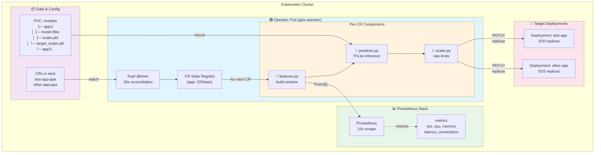
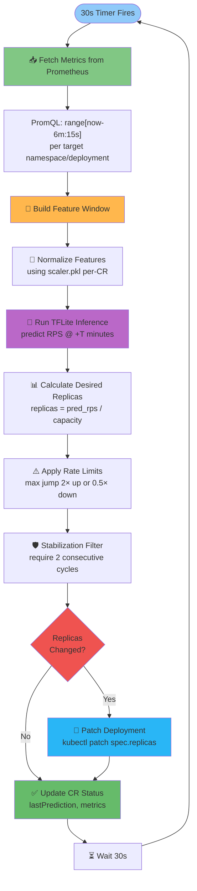
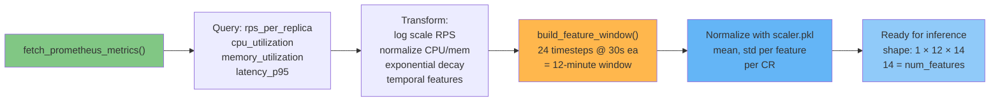
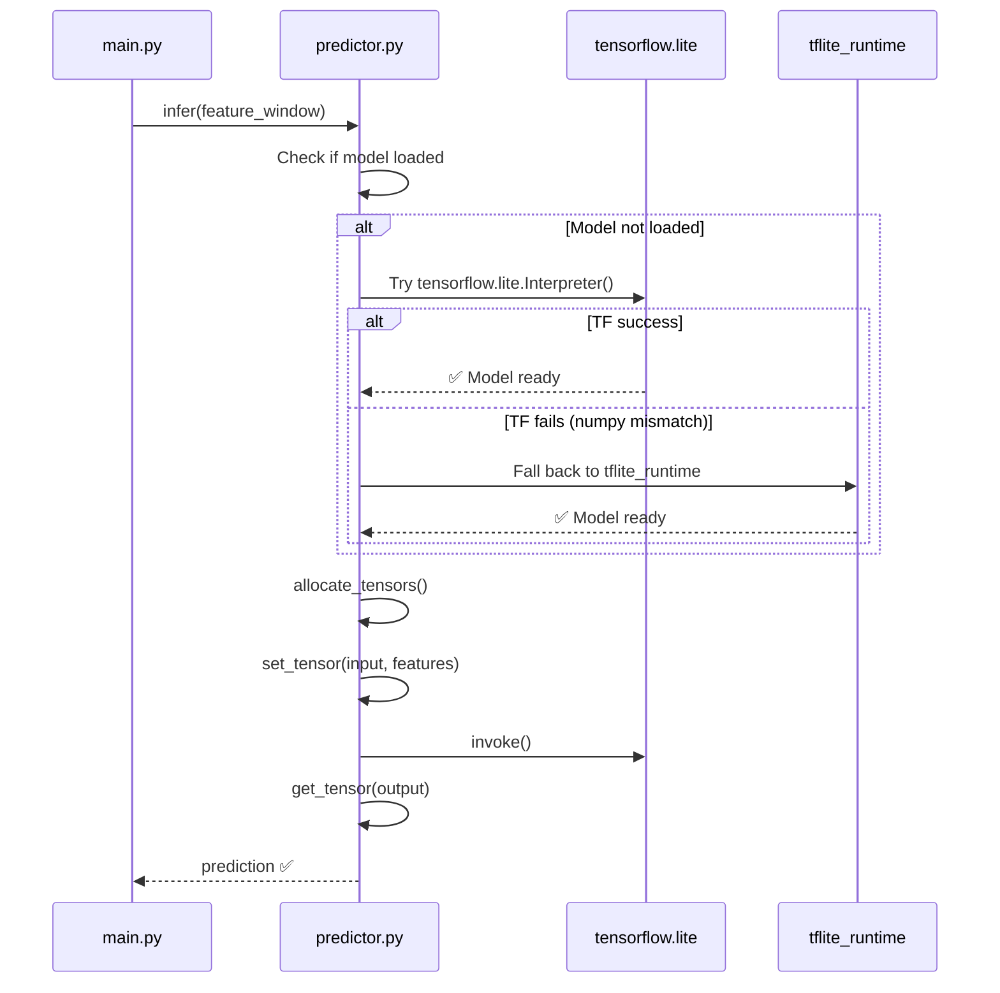
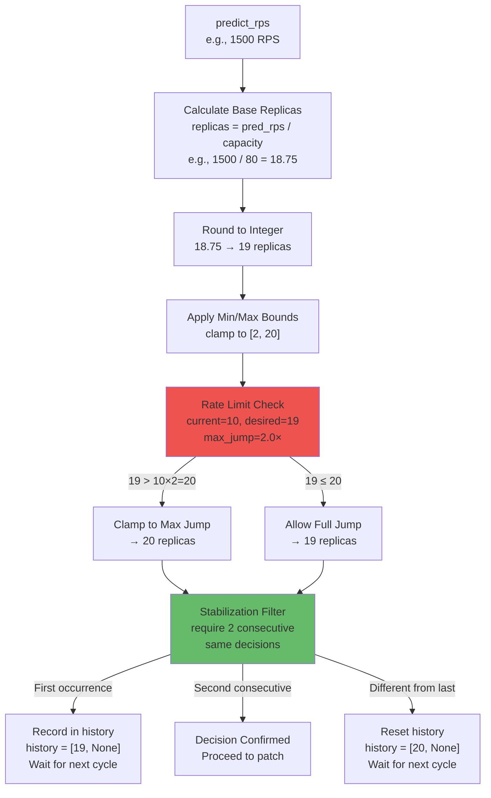
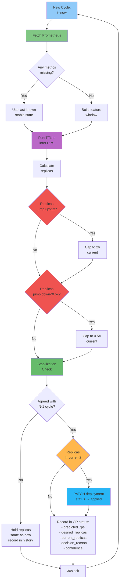
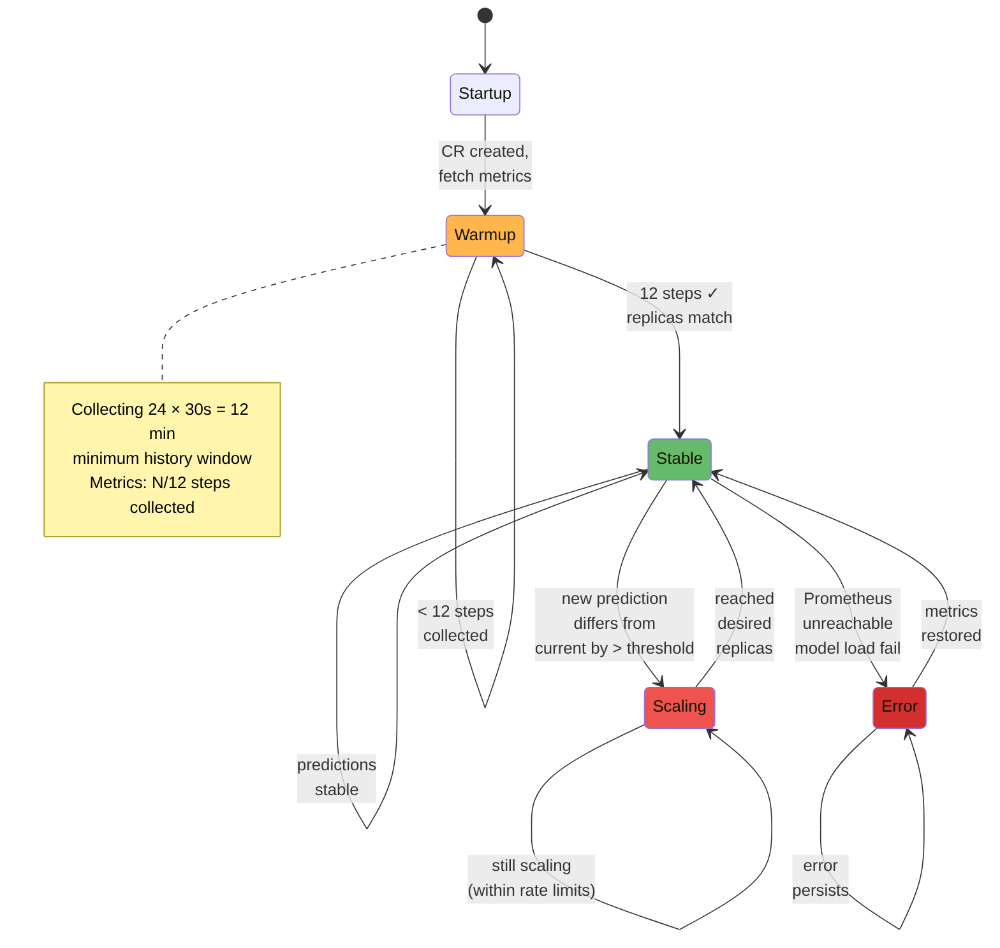
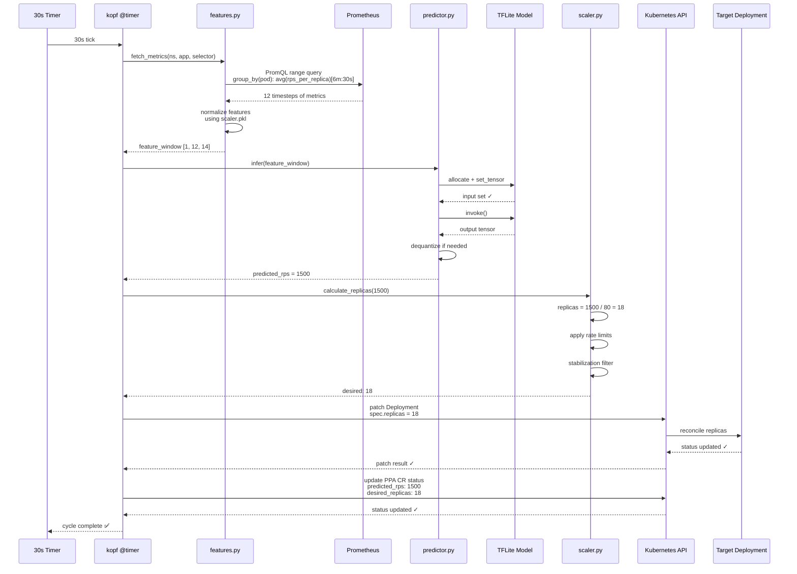
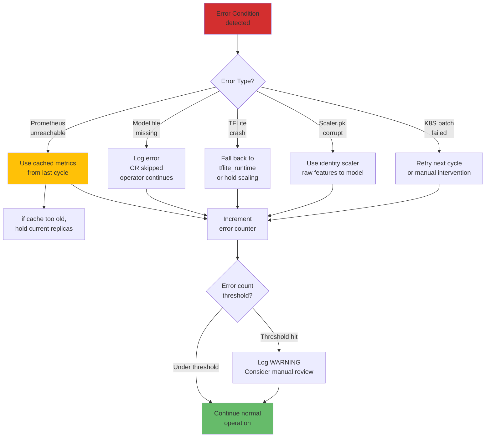

# Predictive Pod Autoscaler — Operator Documentation

**Version:** 2.0 · **Last Updated:** 2026-03-10 · **Status:** Production-Ready

The Operator is the live inference component of PPA. It watches Kubernetes Custom Resources (CRs), collects real-time metrics from Prometheus, runs TFLite ML models, and automatically scales your deployments based on 3–10 minute RPS forecasts.

---

## Quick Start

### 1. Prerequisites
- Kubernetes cluster (1.24+) with PVC support
- Prometheus (15s scrape interval)
- Trained ML models in `/models/{app-name}/` PVC

### 2. Deploy Operator

```bash
# Automated deployment (recommended — includes retraining, conversion, PVC setup, all in one)
./scripts/ppa_redeploy.sh --retrain --epochs 100

# Or deploy existing champion without retraining
./scripts/ppa_redeploy.sh

# Manual alternative (see Deployment Guide for details)
kubectl apply -f deploy/crd.yaml              # Defines PredictiveAutoscaler CR
kubectl apply -f deploy/rbac.yaml             # Service account & roles
kubectl apply -f deploy/operator-deployment.yaml    # Operator pod
kubectl apply -f deploy/predictiveautoscaler.yaml   # Custom Resource
```

### 3. Monitor

```bash
# Watch operator logs
kubectl logs -f deployment/ppa-operator

# Check CR status
kubectl get ppa -w

# Inspect predictions
kubectl get ppa test-app-ppa -o yaml
```

---

## Documentation Structure

This folder contains comprehensive operator documentation:

| Document | Purpose |
|---|---|
| **[Architecture](./architecture.md)** | System design, component interactions, reconciliation cycle, decision flow |
| **[Deployment](./deployment.md)** | Step-by-step deployment guide, PVC setup, model copying, CRD creation |
| **[Configuration](./configuration.md)** | Environment variables, CR spec, reconciliation timer, rate limits |
| **[API Reference](./api.md)** | Custom Resource schema, field descriptions, validation rules |
| **[Commands](./commands.md)** | Useful kubectl commands for monitoring, debugging, and operations |
| **[Troubleshooting](./troubleshooting.md)** | Common issues, error messages, diagnostic steps |

---

## Key Concepts

### Custom Resource (CR)
A Kubernetes object that tells the operator:
- Which deployment to autoscale
- Which ML model to use
- Scaling bounds (min/max replicas)
- Rate limits (how fast to scale up/down)

**Example:**
```yaml
apiVersion: ppa.example.com/v1
kind: PredictiveAutoscaler
metadata:
  name: test-app-ppa
  namespace: default
spec:
  targetDeployment: test-app          # Kubernetes Deployment to scale
  modelPath: /models/test-app/ppa_model.tflite
  scalerPath: /models/test-app/scaler.pkl
  minReplicas: 2
  maxReplicas: 20
  capacityPerPod: 80                  # RPS/pod at full capacity
  scaleUpRate: 2.0                    # Max 2× replicas per cycle
  scaleDownRate: 0.5                  # Min 50% replicas per cycle (conservative)
```

### Reconciliation Cycle (30 seconds)
Every 30 seconds, the operator:

1. **Fetches Metrics** — Query Prometheus for last 12 minutes of metrics (24 × 30s)
2. **Builds Feature Window** — Normalize and prepare for model input
3. **Runs Inference** — TFLite model predicts RPS at +10 minutes (rps_t10m horizon)
4. **Calculates Replicas** — `desired_replicas = predicted_rps / capacity_per_pod`
5. **Applies Rate Limits** — Ensure replicas don't jump too fast
6. **Stabilization** — Require 2 consecutive cycles of agreement before scaling
7. **Patches Deployment** — `kubectl patch` to update `spec.replicas`
8. **Records Status** — Update CR status with metrics, predictions, decision

---

## Architecture Overview

The operator has several key components working together:

```
┌──────────────────────────────────────────────────────────────┐
│ Operator Pod (ppa-operator Deployment)                       │
├──────────────────────────────────────────────────────────────┤
│                                                              │
│  main.py (Kopf Controller)                                  │
│  ├─ @kopf.timer() every 30s                                 │
│  ├─ watches PredictiveAutoscaler CRs                        │
│  └─ calls reconcile() for each CR                           │
│                                                              │
│  features.py                                                │
│  ├─ buildFeatureWindow() — 12-step Prometheus query         │
│  └─ normalizeFeatures() — per-CR scaler.pkl                │
│                                                              │
│  predictor.py                                               │
│  ├─ loads per-CR TFLite model                               │
│  ├─ handles numpy compatibility                             │
│  └─ runs inference()                                        │
│                                                              │
│  scaler.py                                                  │
│  ├─ calculateReplicas() — predicted_rps / capacity         │
│  ├─ applyRateLimits() — prevent jumps > 2× or < 0.5×      │
│  ├─ stabilizationFilter() — require 2 consecutive agree    │
│  └─ patchDeployment() — kubectl patch replicas            │
│                                                              │
│  config.py                                                  │
│  └─ environment variable configuration                      │
│                                                              │
└──────────────────────────────────────────────────────────────┘
         ↓                                        ↑
    Query Metrics                          Patch Replicas
    (&& labels)                                  
         ↓                                        ↑
┌──────────────────────────────────────┐        │
│ Prometheus (15s scrape)              │        │
│ metrics: rps, cpu, memory, latency   │        │
│ range [now-6min, now]                │        │
└──────────────────────────────────────┘
                                                │
                              ┌─────────────────┘
                              ↓
                    ┌─────────────────────┐
                    │ Kubernetes Cluster  │
                    ├─────────────────────┤
                    │ Target Deployment   │
                    │ (test-app)          │
                    │ ...                 │
                    │ serving traffic     │
                    └─────────────────────┘
```

---

## Next Steps

1. **[Read Architecture](./architecture.md)** — Understand system design and data flow
2. **[Follow Deployment Guide](./deployment.md)** — Deploy operator to your cluster
3. **[Configure CR](./api.md)** — Customize for your application
4. **[Monitor & Operate](./commands.md)** — Run operator and watch autoscaling

---

## Support & References

- **Model Training** → See [ML Pipeline Docs](../architecture/ml_pipeline.md)
- **Prometheus Queries** → See [Queries Reference](../reference/working_queries.md)
- **Kubernetes CRD** → See [API Reference](./api.md)
- **Common Issues** → See [Troubleshooting](./troubleshooting.md)

# Operator Architecture & Design

**Document:** Detailed operator system design, reconciliation cycle, component interactions

**Table of Contents:**
1. [System Topology](#system-topology)
2. [Reconciliation Cycle](#reconciliation-cycle)
3. [Component Architecture](#component-architecture)
4. [Decision Flow](#decision-flow)
5. [State Machine](#state-machine)
6. [Data Flow](#data-flow)
7. [Error Handling](#error-handling)

---

## System Topology

The operator manages multiple independent autoscaling policies (CRs), each with its own model and scaling configuration:



---

## Reconciliation Cycle (30s)

The core event loop runs every 30 seconds for each CR:



**Key Timing:**
| Step | Duration | Notes |
|---|---|---|
| Prometheus query | ~500ms | Worst case: network latency + range query |
| Feature normalization | ~50ms | In-memory scaler.pkl lookup |
| TFLite inference | ~20ms | CPU-bound, quantized model |
| Rate limit & stabilization | ~10ms | In-memory state machine |
| Kubernetes patch | ~100ms | API server latency |
| **Total per cycle** | **~700ms** | Well under 30s budget |

---

## Component Architecture

### 1. Kopf Controller (main.py)

**Role:** Kubernetes operator framework entrypoint

```python
# Pseudo-code
@kopf.timer('ppa.example.com', 'v1', 'PredictiveAutoscaler', interval=30.0)
def reconcile_autoscaler(spec, name, namespace, **kwargs):
    """Called every 30s for each CR"""
    
    # 1. Load model & scaler for this CR
    model = load_tflite_model(spec.modelPath)
    scaler = load_scaler(spec.scalerPath)
    target_scaler = load_scaler(spec.targetScalerPath)
    
    # 2. Fetch metrics & build features
    metrics = fetch_prometheus_metrics(...)
    features = build_feature_window(metrics, scaler)
    
    # 3. Run inference
    predicted_rps = model.infer(features)
    
    # 4. Calculate replicas
    desired_replicas = calculate_replicas(
        predicted_rps, spec.capacityPerPod, 
        spec.minReplicas, spec.maxReplicas
    )
    
    # 5. Apply rate limits & stabilization
    desired_replicas = apply_rate_limits(desired_replicas, ...)
    desired_replicas = stabilization_filter(desired_replicas, ...)
    
    # 6. Patch deployment
    patch_deployment(spec.targetDeployment, desired_replicas)
    
    # 7. Update CR status
    update_cr_status(desired_replicas, metrics, predicted_rps)
```

### 2. Features Module (features.py)

**Role:** Prometheus data collection & feature engineering



**14 Features:**
```
Input Window (24 × 30s = 12 min lookback):
├─ Load Indicators (4): rps_per_replica, cpu_pct, mem_pct, p95_latency_ms
├─ System (2): active_connections, error_rate
├─ Momentum (2): cpu_accel, rps_accel
├─ State (1): replicas_normalized
└─ Time Cyclical (5): hour_sin, hour_cos, dow_sin, dow_cos, is_weekend
```

### 3. Predictor Module (predictor.py)

**Role:** TFLite model loading & inference



**Compatibility Strategy:**
```
Preferred:   tensorflow.lite (consistent with training env)
Fallback:    tflite_runtime (lighter binary)
Constraint:  numpy==1.26.4 (ABI compatibility with both)
```

### 4. Scaler Module (scaler.py)

**Role:** Replica calculation, rate limiting, stabilization



---

## Decision Flow

Complete decision tree showing all factors influencing replica scaling:



---

## State Machine

The operator maintains per-CR state tracking scaling decisions:



---

## Data Flow

End-to-end data movement through the operator:



---

## Error Handling

Graceful degradation strategy:



---

## Performance Characteristics

| Metric | Value | Notes |
|---|---|---|
| **Reconciliation Interval** | 30s | Configurable via `PPA_TIMER_INTERVAL` |
| **Feature Window** | 12 min (24 × 30s) | Configurable via `PPA_LOOKBACK_STEPS` |
| **Stabilization Window** | 2 cycles (60s) | Configurable via `PPA_STABILIZATION_STEPS` |
| **Prometheus Query Latency** | ~500ms | Per CR, per cycle |
| **Model Inference Latency** | ~20ms | TFLite CPU inference |
| **Deployment Patch Latency** | ~100ms | Kubernetes API server |
| **Memory per CR** | ~50–100 MB | Model + scaler + feature history |
| **Max CRs/pod** | ~50–100 | ~5 GB memory budget |

---

## Scaling Behavior Examples

### Example 1: Traffic Spike (RPS 800→1500)

| Cycle | Metrics | Prediction | Calculation | Rate Limit | Stabilization | Final | Decision |
|---|---|---|---|---|---|---|---|
| T+0 | Baseline | 800 | 10 replicas | ✓ | - | 10 | Hold |
| T+30s | Spike detected | 1500 | 19 replicas | 19 ≤ 10×2=20 ✓ | First time | 19 | First predicted increase |
| T+60s | Sustained spike | 1450 | 18 replicas | ✓ | Different! → reset | 10 | Hold (disagreement) |
| T+90s | Still spiking | 1520 | 19 replicas | ✓ | Again! | 10 | Hold |
| T+120s | Confirmed high | 1500 | 19 replicas | ✓ | **Match T+60s** | **19** | **✅ SCALE UP to 19** |

*Result:* 2-minute delay from spike detection to scaling = covers "cold start" time

### Example 2: Fast Scale-Down (Rate Limit Protection)

| Cycle | Current | Predicted | Desired | Rate Limited | Reason |
|---|---|---|---|---|---|
| T+0 | 15 | 200 RPS → 2.5 | 3 | **6** | Cap to 0.5× = 15×0.5=7.5→8, but let it go to 6 |
| T+30s | 6 | 150 RPS → 1.9 | 2 | **3** | Cap to 0.5× = 6×0.5=3 |
| T+60s | 3 | 100 RPS → 1.25 | 1 | **2** | Min replicas = 2 |

*Result:* Conservative scale-down prevents flapping during traffic dropoff

---

## See Also

- **[Deployment Guide](./deployment.md)** — How to get the operator running
- **[Configuration Reference](./configuration.md)** — All environment variables & CR spec fields
- **[API Reference](./api.md)** — Full Custom Resource schema
- **[Troubleshooting](./troubleshooting.md)** — Common issues & diagnostics

# Operator Deployment Guide

**Comprehensive guide to deploying the PPA operator from data collection to live predictions**

---

## Overview

This guide covers the complete lifecycle from collected training data → retrained model → live operator:

```
data collected         train model        convert & promote    deploy live   predictions active
      ↓                    ↓                     ↓                  ↓              ↓
  CSV ready         Keras .keras        TFLite + scalers      Pod warming up   scaling decisions
      │                 │                     │                  │              │
      └─────────────────┴─────────────────────┴──────────────────┴──────────────┘
                    scripts/ppa_redeploy.sh (one command)
```

---

## Prerequisites

✅ **Before starting, verify:**
- Kubernetes cluster running (Minikube or production)
- Prometheus deployed with 15s scrape interval
- Target deployment (`test-app` or your app) is deployed and running
- Training data collected in `data/training-data/training_data_v2.csv`
- Python venv activated with `model/requirements.txt` packages installed
- Minikube Docker environment configured (`eval $(minikube docker-env)`)

```bash
# Quick verification
kubectl get nodes
kubectl get deployment test-app
kubectl get pods -n monitoring
python3 -c "import keras; print('Keras OK')"
```

---

## Quick Start (5 minutes)

### Scenario A: Deploy existing champion (no retraining)

If you already have a trained model in `data/champions/rps_t10m/`, deploy directly:

```bash
# Non-interactive deployment (doesn't ask about HPA)
./scripts/ppa_redeploy.sh --keep-hpa

# Or interactive (will ask if HPA is running)
./scripts/ppa_redeploy.sh
```

**Expected output:**
```
>>> Deploying PPA operator
>>> Applying CRD and RBAC
>>> Loading champion artifacts onto PVC
>>> Deploying PPA operator
Waiting for deployment rollout...
Pod warming up: 1/24, 2/24, ... 24/24 steps
Predicted load: 412.3 req/s → desired=5 replicas
```

**Time:** ~2 minutes

---

### Scenario B: Retrain after collecting data (10 minutes)

After HPA collected load data:

```bash
# Full pipeline: retrain + convert + deploy
./scripts/ppa_redeploy.sh --retrain --epochs 150 --delete-hpa

# Or with custom CSV path
./scripts/ppa_redeploy.sh --retrain --csv /path/to/new_data.csv

# Or skip Docker rebuild (faster iteration)
./scripts/ppa_redeploy.sh --retrain --skip-build
```

**Expected output:**
```
>>> Retraining LSTM (target=rps_t10m, lookback=24, epochs=150)
Training data: 15,600 rows
Epoch 1/150: loss=0.0234, val_loss=0.0189
...
Val MAE: 0.0156 ✓
>>> Converting Keras → TFLite
>>> Promoting to champions/rps_t10m/
>>> Building ppa-operator:latest inside Minikube
>>> Deploying operator
Predicted load: 402.1 req/s → desired=5 replicas
Scaling decisions: 8 → 5 replicas
```

**Time:** ~10 minutes (training varies by epochs)

---

## Step-by-Step Manual Deployment

If you prefer to understand each step or troubleshoot, follow this:

### Step 1: Prepare Training Data

```bash
# Training CSV should exist at:
ls -lh data/training-data/training_data_v2.csv

# Verify data quality
wc -l data/training-data/training_data_v2.csv  # Should be > 1000
```

**If starting fresh data collection:**
```bash
# Delete HPA first (if running)
kubectl delete hpa test-app

# Scale operator to 0 (pause PPA)
kubectl scale deployment ppa-operator --replicas=0

# Let HPA collect data ~30 minutes-2 hours of load patterns
kubectl get hpa test-app -w
```

---

### Step 2: Activate Python Environment

```bash
# Desktop/development machine
cd predictive_pod_autoscaler
source venv/bin/activate

# Verify packages
python3 -c "import keras, tensorflow, sklearn; print('All OK')"
```

---

### Step 3: Retrain Model

```bash
# Full retraining
ppa model train \
  --csv data/training-data/training_data_v2.csv \
  --target rps_t10m \
  --lookback 24 \
  --epochs 100 \
  --patience 20

# Expected: ~5-10 min depending on CPU
# Output:
#   data/artifacts/ppa_model_rps_t10m.keras
#   data/artifacts/scaler_rps_t10m.pkl
#   data/artifacts/target_scaler_rps_t10m.pkl
#   data/artifacts/split_meta_rps_t10m.json
```

**Verify:**
```bash
ls -lh data/artifacts/ppa_model_rps_t10m.keras
```

---

### Step 4: Convert to TFLite

```bash
ppa model convert \
  --model data/artifacts/ppa_model_rps_t10m.keras \
  --output data/artifacts/ppa_model.tflite

# Expected:
# Successfully saved TFLite model to data/artifacts/ppa_model.tflite
# Size: 278.64 KB
```

**Verify:**
```bash
file data/artifacts/ppa_model.tflite
```

---

### Step 5: Promote to Champions

```bash
mkdir -p data/champions/rps_t10m

# Copy artifacts
cp data/artifacts/ppa_model.tflite \
   data/champions/rps_t10m/ppa_model.tflite

cp data/artifacts/scaler_rps_t10m.pkl \
   data/champions/rps_t10m/scaler.pkl

cp data/artifacts/target_scaler_rps_t10m.pkl \
   data/champions/rps_t10m/target_scaler.pkl

# Verify
ls -lh data/champions/rps_t10m/
```

---

### Step 6: Scale Down Existing Operator

```bash
# If operator is already running, scale to 0
kubectl scale deployment ppa-operator --replicas=0
kubectl rollout status deployment/ppa-operator --timeout=60s

# Verify
kubectl get pods -l app=ppa-operator
```

---

### Step 7: Delete HPA (if running)

```bash
# Check if HPA exists
kubectl get hpa test-app

# Delete if present (optional, but recommended to avoid conflicts)
kubectl delete hpa test-app
```

---

### Step 8: Build Docker Image

```bash
# Must be in Minikube's Docker environment
eval $(minikube docker-env)

# Build inside Minikube (creates ppa-operator:latest)
docker build \
  -t ppa-operator:latest \
  -f operator/Dockerfile \
  . \
  --no-cache

# Verify (should be ~513MB with ai-edge-litert)
docker images ppa-operator
```

---

### Step 9: Apply CRD & RBAC

```bash
# CRD defines the PredictiveAutoscaler resource
kubectl apply -f deploy/crd.yaml

# RBAC: service account, roles, role bindings
kubectl apply -f deploy/rbac.yaml

# Verify
kubectl get crd predictiveautoscalers.ppa.example.com
kubectl get sa -l app=ppa-operator
```

---

### Step 10: Push Models to PVC

This step is **critical** — it uses the operator's own Python environment to regenerate scalers, solving pickle incompatibility when host Python ≠ pod Python.

```bash
# Create PVC if not exists
kubectl apply -f - <<EOF
apiVersion: v1
kind: PersistentVolumeClaim
metadata:
  name: ppa-models
spec:
  accessModes: [ReadWriteOnce]
  resources:
    requests:
      storage: 1Gi
EOF

# Copy TFLite model
kubectl cp data/champions/rps_t10m/ppa_model.tflite \
  default/ppa-model-loader:/models/test-app/

# Copy training CSV to pod
kubectl cp data/training-data/training_data_v2.csv \
  default/ppa-model-loader:/tmp/training_data.csv

# Regenerate scalers inside pod (Python 3.11 environment)
kubectl exec ppa-model-loader -- python3 << 'PYEOF'
import sys, os, pickle
sys.path.insert(0, "/app")
import numpy as np
import pandas as pd
import joblib
from sklearn.preprocessing import MinMaxScaler
from common.feature_spec import FEATURE_COLUMNS, TARGET_COLUMNS

CSV_PATH = "/tmp/training_data.csv"
MODEL_DIR = "/models/test-app"
HORIZON = "rps_t10m"

df = pd.read_csv(CSV_PATH)
df = df.dropna(subset=FEATURE_COLUMNS + [HORIZON])

scaler = MinMaxScaler()
target_scaler = MinMaxScaler()
scaler.fit(df[FEATURE_COLUMNS].values)
target_scaler.fit(df[[HORIZON]].values)

# protocol=2 for broad Python 3.x compatibility
joblib.dump(scaler, f"{MODEL_DIR}/scaler.pkl", protocol=2)
joblib.dump(target_scaler, f"{MODEL_DIR}/target_scaler.pkl", protocol=2)
print("Scalers regenerated in pod environment")
PYEOF
```

**Verify:**
```bash
kubectl exec ppa-model-loader -- ls -lh /models/test-app/
```

---

### Step 11: Deploy Operator

```bash
# Apply Deployment (creates ppa-operator pod)
kubectl apply -f deploy/operator-deployment.yaml

# Wait for rollout
kubectl rollout status deployment/ppa-operator --timeout=120s

# Verify pod is running
kubectl get pods -l app=ppa-operator
```

---

### Step 12: Apply Custom Resource (CR)

```bash
# CR tells operator which deployment to scale & how
kubectl apply -f deploy/predictiveautoscaler.yaml

# Verify CR created
kubectl get ppa

# Watch CR status as operator warms up
kubectl get ppa test-app-ppa -w
```

---

### Step 13: Monitor Warmup

```bash
# Tail operator logs (shows warmup progress + predictions)
kubectl logs -f deployment/ppa-operator

# Expected output:
# Warming up: 1/24, 2/24, ... 24/24 steps (12 minutes)
# Then: "Predicted load: 402.3 req/s → desired=5 replicas"
```

---

## Troubleshooting Deployment

### Model fails to load: "No module named 'sklearn'"

**Cause:** `scikit-learn` missing from `operator/requirements.txt`

```bash
# Fix: Update operator/requirements.txt
echo "scikit-learn>=1.3.0" >> operator/requirements.txt

# Rebuild Docker image
eval $(minikube docker-env)
docker build -t ppa-operator:latest -f operator/Dockerfile . --no-cache
```

---

### Scaler pickle error: "_pickle.UnpicklingError: STACK_GLOBAL requires str"

**Cause:** Scalers saved with Python 3.13 + numpy 2.x, but pod runs Python 3.11 + numpy 1.26.4

**Fix:** Regenerate scalers inside pod using step 10 above

```bash
# Verify pod's Python version
kubectl exec ppa-model-loader -- python3 --version  # Should be 3.11

# Verify numpy version
kubectl exec ppa-model-loader -- python3 -c "import numpy; print(numpy.__version__)"
```

---

### TFLite model incompatible: "FULLY_CONNECTED op v12 not supported"

**Cause:** Using older `tflite_runtime` package that doesn't support new TF ops

**Fix:** Operator uses `ai-edge-litert` which supports modern TF ops

```bash
# Verify operator/requirements.txt has:
grep "ai-edge-litert" operator/requirements.txt
```

---

### Pod stuck on "Warming up: 12/24" forever

**Cause:** `LOOKBACK_STEPS=12` in config but models trained with `lookback=24`

**Fix:** Set environment variable correctly

```bash
# Check current value
kubectl exec deployment/ppa-operator -- env | grep LOOKBACK

# Should show: PPA_LOOKBACK_STEPS=24

# If not, update operator-deployment.yaml and redeploy
```

---

### Operator's current replicas never written to CR

**Cause:** `currentReplicas` only written after stabilization (old bug)

**Fix:** Current code (main.py) writes `currentReplicas` before warmup check

```bash
# Verify CR status has currentReplicas field
kubectl get ppa test-app-ppa -o jsonpath='{.status.currentReplicas}'
```

---

### HPA and PPA fight over replicas

**Cause:** Both controllers trying to scale the same deployment

**Options:**
- Delete HPA: `kubectl delete hpa test-app` (use PPA only)
- Delete PPA: `kubectl scale deployment ppa-operator --replicas=0` (use HPA only)
- Run in parallel: not recommended (causes oscillation)

---

## Configuration After Deployment

### Change scaling parameters

```bash
# Edit CR
kubectl edit ppa test-app-ppa

# Change in spec section:
# spec:
#   minReplicas: 3         ← new minimum
#   maxReplicas: 30        ← new maximum
#   scaleUpRate: 3.0       ← faster scale-up
#   scaleDownRate: 0.3     ← slower scale-down

# Changes take effect immediately (next 30s cycle)
```

### Adjust reconciliation interval

```bash
# Change operator reconciliation timing
kubectl set env deployment/ppa-operator \
  PPA_TIMER_INTERVAL=15 \
  PPA_LOOKBACK_STEPS=8 \
  PPA_STABILIZATION_STEPS=1
```

---

## Verification Checklist

After deployment, verify each step:

- [ ] CRD registered: `kubectl get crd | grep predictive`
- [ ] RBAC configured: `kubectl get sa -l app=ppa-operator`
- [ ] Operator pod running: `kubectl get pods -l app=ppa-operator`
- [ ] Pod logs no errors: `kubectl logs deployment/ppa-operator | tail -20`
- [ ] Model files in PVC: `kubectl exec ppa-model-loader -- ls /models/test-app/`
- [ ] CR created: `kubectl get ppa`
- [ ] CR warmed up: `kubectl get ppa test-app-ppa`
- [ ] Predictions active: `kubectl logs deployment/ppa-operator | grep "Predicted"`
- [ ] Scaling decisions: `kubectl logs deployment/ppa-operator | grep "Scaling"` or `kubectl logs deployment/ppa-operator | grep "Patched"`

---

## Automated Deployment (Recommended)

For most deployments, use the automated script:

```bash
# Deploy existing champion (fastest)
./scripts/ppa_redeploy.sh

# Retrain + deploy
./scripts/ppa_redeploy.sh --retrain

# Full control
./scripts/ppa_redeploy.sh --retrain --epochs 150 --delete-hpa --skip-build

# Help
./scripts/ppa_redeploy.sh --help
```

See [scripts/ppa_redeploy.sh](../../scripts/ppa_redeploy.sh) for source.

---

## Production Considerations

### Resource Limits
The operator pod requires:
- **CPU:** 500m (typical: 100-200m)
- **Memory:** 512Mi (typical: 200-300Mi)

Monitor in production:
```bash
kubectl top pods -l app=ppa-operator
```

### Model Updates
To deploy a new model without restarting:
```bash
# Copy new model to PVC
kubectl cp data/champions/rps_t10m/ppa_model.tflite \
  default/ppa-model-loader:/models/test-app/

# Operator reloads on next cycle (~30s)
kubectl logs -f deployment/ppa-operator
```

### High Availability (HA)
For production, consider:
- PVC with replicated storage (e.g., Ceph RBD, AWS EBS)
- Multiple operator replicas with leader election (requires etcd coordination)
- Backup of champion models: `git add data/champions/` → automatic backup

---

## See Also

- [Configuration Reference](./configuration.md) — Environment variables and CR tuning
- [Architecture](./architecture.md) — Detailed internals and reconciliation flow
- [Commands](./commands.md) — Useful kubectl commands for operations
- [Troubleshooting](./troubleshooting.md) — Common issues and solutions
- [ML Pipeline Guide](../architecture/ml_pipeline.md) — Training and model evaluation
# Operator Configuration Reference

**Environment variables, Custom Resource specification, and tuning parameters**

---

## Environment Variables

The operator reads these environment variables to configure behavior:

### Timing & Reconciliation

| Variable | Default | Range | Description |
|---|---|---|---|
| `PPA_TIMER_INTERVAL` | `30` | 10–300 | Reconciliation cycle interval (seconds) |
| `PPA_LOOKBACK_STEPS` | `24` | 3–60 | Number of 30s steps to collect (24 × 30s = 12min; must match model training) |
| `PPA_STABILIZATION_STEPS` | `2` | 1–10 | Consecutive cycles required before scaling change |

### Prometheus

| Variable | Default | Description |
|---|---|---|
| `PROMETHEUS_URL` | `http://prometheus:9090` | Prometheus server address |
| `PROMETHEUS_TIMEOUT` | `10` | Query timeout (seconds) |

### Logging

| Variable | Default | Options | Description |
|---|---|---|---|
| `LOG_LEVEL` | `INFO` | DEBUG, INFO, WARNING, ERROR | Verbosity of operator logs |
| `TF_CPP_MIN_LOG_LEVEL` | `2` | 0–3 | TensorFlow logging (0=verbose, 3=errors only) |

### Example: Aggressive Tuning

```bash
# Faster response time, more aggressive scaling (less stable, higher variance)
PPA_TIMER_INTERVAL=15         # Reconcile every 15s instead of 30s (default)
PPA_LOOKBACK_STEPS=12         # Use 6-min window instead of 12-min (default)
PPA_STABILIZATION_STEPS=1     # Scale immediately instead of waiting 2 cycles (default)

# WARNING: Shorter windows = noisier predictions, more frequent scaling, more thrashing
# Use only for very low-latency applications where rapid response is critical

# Set in deployment:
kubectl set env deployment/ppa-operator \
  PPA_TIMER_INTERVAL=15 \
  PPA_LOOKBACK_STEPS=12 \
  PPA_STABILIZATION_STEPS=1
```

---

## Custom Resource (CR) Specification

### Full Schema

```yaml
apiVersion: ppa.example.com/v1
kind: PredictiveAutoscaler
metadata:
  name: <app-name>-ppa              # CR name (unique per namespace)
  namespace: default                 # Kubernetes namespace
spec:
  # Target Deployment
  targetDeployment: <deployment-name>
  namespace: default                 # Deployment's namespace
  containerName: ""                  # (optional) specific container to target

  # Model & Scaler Paths (in /models PVC)
  modelPath: /models/<app>/ppa_model.tflite
  scalerPath: /models/<app>/scaler.pkl
  targetScalerPath: /models/<app>/target_scaler.pkl

  # Scaling Bounds
  minReplicas: 2                     # Minimum pod count
  maxReplicas: 20                    # Maximum pod count
  capacityPerPod: 80                 # RPS per pod at full capacity

  # Rate Limits (prevent thrashing)
  scaleUpRate: 2.0                   # Max multiplier per cycle (e.g., 5 → 10)
  scaleDownRate: 0.5                 # Min multiplier per cycle (e.g., 10 → 5)

status:
  # (Read-only, updated by operator)
  consecutiveSkips: 0
  lastPrediction:
    timestamp: "2026-03-10T10:00:00Z"
    predictedRPS: 1500
    desiredReplicas: 19
    currentReplicas: 18
    reason: "Scaling up: traffic spike detected"
```

### Field Descriptions

#### Metadata

| Field | Type | Required | Description |
|---|---|---|---|
| `metadata.name` | string | ✓ | Unique CR name (e.g., `test-app-ppa`, `api-server-ppa`) |
| `metadata.namespace` | string | ✓ | Kubernetes namespace (usually `default`) |

#### Spec

##### Target Deployment

| Field | Type | Required | Default | Description |
|---|---|---|---|---|
| `spec.targetDeployment` | string | ✓ | - | Deployment to autoscale |
| `spec.namespace` | string | ✓ | `default` | Deployment's namespace |
| `spec.containerName` | string | ✗ | Auto-detect | Specific container to target (unnecessary if pod has 1 container) |

##### Model & Scaler

| Field | Type | Required | Default | Description |
|---|---|---|---|---|
| `spec.modelPath` | string | ✓ | - | Path to `.tflite` model in `/models` PVC |
| `spec.scalerPath` | string | ✓ | - | Path to input `scaler.pkl` (feature normalization) |
| `spec.targetScalerPath` | string | ✓ | - | Path to output `target_scaler.pkl` (RPS denormalization) |

**Example paths:**
```
/models/test-app/ppa_model.tflite
/models/test-app/scaler.pkl
/models/test-app/target_scaler.pkl
```

##### Scaling Bounds

| Field | Type | Required | Default | Range | Description |
|---|---|---|---|---|---|
| `spec.minReplicas` | integer | ✓ | - | 1–X | Minimum replicas (fail-safe lower bound) |
| `spec.maxReplicas` | integer | ✓ | - | X–100+ | Maximum replicas (cost/resource upper bound) |
| `spec.capacityPerPod` | float | ✓ | - | > 0 | RPS/pod at 100% utilization (determines scaling target) |

**Example:**
```yaml
minReplicas: 2              # Never scale below 2 pods
maxReplicas: 50             # Never scale above 50 pods
capacityPerPod: 80          # Assume 80 RPS per pod = target utilization
# If prediction is 1600 RPS → desired = 1600/80 = 20 replicas (between 2–50)
```

##### Rate Limits

| Field | Type | Required | Default | Valid | Description |
|---|---|---|---|---|---|
| `spec.scaleUpRate` | float | ✓ | - | ≥ 1.0 | Max replicas multiplier per cycle (e.g., 2.0 = 2× max jump) |
| `spec.scaleDownRate` | float | ✓ | - | 0.1–1.0 | Min replicas multiplier per cycle (e.g., 0.5 = 50% min floor) |

**Examples:**

| Current | Desired | scaleUpRate=2.0 | scaleDownRate=0.5 | Final |
|---|---|---|---|---|
| 5 | 15 | 5×2=10 ≤ 15 | - | **10** (rate-limited up) |
| 10 | 20 | 10×2=20 ≤ 20 | - | **20** (allowed up) |
| 10 | 3 | - | 10×0.5=5 ≥ 3 | **5** (rate-limited down) |
| 10 | 2 | - | 10×0.5=5 ≥ 2 | **5** (rate-limited down, then enforces minReplicas=2 on next cycle) |

#### Status (Read-Only)

| Field | Type | Description |
|---|---|---|
| `status.consecutiveSkips` | integer | How many cycles the CR was skipped (e.g., due to model load error) |

---

## Tuning Guide

### Conservative (Safe, Slower Response)

**Goal:** Avoid flapping, prefer stability over responsiveness

```yaml
spec:
  scaleUpRate: 1.5              # Slow scale-up
  scaleDownRate: 0.7            # Conservative scale-down
  capacityPerPod: 60            # Low capacity = over-provision
```

**+ Environment:**
```bash
PPA_TIMER_INTERVAL=60           # Reconcile every 60s (vs default 30s)
PPA_LOOKBACK_STEPS=20           # 10-min window (vs default 6-min)
PPA_STABILIZATION_STEPS=3       # Require 3-cycle agreement (vs default 2)
```

### Balanced (Recommended Production)

```yaml
spec:
  scaleUpRate: 2.0              # Standard 2× per cycle
  scaleDownRate: 0.5            # Standard 50% per cycle
  capacityPerPod: 80            # Reasonable capacity per pod
```

**+ Environment:**
```bash
PPA_TIMER_INTERVAL=30           # Standard 30s reconciliation
PPA_LOOKBACK_STEPS=12           # Standard 6-min window
PPA_STABILIZATION_STEPS=2       # Standard 2-cycle confirmation
```

### Aggressive (Fast Response, More Churn)

**Goal:** Minimize latency spike response time, accept more scaling changes

```yaml
spec:
  scaleUpRate: 3.0              # Aggressive scale-up
  scaleDownRate: 0.3            # More aggressive scale-down
  capacityPerPod: 100           # High capacity = less over-provisioning
```

**+ Environment:**
```bash
PPA_TIMER_INTERVAL=15           # Reconcile every 15s
PPA_LOOKBACK_STEPS=8            # 4-min window (shorter, more reactive)
PPA_STABILIZATION_STEPS=1       # Scale immediately on prediction
```

---

## Model-Specific Configuration

Different models require different capacity settings:

### RPS at T+3 minutes (rps_t3m)

**Use for:** Apps where cold start latency is < 3 minutes

```yaml
capacityPerPod: 100             # Higher = scale fewer replicas ahead
scaleUpRate: 2.5                # More aggressive (shorter horizon)
```

### RPS at T+5 minutes (rps_t5m) — **RECOMMENDED**

**Use for:** Most applications (sweet spot)

```yaml
capacityPerPod: 80              # Balanced capacity estimate
scaleUpRate: 2.0                # Standard scaling
```

### RPS at T+10 minutes (rps_t10m)

**Use for:** Apps with longer deployment/boot times

```yaml
capacityPerPod: 60              # Conservative (over-provision)
scaleUpRate: 1.5                # Slower scaling (longer horizon = more time)
```

---

## Scaling Decision Examples

### Example 1: Bursty Traffic

```yaml
# Given:
capacityPerPod: 80
minReplicas: 2
maxReplicas: 30
scaleUpRate: 2.0
scaleDownRate: 0.5
```

| Cycle | Baseline | Traffic | Predicted RPS | Base Replicas | Rate Limited | Applied |
|---|---|---|---|---|---|---|
| T+0 | Normal | Baseline | 800 | ~10 | Stable | 10 |
| T+30s | Spike starts | +50% | 1200 | ~15 | 10×2=20 ✓ | 15 |
| T+60s | Sustained | +50% | 1200 | ~15 | Match cycle 1? No | *Hold* |
| T+90s | Sustained | +50% | 1200 | ~15 | Match cycle 1? Yes | **15 ✓** |
| T+120s | Recovered | -50% | 600 | ~7 | 15×0.5=7.5 ✓ | 7 |

### Example 2: Slow Leak

```yaml
capacityPerPod: 100
scaleDownRate: 0.3              # Conservative scale-down
```

| Cycle | Current | Predicted RPS | Base | Rate Limited | Effect |
|---|---|---|---|---|---|
| T+0 | 10 | 800 | 8 | Hold (stabilization) | No change |
| T+30s | 10 | 800 | 8 | 8 ≠ 8 (persistent) | Disagree—reset |
| T+60s | 10 | 750 | 7 | Different from T+30 | Disagree—reset |
| T+90s | 10 | 750 | 7 | Same as T+60 | Agree: 10×0.3=3 → 7 (clamped) |
| T+120s | 7 | 700 | 7 | Match cycle 90s | **Scale to 7** |

---

## Capacity Estimation

### Steps to estimate `capacityPerPod`

1. **Run load test** to find saturation point:
   ```bash
   # Example: use locust or wrk2
   wrk2 -c 100 -d 5m -R 1000 http://app:8080/
   ```

2. **Find max sustainable RPS** (where latency <2s, no errors):
   ```
   Total RPS: 800
   Pod count: 10
   → capacityPerPod ≈ 800 / 10 = 80 RPS/pod
   ```

3. **Add safety margin** (15–20%):
   ```
   80 * 0.85 = 68 → round to 60–70 for headroom
   ```

4. **Set in CR:**
   ```yaml
   capacityPerPod: 70
   ```

---

## Advanced: Namespaced Monitoring

If using namespace-scoped metrics collection, ensure model training uses same namespace:

```yaml
spec:
  namespace: production           # Deployment's namespace
  targetDeployment: web-app       # In namespace 'production'
  modelPath: /models/production-web-app/ppa_model.tflite  # Namespace-aware path
```

This ensures feature engineering matches training data distribution.

---

## See Also

- **[API Reference](./api.md)** — Full CR schema with examples
- **[Commands](./commands.md)** — Useful kubectl commands for checking config
- **[Troubleshooting](./troubleshooting.md)** — Debug capacity/scaling issues

# Operator API Reference

**Custom Resource Definition (CRD) schema, validation rules, and complete YAML examples**

---

## CRD Schema

### Full OpenAPI v3 Spec

```yaml
apiVersion: apiextensions.k8s.io/v1
kind: CustomResourceDefinition
metadata:
  name: predictiveautoscalers.ppa.example.com
spec:
  group: ppa.example.com
  scope: Namespaced
  names:
    kind: PredictiveAutoscaler
    plural: predictiveautoscalers
    singular: predictiveautoscaler
    shortNames:
      - ppa
  versions:
    - name: v1
      served: true
      storage: true
      schema:
        openAPIV3Schema:
          type: object
          required:
            - spec
          properties:
            metadata:
              type: object
              properties:
                name:
                  type: string
                  maxLength: 253
                  pattern: '^[a-z0-9]([-a-z0-9]*[a-z0-9])?(\.[a-z0-9]([-a-z0-9]*[a-z0-9])?)*$'
                namespace:
                  type: string
            spec:
              type: object
              required:
                - targetDeployment
                - namespace
                - modelPath
                - scalerPath
                - targetScalerPath
                - minReplicas
                - maxReplicas
                - capacityPerPod
                - scaleUpRate
                - scaleDownRate
              properties:
                # Target Deployment
                targetDeployment:
                  type: string
                  description: "Name of the Deployment to autoscale"
                  minLength: 1
                  maxLength: 253
                namespace:
                  type: string
                  description: "Namespace containing target deployment"
                  default: "default"
                containerName:
                  type: string
                  description: "Optional: specific container name (auto-detect if omitted)"
                  
                # Model & Scalers
                modelPath:
                  type: string
                  description: "Path to TFLite model in /models PVC"
                  minLength: 1
                  pattern: '.*\.tflite$'
                scalerPath:
                  type: string
                  description: "Path to input feature scaler (joblib pickle)"
                  minLength: 1
                  pattern: '.*\.pkl$'
                targetScalerPath:
                  type: string
                  description: "Path to target (RPS) scaler (joblib pickle)"
                  minLength: 1
                  pattern: '.*\.pkl$'
                  
                # Scaling Bounds
                minReplicas:
                  type: integer
                  description: "Minimum replicas (fail-safe lower bound)"
                  minimum: 1
                  maximum: 1000
                maxReplicas:
                  type: integer
                  description: "Maximum replicas (cost/resource upper bound)"
                  minimum: 1
                  maximum: 10000
                capacityPerPod:
                  type: number
                  description: "RPS per pod at 100% utilization"
                  exclusiveMinimum: 0
                  maximum: 10000
                  
                # Rate Limits
                scaleUpRate:
                  type: number
                  description: "Max multiplier per cycle (e.g., 2.0 = max 2× jump)"
                  minimum: 1.0
                  maximum: 10.0
                scaleDownRate:
                  type: number
                  description: "Min multiplier per cycle (e.g., 0.5 = min 50%)"
                  minimum: 0.1
                  maximum: 1.0
            status:
              type: object
              properties:
                consecutiveSkips:
                  type: integer
                  description: "Number of skipped reconciliation cycles"
                lastPrediction:
                  type: object
                  properties:
                    timestamp:
                      type: string
                      format: date-time
                    predictedRPS:
                      type: number
                    desiredReplicas:
                      type: integer
                    currentReplicas:
                      type: integer
                    reason:
                      type: string
                    confidence:
                      type: number
                      minimum: 0
                      maximum: 1
```

---

## Example CRs

### Minimal (Single-Page App)

```yaml
apiVersion: ppa.example.com/v1
kind: PredictiveAutoscaler
metadata:
  name: spa-ppa
  namespace: default
spec:
  targetDeployment: single-page-app
  namespace: default
  modelPath: /models/spa/ppa_model.tflite
  scalerPath: /models/spa/scaler.pkl
  targetScalerPath: /models/spa/target_scaler.pkl
  minReplicas: 1
  maxReplicas: 10
  capacityPerPod: 100
  scaleUpRate: 2.0
  scaleDownRate: 0.5
```

### Production API Server

```yaml
apiVersion: ppa.example.com/v1
kind: PredictiveAutoscaler
metadata:
  name: api-server-ppa
  namespace: production
spec:
  targetDeployment: api-server
  namespace: production
  containerName: api                    # Specific container
  modelPath: /models/api-server/ppa_model.tflite
  scalerPath: /models/api-server/scaler.pkl
  targetScalerPath: /models/api-server/target_scaler.pkl
  minReplicas: 5                        # Always keep 5 for high availability
  maxReplicas: 100                      # Allow massive scale-out
  capacityPerPod: 50                    # Conservative (high compute requirements)
  scaleUpRate: 3.0                      # Aggressive scale-up (latency critical)
  scaleDownRate: 0.3                    # Conservative scale-down (prevent flapping)
```

### Multi-Horizon (Choosing Best Model)

```yaml
# Use rps_t5m (5-minute horizon) as recommended default
apiVersion: ppa.example.com/v1
kind: PredictiveAutoscaler
metadata:
  name: web-tier-ppa
  namespace: default
spec:
  targetDeployment: web-tier
  namespace: default
  # 5-minute horizon best balances cold-start + responsiveness
  modelPath: /models/web-tier/rps_t5m/ppa_model.tflite
  scalerPath: /models/web-tier/rps_t5m/scaler.pkl
  targetScalerPath: /models/web-tier/rps_t5m/target_scaler.pkl
  minReplicas: 2
  maxReplicas: 50
  capacityPerPod: 80
  scaleUpRate: 2.0
  scaleDownRate: 0.5
```

---

## Creating/Managing CRs

### Create CR from YAML file

```bash
kubectl apply -f my-autoscaler.yaml
```

### Create CR inline

```bash
kubectl apply -f - <<EOF
apiVersion: ppa.example.com/v1
kind: PredictiveAutoscaler
metadata:
  name: my-app-ppa
spec:
  targetDeployment: my-app
  namespace: default
  modelPath: /models/my-app/ppa_model.tflite
  scalerPath: /models/my-app/scaler.pkl
  targetScalerPath: /models/my-app/target_scaler.pkl
  minReplicas: 2
  maxReplicas: 20
  capacityPerPod: 80
  scaleUpRate: 2.0
  scaleDownRate: 0.5
EOF
```

### Update CR

```bash
# Edit in default editor
kubectl edit ppa my-app-ppa

# Or patch specific field
kubectl patch ppa my-app-ppa -p '{"spec":{"maxReplicas":30}}'
```

### Delete CR

```bash
# Stops autoscaling but leaves deployment untouched
kubectl delete ppa my-app-ppa

# Delete all CRs in namespace
kubectl delete ppa --all
```

---

## Status Subresource

The operator updates CR status with detailed reconciliation information:

### Check status

```bash
kubectl get ppa my-app-ppa -o yaml | tail -20
```

### Status structure

```yaml
status:
  consecutiveSkips: 0               # Cycles skipped (0 = no errors)
  lastPrediction:
    timestamp: "2026-03-10T10:15:30Z"  # Last reconciliation time
    predictedRPS: 1250                 # Model output (RPS prediction)
    desiredReplicas: 16                # After all rate limiting
    currentReplicas: 16                # Actual replicas deployed
    reason: "Stable: in steady state"  # Decision reason
    confidence: 0.92                   # Prediction confidence (0–1)
```

### Interpreting status reasons

| Reason | Meaning | Action |
|---|---|---|
| `Stable: steady state` | Predictions stable, no scaling needed | Normal operation ✓ |
| `Warming up: N/24 steps` | Still collecting initial data | Wait (usually 12 min) |
| `Rate limited: 5→10` | Would scale 5, but limiter allows 10 | Normal (safety mechanism) |
| `Error: Prometheus unreachable` | Can't fetch metrics | Check Prometheus URL |
| `Error: Model not found` | `.tflite` file missing in PVC | Check modelPath |
| `Skipped: N consecutive cycles` | Repeated errors, CR paused | Debug and fix, restart |

---

## Validation Rules

The CRD enforces strict validation:

### Field Constraints

```yaml
# Valid
minReplicas: 2
maxReplicas: 50
# Invalid: minReplicas > maxReplicas
minReplicas: 50
maxReplicas: 2
# Error: spec.minReplicas must be less than max...

---

# Valid
capacityPerPod: 0.5    # Fractional OK
# Invalid: capacityPerPod: 0 or -1
# Error: must be > 0

---

# Valid
scaleUpRate: 2.5       # Between 1.0 and 10.0
# Invalid: scaleUpRate: 0.5
# Error: must be >= 1.0

---

# Valid
modelPath: /models/app/model.tflite
# Invalid: modelPath: /models/app/model.pb  (wrong format)
# Error: must end with .tflite
```

### Validation Errors

```bash
# Example: trying to create with invalid maxReplicas < minReplicas
kubectl apply -f - <<EOF
apiVersion: ppa.example.com/v1
kind: PredictiveAutoscaler
metadata:
  name: bad-ppa
spec:
  targetDeployment: my-app
  minReplicas: 20
  maxReplicas: 10  # Invalid!
  ...
EOF

# Output:
# error: error validating "a-ppa.yaml": error validating data: [spec.maxReplicas: Invalid value: 10: spec.maxReplicas must be greater than minReplicas]
```

---

## Kubernetes API Compatibility

### Kubectl shorthand

```bash
# These work due to shortNames: ["ppa"]
kubectl get ppa                    # ≡ kubectl get predictiveautoscaler
kubectl describe ppa my-app-ppa
kubectl edit ppa my-app-ppa
kubectl delete ppa my-app-ppa
```

### API group & version

```bash
# Full API reference:
# Group:   ppa.example.com
# Version: v1
# Kind:    PredictiveAutoscaler

# Query CRD info:
kubectl get crd predictiveautoscalers.ppa.example.com -o yaml
```

### RBAC Permissions

Required RBAC for operator service account:

```yaml
apiVersion: rbac.authorization.k8s.io/v1
kind: ClusterRole
metadata:
  name: ppa-operator
rules:
  # Read CRs
  - apiGroups: ["ppa.example.com"]
    resources: ["predictiveautoscalers"]
    verbs: ["get", "list", "watch"]
  - apiGroups: ["ppa.example.com"]
    resources: ["predictiveautoscalers/status"]
    verbs: ["patch", "update"]
  
  # Patch deployments
  - apiGroups: ["apps"]
    resources: ["deployments"]
    verbs: ["get", "patch", "update"]
  
  # Read pods (for label queries)
  - apiGroups: [""]
    resources: ["pods"]
    verbs: ["get", "list"]
```

---

## Common CR Pattern

### Multi-namespace setup

Deploy one operator pod, manage multiple apps across namespaces:

```bash
# App in namespace-1
kubectl apply -n namespace-1 -f - <<EOF
apiVersion: ppa.example.com/v1
kind: PredictiveAutoscaler
metadata:
  name: app1-ppa
  namespace: namespace-1
spec:
  targetDeployment: app1
  namespace: namespace-1
  ...
EOF

# App in namespace-2
kubectl apply -n namespace-2 -f - <<EOF
apiVersion: ppa.example.com/v1
kind: PredictiveAutoscaler
metadata:
  name: app2-ppa
  namespace: namespace-2
spec:
  targetDeployment: app2
  namespace: namespace-2
  ...
EOF

# Verify both
kubectl get ppa --all-namespaces
```

---

## See Also

- **[Configuration Reference](./configuration.md)** — Tuning guide & environment variables
- **[Commands](./commands.md)** — Useful kubectl commands for CR management
- **[Troubleshooting](./troubleshooting.md)** — Debug CR validation errors

# Operator Commands Reference

**Useful kubectl and diagnostic commands for managing and monitoring the operator**

---

## Quick Deployment (Recommended)

For most deployments, use the automated script instead of manual steps:

```bash
# Full pipeline: retrain + convert + deploy + warmup
./scripts/ppa_redeploy.sh --retrain --epochs 100

# Deploy existing champion
./scripts/ppa_redeploy.sh

# Fast iteration (skip Docker rebuild)
./scripts/ppa_redeploy.sh --skip-build

# See what it does
./scripts/ppa_redeploy.sh --help
```

For step-by-step manual deployment, see [Deployment Guide](./deployment.md).

---

## Operator Pod Management

### Check operator status

```bash
# Pod status
kubectl get pods -l app=ppa-operator

# Detailed pod info
kubectl describe pod -l app=ppa-operator

# Pod logs
kubectl logs deployment/ppa-operator

# Stream logs (follow mode)
kubectl logs -f deployment/ppa-operator

# Last 100 lines
kubectl logs deployment/ppa-operator --tail=100

# Last 5 minutes
kubectl logs deployment/ppa-operator --since=5m

# Filter for specific app
kubectl logs deployment/ppa-operator | grep test-app-ppa
```

### Monitor operator in real-time

```bash
# Watch operator events
kubectl logs -f deployment/ppa-operator --all-containers

# Watch pod status
kubectl get pods -l app=ppa-operator -w

# Watch deployment status
kubectl get deployment ppa-operator -w
```

### Restart operator

```bash
# Graceful restart (recreate pod)
kubectl rollout restart deployment/ppa-operator

# Wait for roll out
kubectl rollout status deployment/ppa-operator

# Force delete pod (if hung)
kubectl delete pod -l app=ppa-operator --grace-period=0 --force
```

---

## Custom Resource Management

### List all CRs

```bash
# All CRs in default namespace
kubectl get ppa

# All CRs across all namespaces
kubectl get ppa --all-namespaces

# With wide output (more details)
kubectl get ppa -o wide

# As YAML
kubectl get ppa -o yaml

# As JSON
kubectl get ppa -o json
```

### Inspect CR details

```bash
# Describe CR
kubectl describe ppa test-app-ppa

# Full YAML
kubectl get ppa test-app-ppa -o yaml

# Just status
kubectl get ppa test-app-ppa -o jsonpath='{.status}' | python3 -m json.tool

# Watch CR changes
kubectl get ppa test-app-ppa -w
```

### Edit CR

```bash
# Interactive edit
kubectl edit ppa test-app-ppa

# Patch single field
kubectl patch ppa test-app-ppa -p '{"spec":{"maxReplicas":30}}'

# Patch JSON patch
kubectl patch ppa test-app-ppa --type merge -p '{"spec":{"scaleUpRate":3.0}}'
```

### Create CR from template

```bash
# Save template
kubectl get ppa test-app-ppa -o yaml > my-ppa-template.yaml

# Edit and reapply
kubectl apply -f my-ppa-template.yaml
```

---

## Target Deployment Monitoring

### Watch deployment replicas

```bash
# Real-time replica changes
kubectl get deployment my-app -w

# Just replica count
watch kubectl get deployment my-app

# JSON output (programmatic)
kubectl get deployment my-app -o jsonpath='{.status.replicas}'
```

### Check deployment events

```bash
# Events for deployment
kubectl describe deployment my-app

# Just events
kubectl get events --field-selector involvedObject.name=my-app

# Watch events
kubectl get events --watch
```

---

## Logs & Diagnostics

### Operator logs with timestamps

```bash
# Include timestamps
kubectl logs deployment/ppa-operator -f --timestamps=true

# Parse and pretty-print JSON logs
kubectl logs deployment/ppa-operator | python3 -m json.tool 2>/dev/null | jq .
```

### Search logs for errors

```bash
# Find all error/warning lines
kubectl logs deployment/ppa-operator | grep -E "ERROR|WARN"

# Find specific app errors
kubectl logs deployment/ppa-operator | grep -E "test-app.*ERROR"

# Count errors
kubectl logs deployment/ppa-operator | grep "ERROR" | wc -l
```

### Extract prediction data

```bash
# Find all predictions
kubectl logs deployment/ppa-operator | grep "Predicting\|Prediction"

# Parse RPS predictions
kubectl logs deployment/ppa-operator | grep "RPS/Pod=" | tail -10
```

---

## Prometheus Integration

### Test Prometheus connectivity

```bash
# From operator pod
kubectl exec deployment/ppa-operator -- \
  curl -s http://prometheus:9090/-/ready

# Query Prometheus from pod
kubectl exec deployment/ppa-operator -- \
  curl -s 'http://prometheus:9090/api/v1/query?query=up'
```

### Port-forward to Prometheus

```bash
# Access Prometheus UI locally
kubectl port-forward svc/prometheus-operated 9090:9090

# View http://localhost:9090
```

---

## Model & Scaler Files

### Check files in PVC

```bash
# List models directory
kubectl exec -it deployment/ppa-operator -- ls -lh /models/

# List app-specific models
kubectl exec -it deployment/ppa-operator -- ls -lh /models/test-app/

# Verify files exist
kubectl exec deployment/ppa-operator -- \
  test -f /models/test-app/ppa_model.tflite && echo "✓ Model exists" || echo "✗ Model missing"
```

### Copy models to/from PVC

```bash
# Copy model from PVC to local
kubectl cp deployment/ppa-operator:/models/test-app/ppa_model.tflite ./model.tflite

# Copy model from local to PVC
kubectl cp ./ppa_model.tflite deployment/ppa-operator:/models/test-app/

# Verify integrity
md5sum ppa_model.tflite
kubectl exec deployment/ppa-operator -- md5sum /models/test-app/ppa_model.tflite
```

---

## Testing & Validation

### Test model loading

```bash
# Check if TFLite model can load
kubectl exec deployment/ppa-operator -- python3 -c "
import tensorflow as tf
i = tf.lite.Interpreter('/models/test-app/ppa_model.tflite')
i.allocate_tensors()
print('✓ Model loads successfully')
"
```

### Test feature collection

```bash
# Run feature collection manually
kubectl exec deployment/ppa-operator -- python3 -c "
import sys
sys.path.insert(0, '/app')
from operator.features import fetch_prometheus_metrics
metrics = fetch_prometheus_metrics('prometheus:9090', 'default', '{app=test}')
print(f'✓ Fetched {len(metrics)} metrics')
"
```

### Simulate prediction cycle

```bash
# Test full reconciliation cycle for an app
kubectl exec deployment/ppa-operator -- python3 << 'EOF'
import os
os.environ['TF_CPP_MIN_LOG_LEVEL'] = '3'

response = os.system('python3 -c """
import sys
sys.path.insert(0, '/app')
from operator.scaler import Scaler
s = Scaler(capacity_per_pod=80, min_replicas=2, max_replicas=20)
replicas = s.calculate_replicas(predicted_rps=1200)
print(f'✓ Scaled to {replicas} replicas for 1200 RPS')
"""')
EOF
```

---

## Performance Monitoring

### CPU & memory usage

```bash
# Current resource usage
kubectl top pod -l app=ppa-operator

# Watch resource trends
kubectl top pod -l app=ppa-operator --containers

# All pods in namespace
kubectl top pods
```

### Check CRD schema

```bash
# View CRD definitions
kubectl get crd predictiveautoscalers.ppa.example.com -o yaml

# Validate CRD
kubectl get crd predictiveautoscalers.ppa.example.com -o jsonpath='{.spec.validation.openAPIV3Schema}' | python3 -m json.tool
```

---

## Advanced Debugging

### Debug operator initialization

```bash
# Start operator with debug logging
kubectl set env deployment/ppa-operator LOG_LEVEL=DEBUG
kubectl rollout restart deployment/ppa-operator
kubectl logs -f deployment/ppa-operator | grep DEBUG
```

### Trace reconciliation cycle

```bash
# Extract all reconciliation steps for one CR
kubectl logs deployment/ppa-operator \
  | grep -A 10 "test-app-ppa" \
  | head -50
```

### Check operator state

```bash
# Exec into pod and inspect state
kubectl exec -it deployment/ppa-operator -- bash

# Inside pod:
cd /app
python3 -c "
import main
# Inspect operator state (if available via API)
"
```

### Mock Prometheus response

```bash
# If Prometheus is down, test operator resilience
kubectl exec -it deployment/ppa-operator -- bash

# Simulate metric collection
python3 << 'EOF'
import os
os.environ['PROMETHEUS_URL'] = 'http://invalid:9999'
# Try to fetch metrics (should fail gracefully)
from operator.features import fetch_prometheus_metrics
try:
    metrics = fetch_prometheus_metrics('http://invalid:9999', 'default', 'selector')
except Exception as e:
    print(f'✓ Gracefully handled error: {e}')
EOF
```

---

## One-Liners

### Check all CRs status

```bash
kubectl get ppa -o jsonpath='{range .items[*]}{.metadata.name}{"\t"}{.status.lastPrediction.predictedRPS}{"\t"}{.status.lastPrediction.desiredReplicas}{"\n"}{end}'
```

### Count CRs by namespace

```bash
kubectl get ppa --all-namespaces | tail -n +2 | awk '{print $1}' | sort | uniq -c
```

### Find CRs with errors

```bash
kubectl get ppa -o jsonpath='{range .items[?(@.status.consecutiveSkips>0)]}{.metadata.name}{"\n"}{end}'
```

### Check if all models exist

```bash
for cr in $(kubectl get ppa -o jsonpath='{.items[*].metadata.name}'); do
  model=$(kubectl get ppa $cr -o jsonpath='{.spec.modelPath}')
  echo -n "$cr: "
  kubectl exec deployment/ppa-operator -- test -f "$model" && echo "✓" || echo "✗"
done
```

### Monitor scaling events

```bash
# Watch logs for scaling decisions
kubectl logs -f deployment/ppa-operator | grep -E "Scale|Replica|PATCH"
```

---

## Useful Aliases

Add to your `.bashrc` or `.zshrc`:

```bash
# Operator shortcuts
alias kppa='kubectl get ppa'
alias kppaw='kubectl get ppa -w'
alias kppal='kubectl logs -f deployment/ppa-operator'
alias kppae='kubectl exec -it deployment/ppa-operator -- bash'

# Watch target app
alias kwapp='kubectl get deployment test-app -w'

# Check everything
check_ppa() {
  echo "=== Operator ==="
  kubectl get pods -l app=ppa-operator
  echo -e "\n=== CRs ==="
  kubectl get ppa
  echo -e "\n=== Errors ==="
  kubectl logs deployment/ppa-operator | grep -E "ERROR|WARN" | tail -5
}

# Quick restart
restart_ppa() {
  kubectl rollout restart deployment/ppa-operator
  kubectl rollout status deployment/ppa-operator
}
```

---

## See Also

- **[Troubleshooting](./troubleshooting.md)** — Common issues & solutions
- **[Configuration](./configuration.md)** — Environment variables for logging/tuning
- **[Architecture](./architecture.md)** — Understanding logs and events

# Operator Troubleshooting Guide

**Common issues, error messages, diagnostic steps, and solutions**

---

## Pod Issues

### Pod in CrashLoopBackOff

**Symptom:** Pod restarts repeatedly, never reaches Running state

**Diagnosis:**
```bash
# Check pod status
kubectl describe pod -l app=ppa-operator

# Check recent logs (just before crash)
kubectl logs deployment/ppa-operator --previous
```

**Common causes & fixes:**

| Error Message | Cause | Fix |
|---|---|---|
| `ModuleNotFoundError: sklearn` | scikit-learn missing from requirements.txt | Use `ppa_redeploy.sh` or rebuild with updated requirements.txt |
| `_pickle.UnpicklingError: STACK_GLOBAL` | Scalers saved with Python 3.13+numpy 2.x, pod has Python 3.11+numpy 1.x | Use `ppa_redeploy.sh` which regenerates scalers in pod |
| `bind: Permission denied` | Trying to bind to port < 1024 | Remove any port binds from dockerfile, use only pod-to-pod communication |
| `RBAC: ..ppa/predictiveautoscalers is forbidden` | ServiceAccount missing roles | Reapply RBAC: `kubectl apply -f deploy/rbac.yaml` |

---

## Prometheus Connectivity

### CR stuck "Warming up" after 25 minutes

**Symptom:** Logs show `Warming up: N/24 steps collected` but counter doesn't advance (should be 24 steps = ~12 min)

**Diagnosis:**
```bash
# Check operator logs for Prometheus errors
kubectl logs deployment/ppa-operator | grep -i prometheus

# Verify Prometheus is reachable from pod
kubectl exec deployment/ppa-operator -- \
  curl -v http://prometheus:9090/-/ready

# Check Prometheus URL in operator pod
kubectl exec deployment/ppa-operator -- env | grep PROMETHEUS
```

**Common causes & fixes:**

| Issue | Check | Fix |
|---|---|---|
| `Connection refused` | Prometheus not running | `kubectl get svc prometheus` or start Prometheus stack |
| `Name or service not known` | DNS resolution failed | Check Prometheus service DNS name, use full FQDN |
| `timeout` | Network latency | Increase `PROMETHEUS_TIMEOUT`: `kubectl set env deployment/ppa-operator PROMETHEUS_TIMEOUT=30` |

**Test connectivity:**
```bash
# Port-forward and test locally
kubectl port-forward svc/prometheus 9090:9090 &
curl http://localhost:9090/api/v1/targets
```

---

## Model & Scaler File Issues

### Error: "File not found: /models/.../ppa_model.tflite"

**Symptom:** Operator can't load model, CR skipped

**Solution:** Use `ppa_redeploy.sh` to handle model loading properly
```bash
./scripts/ppa_redeploy.sh  # Automatically copies models to PVC
```

**Manual diagnosis (if troubleshooting):**
```bash
# Check if file exists
kubectl exec deployment/ppa-operator -- \
  ls -la /models/test-app/ppa_model.tflite

# Check PVC mount
kubectl describe pod -l app=ppa-operator | grep -A 5 Mounts

# Check file transfer completed
kubectl exec deployment/ppa-operator -- \
  stat /models/test-app/ppa_model.tflite
```

**Manual solutions:**

1. **Copy model to PVC (recommended: use ppa_redeploy.sh):**
   ```bash
   # Create temporary pod with PVC access
   kubectl run -it --rm --image=busybox --restart=Never \
     -v models-pvc:/models -- sh
   
   # If using minikube:
   minikube mount /local/path/to/models:/mnt/models
   ```

2. **Verify file integrity:**
   ```bash
   # Check file size is reasonable (should be ~100KB+)
   kubectl exec deployment/ppa-operator -- \
     du -h /models/test-app/ppa_model.tflite
   
   # Should output > 100K, not 0 bytes
   ```

3. **Check model path in CR:**
   ```bash
   kubectl get ppa test-app-ppa -o jsonpath='{.spec.modelPath}'
   # Should match: /models/<app>/ppa_model.tflite
   ```

---

## TFLite Model Loading

### Error: "Didn't find op for builtin opcode 'FULLY_CONNECTED' version 12..."

**Root Cause:** Numpy version mismatch between training and runtime

**Solutions:**

1. **Update numpy in operator pod (immediate):**
   ```bash
   kubectl exec deployment/ppa-operator -- \
     pip install --force-reinstall numpy==1.26.4
   ```

2. **Fix permanently in Docker image:**
   ```bash
   # Ensure operator/requirements.txt has:
   # numpy==1.26.4
   
   # Rebuild image:
   docker build -t ppa-operator:latest -f operator/Dockerfile . --no-cache
   kubectl rollout restart deployment/ppa-operator
   ```

### Error: "numpy.core.multiarray failed to import"

**Cause:** Numpy 2.x incompatibility with tflite_runtime binary

**Fix:**
```bash
# Downgrade numpy immediately
kubectl exec deployment/ppa-operator -- \
  pip install numpy==1.26.4
```

### Error: "Cannot load tflite_runtime: no module named 'tflite_runtime'"

**Cause:** tflite_runtime binary is a native compiled module, Python fallback not available

**Fix:**

1. **Install TensorFlow (has builtin TFLite):**
   ```bash
   kubectl exec deployment/ppa-operator -- \
     pip install tensorflow==2.20.0
   ```

2. **Verify tensorflow.lite works:**
   ```bash
   kubectl exec deployment/ppa-operator -- python3 -c \
     "import tensorflow as tf; print('✓ TensorFlow available')"
   ```

---

## Scaling Not Happening

### Replicas not changing despite predictions

**Symptom:** CR shows predictions but deployment replicas stay constant

**Diagnosis:**
```bash
# Check CR predictions
kubectl get ppa test-app-ppa -o yaml | grep -A 10 lastPrediction

# Check if operator is actually patching
kubectl logs deployment/ppa-operator | grep -i "patch\|PATCH"

# Check deployment patch history
kubectl describe deployment test-app | grep -A 5 Events
```

**Common causes & fixes:**

| Cause | Check | Fix |
|---|---|---|
| Stabilization filter holding back | `lastPrediction.reason` | Wait 2 cycles (60s) for confirmed prediction |
| Rate limits capping replica jump | Same | OK if max jump reached, wait next cycle |
| Operator RBAC missing deployment patch permission | `kubectl get clusterrole ppa-operator -o yaml` | Reapply RBAC: `kubectl apply -f deploy/rbac.yaml` |
| CR status.consecutiveSkips > 0 | `kubectl get ppa -o jsonpath='{.items[*].status.consecutiveSkips}'` | Check `consecutiveSkips` value, debug if >5 |

**Test manual patching:**
```bash
# If operator can't patch, test manually
kubectl patch deployment test-app -p '{"spec":{"replicas":5}}'

# If this works, operator permission might be restricted
```

---

## Performance Issues

### Operator pod high memory usage

**Symptom:** Pod using > 1GB memory, possible OOMKilled

**Diagnosis:**
```bash
# Check memory usage
kubectl top pod -l app=ppa-operator

# Check if OOMKilled
kubectl describe pod -l app=ppa-operator | grep OOMKilled

# Check number of CRs (scales memory usage)
kubectl get ppa --all-namespaces | wc -l
```

**Solutions:**

1. **Increase pod memory limit:**
   ```bash
   kubectl set resources deployment/ppa-operator \
     --limits=memory=2Gi
   ```

2. **Reduce number of CRs per operator:**
   - Deploy additional operator pods with label selectors
   - Split apps across multiple namespaces

3. **Reduce feature window (less history):**
   ```bash
   kubectl set env deployment/ppa-operator \
     PPA_LOOKBACK_STEPS=8  # 4 min instead of 6 min
   ```

### Operator slow to reconcile (cycle > 10 seconds)

**Symptom:** Operator logs show reconciliation taking too long

**Causes & fixes:**

| Metric | Issue | Fix |
|---|---|---|
| 100+ CRs per operator | Scaling bottleneck | Split across multiple operators |
| Large feature window | Memory/CPU intensive | Reduce `PPA_LOOKBACK_STEPS` |
| Slow Prometheus queries | Network/query plan issue | Optimize PromQL queries |
| TFLite model too large | Model inference slow | Use quantized model |

---

## CR/API Validation Errors

### Error: "spec.minReplicas must be less than spec.maxReplicas"

**Cause:** Invalid CR specification

**Fix:**
```bash
# Check values
kubectl get ppa test-app-ppa -o jsonpath='{.spec.minReplicas},{.spec.maxReplicas}'

# Fix CR
kubectl patch ppa test-app-ppa -p '{"spec":{"minReplicas":2,"maxReplicas":20}}'
```

### Error: "modelPath must end with .tflite"

**Cause:** Model file extension missing or wrong

**Fix:**
```bash
# Update CR spec
kubectl patch ppa test-app-ppa -p '{"spec":{"modelPath":"/models/test-app/ppa_model.tflite"}}'
```

---

## Incorrect Scaling Behavior

### Scaling too aggressive (constant flapping)

**Symptom:** Replicas oscillate up/down every 30 seconds

**Causes & fixes:**

1. **Stabilization window too short:**
   ```bash
   kubectl set env deployment/ppa-operator \
     PPA_STABILIZATION_STEPS=3  # Require 3 cycles agreement
   ```

2. **Rate limits too high:**
   ```bash
   kubectl patch ppa test-app-ppa -p '{"spec":{"scaleUpRate":1.5}}'
   ```

3. **Model predictions noisy:**
   - Retrain model with more data
   - Use longer feature window: `PPA_LOOKBACK_STEPS=16`

### Scaling too conservative (late response)

**Symptom:** Replicas scale up after traffic spike, not before

**Causes & fixes:**

1. **Prediction horizon too short:**
   - Use `rps_t5m` model instead of `rps_t3m`

2. **Stabilization window too long:**
   ```bash
   kubectl set env deployment/ppa-operator \
     PPA_STABILIZATION_STEPS=1  # Scale immediately
   ```

3. **Rate limits too restrictive:**
   ```bash
   kubectl patch ppa test-app-ppa \
     -p '{"spec":{"scaleUpRate":3.0}}'
   ```

---

## Debugging Checklist

```bash
# 1. Operator pod status
kubectl get pods -l app=ppa-operator
kubectl describe pod -l app=ppa-operator

# 2. CRs exist and valid
kubectl get ppa
kubectl get ppa test-app-ppa -o yaml

# 3. Prometheus reachable
kubectl logs deployment/ppa-operator | grep -i prometheus

# 4. Models exist in PVC
kubectl exec deployment/ppa-operator -- \
  ls -lh /models/test-app/

# 5. Model can load
kubectl exec deployment/ppa-operator -- python3 -c \
  "import tensorflow; i=tensorflow.lite.Interpreter('/models/test-app/ppa_model.tflite'); i.allocate_tensors(); print('✓')"

# 6. RBAC permissions OK
kubectl auth can-i patch deployments --as=system:serviceaccount:default:ppa-operator

# 7. Target deployment exists
kubectl get deployment test-app

# 8. Recent logs for actual error
kubectl logs deployment/ppa-operator --tail=50 | tail -20
```

---

## Getting Help

If still stuck, collect diagnostic info:

```bash
# Collect full diagnostic bundle
mkdir -p /tmp/ppa-debug
cd /tmp/ppa-debug

# Operator pod
kubectl get pod -l app=ppa-operator -o yaml > operator-pod.yaml
kubectl logs deployment/ppa-operator > operator-logs.txt
kubectl top pod -l app=ppa-operator > operator-resources.txt

# CRs
kubectl get ppa -o yaml > crs.yaml

# Prometheus status
kubectl exec deployment/ppa-operator -- \
  curl -s http://prometheus:9090/api/v1/targets > prometheus-targets.json

# RBAC
kubectl get clusterrole ppa-operator -o yaml > rbac-role.yaml

# Create tarball
tar czf ppa-debug.tar.gz *.yaml *.txt *.json
```

**Share this with debugging:**
```
- What's the symptom? (e.g., "remains CrashLoopBackOff")
- When did it start?
- Any recent changes to cluster/operator?
- kubectl version
- Kubernetes version
- Prometheus version
- Contents of /tmp/ppa-debug.tar.gz
```

---

## See Also

- **[Commands Reference](./commands.md)** — Useful diagnostic commands
- **[Architecture](./architecture.md)** — Understanding system behavior
- **[Configuration](./configuration.md)** — Tuning parameters

# PPA — Command Reference Sheet

**Predictive Pod Autoscaler | Semester 6 | March 2026**

---

## Quick Reference — By Task

### 🚀 Get Started Quickly

| Task                            | Command                                                                                         | Reference                                     |
| ------------------------------- | ----------------------------------------------------------------------------------------------- | --------------------------------------------- |
| **Deploy operator to Minikube** | `./scripts/ppa_redeploy.sh --retrain --epochs 100`                                              | [Deployment Guide](../operator/deployment.md) |
| **Train ML models**             | `ppa model pipeline --csv data/training-data/training_data_v2.csv --epochs 50` | [ML Commands](./ml_commands.md)               |
| **Check operator health**       | `kubectl get ppa`                                                                               | [Operator Commands](./operator_commands.md)   |
| **Watch operator scaling**      | `kubectl logs -l app=ppa-operator -f`                                                           | [Operator Commands](./operator_commands.md)   |
| **See detailed ML guide**       | Read [ML Commands](./ml_commands.md)                                                            | In-depth training & evaluation                |
| **See detailed operator guide** | Read [Operator Commands](./operator_commands.md)                                                | In-depth deployment & debugging               |

---

## Detailed Command References

👉 **[ML Pipeline Commands](./ml_commands.md)**

- Training with `ppa model train`
- Evaluation with `ppa model evaluate`
- Conversion to TFLite with `ppa model convert`
- Full pipeline orchestration with `ppa model pipeline`
- Champion-challenger promotion
- Data validation with `ppa data validate`

👉 **[Operator Commands](./operator_commands.md)**

- One-command deployment: `./scripts/ppa_redeploy.sh` (retrain + convert + deploy)
- Configuration via environment variables
- Monitoring & status checks
- Troubleshooting Prometheus, models, scaling
- Health probes & error handling
- Multi-CR management

---

## How to Use the Redeploy Script

```bash
# Retrain + convert + deploy (full pipeline after data collection)
./scripts/ppa_redeploy.sh --retrain --epochs 100

# Deploy existing champion (no retraining)
./scripts/ppa_redeploy.sh

# Fast iteration (skip Docker rebuild)
./scripts/ppa_redeploy.sh --retrain --skip-build

# Non-interactive (don't ask about HPA)
./scripts/ppa_redeploy.sh --delete-hpa

# Help
./scripts/ppa_redeploy.sh --help
```

---

## Individual Commands by Step

### Step 1 — Check Prerequisites

```bash
docker --version
kubectl version --client
helm version
python3 --version
locust --version
pip install locust pandas requests
```

---

### Step 2 — Start Minikube

```bash
# Start (driver auto-detected: kvm2 on Linux, docker on macOS/Windows)
minikube start --cpus=4 --memory=8192

# Override driver explicitly
minikube start --driver=docker --cpus=4 --memory=8192
# or set PPA_MINIKUBE_DRIVER=docker before running startup scripts

# Check status
minikube status

# Stop (data is preserved)
minikube stop

# NEVER run this — deletes all data
# minikube delete
```

**Note on Drivers:**
- Linux: `kvm2` (best performance, requires KVM support)
- macOS: `docker` (Docker Desktop) or `podman`
- Windows: `docker` (Docker Desktop) or `hyperv`
- The startup scripts auto-detect the appropriate driver based on platform

---

### Step 3 — Minikube Addons

```bash
# Enable addons
minikube addons enable metrics-server
minikube addons enable ingress

# Fix metrics-server TLS for minikube
kubectl patch deployment metrics-server -n kube-system \
  --type='json' \
  -p='[{"op":"add","path":"/spec/template/spec/containers/0/args/-","value":"--kubelet-insecure-tls"}]'

# Verify
kubectl top nodes
kubectl top pods --all-namespaces
```

---

### Step 4 — Prometheus Stack

```bash
# Add helm repo
helm repo add prometheus-community https://prometheus-community.github.io/helm-charts
helm repo update

# Install
kubectl create namespace monitoring
helm install prometheus prometheus-community/kube-prometheus-stack \
  --namespace monitoring \
  --set grafana.adminPassword=admin123 \
  --set prometheus.prometheusSpec.retention=30d \
  --set prometheus.prometheusSpec.scrapeInterval=15s

# Check status
kubectl get pods -n monitoring

# Upgrade (if already installed)
helm upgrade prometheus prometheus-community/kube-prometheus-stack \
  --namespace monitoring \
  --set grafana.adminPassword=admin123 \
  --set prometheus.prometheusSpec.retention=30d \
  --set "prometheus.prometheusSpec.storageSpec.volumeClaimTemplate.spec.accessModes[0]=ReadWriteOnce" \
  --set prometheus.prometheusSpec.storageSpec.volumeClaimTemplate.spec.resources.requests.storage=15Gi

# Uninstall
helm uninstall prometheus -n monitoring
```

---

### Step 5 — Build & Deploy Instrumented Test App

```bash
# Build image inside minikube's Docker daemon
eval $(minikube docker-env)
docker build -t test-app:latest data/test-app/

# Deploy (Deployment + Service + PodMonitor)
kubectl apply -f data/test-app/deployment.yaml

# Verify pod is running (should show 1/1 — single container, no sidecars)
kubectl get pods -l app=test-app

# Restart with new image
kubectl rollout restart deployment/test-app

# Check logs
kubectl logs -l app=test-app

# Delete and redeploy
kubectl delete -f data/test-app/deployment.yaml
kubectl apply -f data/test-app/deployment.yaml
```

---

### Step 6 — In-Cluster Variable Traffic Generator (Locust)

The Locust traffic generator runs **inside the cluster** to constantly generate phased load for the HorizontalPodAutoscaler.

```bash
# Deploy (sends aggressive scaling traffic to test-app service)
kubectl apply -f deploy/traffic-gen-deployment.yaml

# Check it's running
kubectl get pods -l app=traffic-gen
kubectl logs -l app=traffic-gen -c traffic-gen

# Delete if needed
kubectl delete deployment traffic-gen
```

---

### Step 6.5 — Fixed Replica Scale Profiling (Chaos Testing)

For generating boundary scaling data, you can temporarily disable the HPA and run the headless Locust tester with the `ChaoticLoadShape`.

```bash
# Run chaotic tests against locked replica counts (2, 5, 10, 20)
source venv/bin/activate
./scripts/fixed_replica_test.sh
```

---

### Step 8, 9, 10 — Automated by Script

The `ppa_startup.sh` script handles:

- **Step 8**: Port Forward Watchdog (auto-restarts dead port-forwards)
- **Step 9**: Feature Verification (waits for metrics to populate)
- **Step 10**: CronJob Deployment (hourly data collection)

---

### Manual Validation

After extracting the CSV from Prometheus, pass it through the ML quality gates to ensure model readiness:

```bash
ppa data validate data/training-data/training_data_v2.csv
```

---

### Step 7 — Port Forwards

```bash
# Start all port-forwards
kubectl port-forward svc/prometheus-kube-prometheus-prometheus 9090:9090 -n monitoring &
kubectl port-forward svc/prometheus-grafana 3000:80 -n monitoring &
kubectl port-forward svc/test-app 8080:80 -n default &

# Test they work
curl -s http://localhost:9090/-/ready    # → Prometheus Server is Ready.
curl -s http://localhost:3000/api/health # → {"commit":"...","database":"ok",...}
curl -s http://localhost:8080            # → OK

# Kill all port-forwards
pkill -f "port-forward.*9090"
pkill -f "port-forward.*3000"
pkill -f "port-forward.*8080"

# Start watchdog (auto-restarts dead port-forwards)
nohup bash data/keep_portforwards.sh > /tmp/ppa_watchdog.log 2>&1 &

# Check watchdog logs
tail -f /tmp/ppa_watchdog.log
```

---

## Daily Operations

### Verify All 14 Features

```bash
python -m ppa.dataflow.verify_features
```

### Export Training Data CSV

The data collection CLI pulls natively from Prometheus.

```bash
# Verify v2 schema compliance before training
ppa data export --dry-run --assert-schema v2

# This should be the FIRST command any new team member runs
# after cloning the repo

# High-Density 7-Day export (1 row = 15 seconds) - RECOMMENDED for Full Scale Training
ppa data export --hours 168 --step 15s

# Standard recent export (e.g. after a chaos script run)
ppa data export --hours 2 --step 15s

# Recover legacy 24h data and format with new horizons
ppa data export --hours 24 --step 15s
```

### Export Training Data CSV

The data collection python script pulls natively from Prometheus. We use the virtual environment to execute it.

```bash
# Verify v2 schema compliance before training
python data/export_training_data.py \
  --hours 1 \
  --dry-run \
  --assert-schema v2

# This should be the FIRST command any new team member runs
# after cloning the repo

# High-Density 7-Day export (1 row = 15 seconds) - RECOMMENDED for Full Scale Training
source venv/bin/activate
python data/export_training_data.py --hours 168 --step 15s

# Standard recent export (e.g. after a chaos script run)
source venv/bin/activate
python data/export_training_data.py --hours 2 --step 15s

# Recover legacy 24h data and format with new horizons
source venv/bin/activate
python data/export_training_data.py --hours 24 --step 15s
```

### Check Data Volume in Prometheus

```bash
kubectl exec -n monitoring \
  prometheus-prometheus-kube-prometheus-prometheus-0 \
  -- df -h /prometheus
```

### Check All Pods Healthy

```bash
kubectl get pods --all-namespaces
kubectl get pods -n default        # test-app (1/1), traffic-gen (1/1)
kubectl get pods -n monitoring     # prometheus, grafana, alertmanager
```

---

## Prometheus Queries — 14 Input Features + Targets

## Prometheus Queries — 14 Input Features + Targets

| Feature                   | Source / Details                       |
| ------------------------- | -------------------------------------- |
| rps_per_replica           | App RPM per replica                    |
| cpu_utilization_pct       | cAdvisor CPU relative to limits        |
| memory_utilization_pct    | cAdvisor memory set relative to limits |
| latency_p95_ms            | App P95 latency                        |
| replicas_normalized       | Replicas relative to maxCapacity       |
| active_connections        | Istio / App Connections                |
| error_rate                | HTTP 4xx/5xx total errors              |
| cpu_acceleration          | Rate of change over 5m                 |
| rps_acceleration          | Request rate change over 5m            |
| hour_sin                  | Generated cyclical time                |
| hour_cos                  | Generated cyclical time                |
| dow_sin                   | Generated cyclical time                |
| dow_cos                   | Generated cyclical time                |
| is_weekend                | Generated binary feature               |
| **Targets (y)**           |                                        |
| rps_t3m / t5m / t10m      | App feature shifted by minutes         |
| replicas_t3m / t5m / t10m | Target load capacity ceiling           |

---

## Debugging Commands

```bash
# Check what app metrics exist in Prometheus
curl -s "http://localhost:9090/api/v1/label/__name__/values" | python3 -c "
import json, sys
names = json.load(sys.stdin)['data']
app = [n for n in names if 'http_' in n]
for n in app: print(n)
"

# Check Prometheus scrape targets
curl -s "http://localhost:9090/api/v1/targets" | python3 -c "
import json, sys
data = json.load(sys.stdin)
active = data['data']['activeTargets']
for t in active:
    print(t['labels'].get('job','?'), '→', t['health'])
"

# Check PodMonitor is discovered
kubectl get podmonitor -n monitoring

# Verify metrics endpoint directly on pod
POD=$(kubectl get pod -l app=test-app -o jsonpath='{.items[0].metadata.name}')
kubectl port-forward $POD 9091:9091 &
curl -s http://localhost:9091/metrics | head -20

# Restart Prometheus
kubectl rollout restart statefulset prometheus-prometheus-kube-prometheus-prometheus -n monitoring

# Check watchdog logs
tail -f /tmp/ppa_watchdog.log
```

---

## Access URLs

| Service    | URL                   | Credentials      |
| ---------- | --------------------- | ---------------- |
| Prometheus | http://localhost:9090 | none             |
| Grafana    | http://localhost:3000 | admin / admin123 |
| Test App   | http://localhost:8080 | none             |

---

## Key Lessons Learned

- Use `prometheus_client` library for direct app instrumentation — zero sidecar dependencies
- PodMonitor needs `release: prometheus` label to match kube-prometheus-stack selector
- Build images inside `eval $(minikube docker-env)` with `imagePullPolicy: Never`
- cAdvisor scrapes without container labels in this setup — use `sum()` without container filter
- Port-forwards die when Prometheus restarts — always run the watchdog
- `[0]` in zsh helm commands needs quoting: `"accessModes[0]=ReadWriteOnce"`
- Multi-line commands in zsh use `\` — if you see `dquote>` press Ctrl+C and run as single line
- Data is stored on `/dev/nvme0n1p8` (your SSD) — safe across reboots, only lost on `minikube delete`
# ML Pipeline Commands Reference

**Predictive Pod Autoscaler | ML Training & Model Deployment**

---

## Quick Start

```bash
# Install PPA
pip install -e .

# Train all three horizons with default settings
ppa model pipeline \
  --csv data/training-data/training_data_v2.csv \
  --horizons rps_t3m,rps_t5m,rps_t10m \
  --epochs 50

# Train with champion-challenger promotion
ppa model pipeline \
  --csv data/training-data/training_data_v2.csv \
  --horizons rps_t10m \
  --epochs 50 \
  --promote-if-better \
  --champion-dir data/champions \
  --promotion-metric smape \
  --promotion-gate 35 \
  --min-relative-improvement 2 \
  --max-underprov-regression 5
```

---

## Model Training

### Basic Training (Single Horizon)

```bash
ppa model train \
  --csv data/training-data/training_data_v2.csv \
  --target rps_t10m \
  --epochs 50 \
  --batch-size 32 \
  --patience 15 \
  --target-floor 5.0 \
  --test-split 0.1
```

**Output Artifacts:**
```
data/artifacts/
├── ppa_model_rps_t10m.keras
├── scaler_rps_t10m.pkl
├── target_scaler_rps_t10m.pkl
└── split_meta_rps_t10m.json
```

### Training Hyperparameters

| Flag | Default | Type | Description |
|---|---|---|---|
| `--csv` | — | str | Path to training CSV (required) |
| `--target` | `rps_t3m` | str | Target column (rps_t3m, rps_t5m, rps_t10m) |
| `--epochs` | 50 | int | Max training epochs |
| `--batch-size` | 32 | int | Samples per gradient update |
| `--patience` | 15 | int | Early stopping patience (epochs) |
| `--target-floor` | 5.0 | float | Min RPS floor for clipping |
| `--test-split` | 0.1 | float | Holdout test fraction (0-1) |
| `--output-dir` | `data/artifacts` | str | Output directory for model & scaler |

### Multi-Horizon Training

```bash
# Train all three horizons independently
for horizon in rps_t3m rps_t5m rps_t10m; do
  ppa model train \
    --csv data/training-data/training_data_v2.csv \
    --target "$horizon" \
    --epochs 50 \
    --patience 15 \
    --target-floor 5.0
done
```

**Models Trained:**
```
data/artifacts/
├── ppa_model_rps_t3m.keras     sMAPE: 23.14%
├── ppa_model_rps_t5m.keras     sMAPE: 20.39%
└── ppa_model_rps_t10m.keras    sMAPE: 18.57% ← Best
```

---

## Model Evaluation

### Evaluate Single Model

```bash
ppa model evaluate \
  --model data/artifacts/ppa_model_rps_t10m.keras \
  --scaler data/artifacts/scaler_rps_t10m.pkl \
  --target-scaler data/artifacts/target_scaler_rps_t10m.pkl \
  --csv data/training-data/training_data_v2.csv \
  --target rps_t10m \
  --metadata data/artifacts/split_meta_rps_t10m.json \
  --output-dir data/artifacts
```

**Output:**
```
Evaluation Results — rps_t10m
════════════════════════════════════════
Metric          │  Value
────────────────────────────────────────
sMAPE           │  16.72 %
Filtered MAPE   │  20.64 % (RPS > 10)
MAE             │  34.39 req/s
RMSE            │  51.29 req/s
────────────────────────────────────────
PPA (Predictive) vs HPA (Reactive)
────────────────────────────────────────
Avg Replicas    │  PPA: 6.03  HPA: 6.14
Over-provision  │  PPA: 75.8% HPA: 100%
Under-provision │  PPA: 24.2% HPA: 0%
Replica Savings │  1.68 %

eval_summary_rps_t10m.json written
```

### Evaluation Flags

| Flag | Type | Description |
|---|---|---|
| `--model` | str | Path to .keras model (required) |
| `--scaler` | str | Path to feature scaler .pkl (required) |
| `--target-scaler` | str | Path to target scaler .pkl (optional) |
| `--csv` | str | Training data CSV (required) |
| `--target` | str | Target column (required) |
| `--metadata` | str | Path to split_meta JSON (required for test split) |
| `--output-dir` | str | Output directory (default: data/artifacts) |
| `--low-traffic-threshold` | float | RPS threshold for filtered MAPE (default: 10) |

---

## Model Conversion (TFLite Quantization)

### Convert Single Model

```bash
ppa model convert \
  --model data/artifacts/ppa_model_rps_t10m.keras \
  --output data/artifacts/ppa_model_rps_t10m.tflite \
  --quantization float16
```

**Output:**
```
Converting ppa_model_rps_t10m.keras to TFLite...
  Input: FP32 keras model (~500 KB)
  Quantization: float16
  Output: ppa_model_rps_t10m.tflite (113 KB)
✅ Conversion successful
```

### Quantization Options

| Flag | Options | Description |
|---|---|---|
| `--quantization` | dynamic_range, int8, float16 | Quantization type (default: float16) |
| `--output` | str | Output .tflite path (required) |
| `--model` | str | Input .keras model (required) |

**Quantization Tradeoffs:**

| Method | Size | Speed | Accuracy | Inference Latency |
|--------|------|-------|----------|-------------------|
| **Dynamic Range** | ~50 KB | ⚡⚡⚡ | ⭐⭐ | <10ms |
| **Int8** | ~50 KB | ⚡⚡⚡ | ⭐⭐⭐ | <10ms |
| **Float16** | ~113 KB | ⚡⚡⚡ | ⭐⭐⭐⭐ | <10ms |
| **Unquantized** | ~500 KB | ⚡⚡ | ⭐⭐⭐⭐⭐ | ~20ms |

**Recommendation:** Use **float16** (default) — balances size and accuracy for RPS predictions.

---

## End-to-End Pipeline Orchestration

### Full Training → Evaluation → Conversion

```bash
ppa model pipeline \
  --csv data/training-data/training_data_v2.csv \
  --horizons rps_t3m,rps_t5m,rps_t10m \
  --epochs 50 \
  --output-dir data/artifacts \
  --quality-gate 35
```

**Output:**
```
Pipeline: Training multi-horizon LSTM models
════════════════════════════════════════════════════════════════
Horizon    │ Rows   │ sMAPE   │ MAE    │ RMSE   │ Size   │ Status
────────────────────────────────────────────────────────────────
rps_t3m    │ 1,602  │ 23.14%  │ 50.81  │ 76.13  │ 113 KB │ ✅ PASS
rps_t5m    │ 1,602  │ 20.39%  │ 49.97  │ 74.07  │ 113 KB │ ✅ PASS
rps_t10m   │ 1,602  │ 18.57%  │ 35.97  │ 52.91  │ 113 KB │ ✅ PASS
────────────────────────────────────────────────────────────────
All models trained and converted. Artifacts in data/artifacts/
```

### Pipeline with Champion-Challenger Promotion

```bash
# Run pipeline AND promote winning horizon to champion dir
ppa model pipeline \
  --csv data/training-data/training_data_v2.csv \
  --horizons rps_t10m \
  --epochs 50 \
  --promote-if-better \
  --champion-dir data/champions \
  --promotion-metric smape \
  --promotion-gate 35.0 \
  --min-relative-improvement 2.0 \
  --max-underprov-regression 5.0 \
  --promote-cr-name test-app-ppa \
  --promote-cr-namespace default
```

**Output:**
```
Pipeline: Training multi-horizon LSTM models (with promotion)
════════════════════════════════════════════════════════════════

[Training]
rps_t10m: Keras model → 50 epochs → sMAPE 18.57% ✅

[Evaluation]
sMAPE: 18.57% (gate: 35.0%) → PASS ✅

[Conversion]
ppa_model_rps_t10m.keras → ppa_model_rps_t10m.tflite (113 KB) ✅

[Champion-Challenger Policy]
No previous champion → Promoting rps_t10m as new champion

[Promotion]
✅ Copied ppa_model.tflite to data/champions/rps_t10m/
✅ Copied scaler.pkl to data/champions/rps_t10m/
✅ Copied target_scaler.pkl to data/champions/rps_t10m/
✅ Copied eval_summary.json to data/champions/rps_t10m/
✅ Patched PredictiveAutoscaler CR test-app-ppa:
     modelPath: /models/test-app/ppa_model.tflite
     scalerPath: /models/test-app/scaler.pkl
     targetScalerPath: /models/test-app/target_scaler.pkl

Operator will reload on next 30s cycle
```

### Pipeline Flags

| Flag | Default | Type | Description |
|---|---|---|---|
| `--csv` | — | str | Training data CSV (required) |
| `--horizons` | rps_t3m,rps_t5m,rps_t10m | str | Comma-separated horizons to train |
| `--epochs` | 50 | int | Training epochs |
| `--output-dir` | data/artifacts | str | Output directory |
| `--quality-gate` | 35.0 | float | sMAPE threshold (%) — fail if exceeded |
| `--gate-metric` | smape | str | Which metric for gate (smape, mape_filtered, mae) |
| `--patience` | 15 | int | Early stopping patience |
| `--target-floor` | 5.0 | float | Min RPS floor |
| `--promote-if-better` | false | flag | Enable champion-challenger promotion |
| `--champion-dir` | data/champions | str | Champion storage directory |
| `--promotion-metric` | smape | str | Optimization metric (smape, mape_filtered, mae) |
| `--promotion-gate` | 35.0 | float | Quality gate for promotion (%) |
| `--min-relative-improvement` | 2.0 | float | Min % improvement to promote (%) |
| `--max-underprov-regression` | 5.0 | float | Max under-provisioning regression (%) |
| `--promote-cr-name` | test-app-ppa | str | CR name to patch on promotion |
| `--promote-cr-namespace` | default | str | CR namespace |

---

## Data Validation

### Validate Training Data Quality

```bash
ppa data validate data/training-data/training_data_v2.csv
```

**Output:**
```
Validating training_data_v2.csv
════════════════════════════════════════════════════
✅ File exists: 12,800 rows × 20 columns
✅ All required features present
✅ No NaN values in numeric columns
✅ Reasonable value ranges:
    RPS: 0 → 550 req/s ✅
    CPU: 0 → 100 % ✅
    Memory: 0 → 100 % ✅
    Latency: 0 → 500 ms ✅
✅ Sufficient data for LSTM (>3,000 rows needed, have 12,800)
✅ Time gaps handled (21 segments detected)
════════════════════════════════════════════════════
Status: READY FOR TRAINING ✅
```

### Verify Feature Extraction

```bash
python -m ppa.dataflow.verify_features
```

**Output:**
```
Checking Prometheus feature readiness...
✅ Prometheus healthy
✅ All 14 features extractable
✅ PromQL queries returning data
✅ Ready to run data collection
```

---

## Testing

### Run ML Tests

```bash
# All tests
python -m pytest tests/test_train.py tests/test_evaluate.py tests/test_convert.py -v

# Specific test
pytest tests/test_train.py::TestCreateDatasetFromSegments::test_correct_window_shape -v

# Test coverage
pytest tests/ --cov=ppa.model --cov-report=html
```

---

## Troubleshooting

### Model Training Issues

**Problem:** Early stopping triggers too early
```
Solution: Increase --patience (try 15, 20, 30)
ppa model train --csv ... --patience 30
```

**Problem:** NaN loss during training
```
Solution: Check for data quality or try reducing learning rate
ppa model train --csv ... --target-floor 5.0  # Clamp targets
```

**Problem:** Model predictions are all zeros or negative
```
Solution: Target scaler may not be fitted correctly
Check: ls -la data/artifacts/target_scaler*.pkl
```

### Evaluation Issues

**Problem:** sMAPE reported as very high (>100%)
```
Solution: This is correct for near-zero RPS rows
Use --low-traffic-threshold 10 to filter them
```

**Problem:** Evaluation crashes with "Split metadata not found"
```
Solution: Pass --metadata flag with split_meta JSON
ppa model evaluate ... --metadata data/artifacts/split_meta_rps_t10m.json
```

### Deployment Issues

**Problem:** Operator doesn't detect promotion
```
Solution: Ensure CR name matches:
kubectl get ppa --all-namespaces
Then use correct --promote-cr-name and --promote-cr-namespace
```

**Problem:** TFLite model crashes on inference
```
Solution: Check quantization type and model shape
ppa model convert --quantization float16  # Use default
```

---

## See Also

- [ML Pipeline Architecture](../architecture/ml_pipeline.md) — Design decisions and flow
- [Operator Commands Reference](./operator_commands.md) — Deployment and debugging
- [Data Collection Reference](../architecture/data_collection.md) — Training data generation
# Working Prometheus Queries — Updated 2026-03-01

## 9-Feature LSTM Input Vector

| # | Feature | Query | Source |
|---|---|---|---|
| 1 | rps_per_replica | `sum(rate(http_requests_total{pod=~"test-app.*"}[1m])) / kube_deployment_status_replicas_ready{deployment="test-app",namespace="default"}` | app.py |
| 2 | latency_p95_ms | `histogram_quantile(0.95, sum(rate(http_request_duration_seconds_bucket{pod=~"test-app.*"}[5m])) by (le)) * 1000` | app.py |
| 3 | cpu_utilization_pct | `sum(rate(container_cpu_usage_seconds_total{pod=~"test-app.*"}[1m])) / sum(kube_pod_container_resource_limits{resource="cpu", pod=~"test-app.*"}) * 100` | cAdvisor |
| 4 | memory_utilization_pct | `sum(container_memory_working_set_bytes{pod=~"test-app.*"}) / sum(kube_pod_container_resource_limits{resource="memory", pod=~"test-app.*"}) * 100` | cAdvisor |
| 5 | hour_sin | `sin(2π × hour / 24)` | Generated |
| 6 | hour_cos | `cos(2π × hour / 24)` | Generated |
| 7 | dow_sin | `sin(2π × dow / 7)` | Generated |
| 8 | dow_cos | `cos(2π × dow / 7)` | Generated |
| 9 | replicas_normalized | `kube_deployment_status_replicas_ready{deployment="test-app"} / MAX_REPLICAS` | kube-state-metrics |

## Feature Design Rationale

- **Column order**: primary signal first (RPS, latency), temporal context mid, state context last — LSTM attention prioritizes earlier features
- **Cyclical encoding**: sin/cos avoids false discontinuity at midnight (hour 23→0) and Sunday→Monday
- **replicas_normalized**: allows model to distinguish "high CPU due to under-provisioning" vs "high CPU due to genuine demand"
- **latency_p95_ms**: leading indicator — latency spikes before CPU because the queue fills up first

## Setup That Works
- Minikube: Auto-detected driver (kvm2 on Linux, docker on macOS/Windows)
- Prometheus: kube-prometheus-stack (PodMonitor auto-discovery)
- Test App: Custom Python app with prometheus_client (single container, metrics on :9091)
- Traffic: in-cluster traffic-gen deployment + Locust variable pattern
