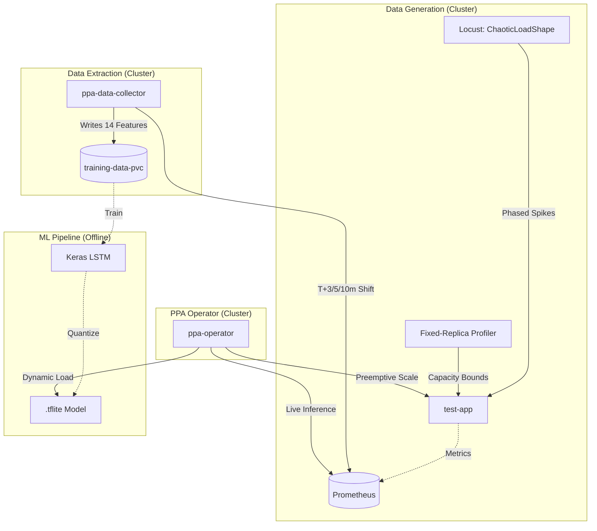

# Predictive Pod Autoscaler (PPA) — Macro Architecture

The PPA system is divided into two distinct, decoupled pipelines. This "Hub" document provides a 10,000-foot overview of how they interact.

For detailed documentation, please refer to the specific subsystems below:

## 1. [Data Collection & Load Generation](./architecture/data_collection.md)
**Focus:** Infrastructure, metrics scraping, and training data creation.

This pipeline is responsible for:
- Generating dynamic chaotic HTTP traffic spikes using Locust `ChaoticLoadShape`.
- Collecting data across fixed scale bounds to construct non-linear capacity curves.
- Triggering the Kubernetes `HorizontalPodAutoscaler` to generate replica variance.
- Running the `ppa-data-collector` CronJob hourly to extract specialized features from Prometheus.
- Safely appending time-series data to the `training-data-pvc` for offline LSTM training.

👉 **[Read the Data Collection Architecture](./architecture/data_collection.md)**

---

## 2. [ML Pipeline Architecture](./architecture/ml_pipeline.md)
**Focus:** Keras LSTM training, multi-horizon forecasting, TFLite conversion, and champion-challenger promotion.

This pipeline is responsible for:
- Training independent LSTM models for 3 prediction horizons (3m, 5m, 10m ahead).
- Building resilient models with target scaling, Huber loss, dropout, and gradient clipping.
- Evaluating models with robust metrics (sMAPE, filtered MAPE) and HPA comparison.
- Converting to optimized TFLite (~113KB) for edge deployment.
- Promoting winning models via a champion-challenger policy with configurable gates.

👉 **[Read the ML Pipeline Architecture](./architecture/ml_pipeline.md)**

---

## 3. [Operator & Live Inference](./operator/README.md)
**Focus:** Kubernetes-native operator, TFLite inference, and active scaling decisions.

This pipeline is responsible for:
- Managing N independent `PredictiveAutoscaler` Custom Resources (CRs) in a single pod.
- Fetching live 15s Prometheus metrics and building rolling 12-step feature windows.
- Running TFLite inference to predict RPS 3–10 minutes ahead.
- Making intelligent scaling decisions with rate limiting and stabilization filters.
- Providing health endpoints, environment-configurable behavior, and Prometheus error resilience.

👉 **[Read the Operator Documentation](./operator/README.md)**

**Operator Documentation Folder Contents:**
- **[Architecture & System Design](./operator/architecture.md)** — Detailed system topology, reconciliation cycle, component interactions
- **[Deployment Guide](./operator/deployment.md)** — Step-by-step deployment instructions
- **[Configuration Reference](./operator/configuration.md)** — Environment variables, CR specification, tuning guide
- **[API Reference](./operator/api.md)** — Custom Resource schema with examples
- **[Commands Reference](./operator/commands.md)** — Useful kubectl commands for monitoring
- **[Troubleshooting Guide](./operator/troubleshooting.md)** — Common issues and solutions

---

## High-Level Topology

