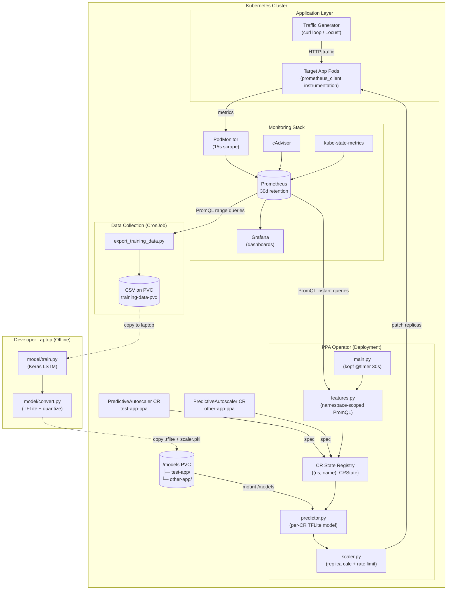
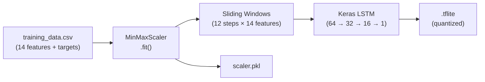
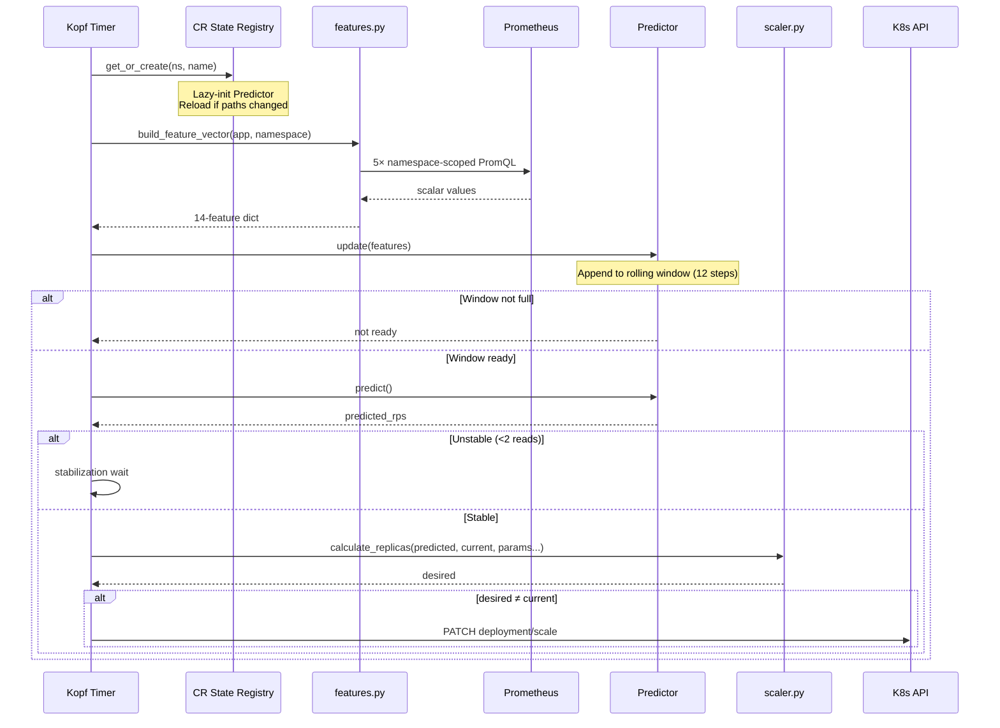
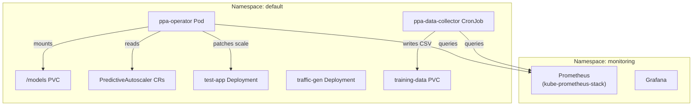

# Predictive Pod Autoscaler — System Architecture

**Last Updated:** 2026-03-05 · **Version:** 2.0 (Multi-CR)

---

## Overview

The Predictive Pod Autoscaler (PPA) is a Kubernetes-native system that uses LSTM-based ML to forecast application load 5–15 minutes ahead and proactively scale deployments before traffic spikes arrive.

The system has three major subsystems:

| Subsystem | Purpose | Runs As |
|---|---|---|
| **Data Collection** | Scrape Prometheus → build training CSV | CronJob (hourly) |
| **ML Pipeline** | Train LSTM → convert to TFLite | Manual / Developer laptop |
| **Operator** | Live inference → scaling decisions | Deployment (always-on pod) |

---

## System Diagram



---

## Data Collection Pipeline

### What It Does

A Kubernetes CronJob (`ppa-data-collector`) runs hourly inside the cluster. It queries Prometheus for a rolling window of historical metrics, computes temporal features, builds future prediction targets, and appends the result to a CSV on a PersistentVolumeClaim.

### 14-Feature Vector

| Category | Features |
|---|---|
| **Core Load** | `requests_per_second`, `cpu_usage_percent`, `memory_usage_bytes`, `latency_p95_ms` |
| **Indicators** | `active_connections`, `error_rate` |
| **Momentum** | `cpu_acceleration`, `rps_acceleration` |
| **State** | `current_replicas` |
| **Cyclical Time** | `hour_sin`, `hour_cos`, `dow_sin`, `dow_cos`, `is_weekend` |

### Prediction Targets

| Target | Description |
|---|---|
| `rps_t5` / `rps_t10` / `rps_t15` | Future RPS at +5, +10, +15 minutes |
| `replicas_t5` / `replicas_t10` / `replicas_t15` | Ceiling-based replica forecast |

### Gap Handling

The pipeline is **segment-aware**: large gaps (>10 minutes, e.g. overnight shutdown) create separate segments. Prediction targets are computed independently within each segment so cross-gap rows aren't poisoned with NaN.

### Modules

| File | Responsibility |
|---|---|
| `config.py` | Parameterized PromQL queries, feature columns, env vars |
| `export_training_data.py` | Main processor: fetch → resample → targets → safe append |
| `verify_features.py` | Liveness probe for Prometheus query readiness |
| `validate_training_data.py` | ML quality gates before training |

---

## ML Pipeline

### Training Flow



### Key Design Decisions

| Decision | Rationale |
|---|---|
| **TFLite** (not Flask API) | Embedded inference: no network hop, no sidecar, <100ms latency |
| **Segment-aware windows** | Training windows never cross overnight gaps |
| **MinMaxScaler** | Simple, invertible, saved alongside model for exact reproduction |

### Artifacts

| File | Location | Description |
|---|---|---|
| `ppa_model.tflite` | `/models/{app}/` on PVC | Quantized LSTM model |
| `scaler.pkl` | `/models/{app}/` on PVC | Sklearn MinMaxScaler fitted on training features |

---

## Operator Architecture (Multi-CR)

### Design Principle

One operator pod manages **N** independently-configured `PredictiveAutoscaler` CRs. Each CR specifies its own target deployment, namespace, model paths, and scaling parameters. The operator maintains per-CR state (predictor instance, stabilization counters) in a registry keyed by `(cr_namespace, cr_name)` to avoid cross-namespace collisions.

### CRD Spec

```yaml
apiVersion: ppa.example.com/v1
kind: PredictiveAutoscaler
metadata:
  name: test-app-ppa
  namespace: default
spec:
  targetDeployment: test-app       # required
  namespace: default               # target deployment namespace
  minReplicas: 2                   # hard floor
  maxReplicas: 20                  # hard ceiling
  capacityPerPod: 50               # req/s per pod
  modelPath: ""                    # empty = /models/{target}/ppa_model.tflite
  scalerPath: ""                   # empty = /models/{target}/scaler.pkl
  scaleUpRate: 2.0                 # max 2× current per cycle
  scaleDownRate: 0.5               # max 50% reduction per cycle
```

### Reconciliation Loop (30s cycle)



### Operator Modules

| File | Responsibility |
|---|---|
| `config.py` | Cluster-wide defaults only (`PROMETHEUS_URL`, `TIMER_INTERVAL`, `LOOKBACK_STEPS`, `DEFAULT_*` constants). No app-specific values. |
| `features.py` | `build_feature_vector(target_app, namespace)` — all PromQL queries namespace-scoped |
| `predictor.py` | `Predictor(model_path, scaler_path)` — per-CR instance with `paths_match()` for reload detection |
| `scaler.py` | `calculate_replicas(...)` — all params as args. `scale_deployment(name, replicas, namespace)` |
| `main.py` | Per-CR state registry `{(ns, name): CRState}`. Lazy-init + reload. Delete handler for cleanup. |

### Model Lifecycle

```
Developer trains model
    → copies .tflite + .pkl to PVC at /models/{app}/
        → Operator detects new CR or path change
            → Predictor reloads from PVC
                → Live inference begins
```

Models are **never baked into the Docker image**. They live on a `PersistentVolumeClaim` mounted at `/models`. To update a model, replace the files on the PVC — the operator will reload on the next reconciliation cycle if the CR's `modelPath` changed, or on pod restart.

---

## Deployment Topology



### Key Files

| File | Purpose |
|---|---|
| `deploy/crd.yaml` | PredictiveAutoscaler CRD definition |
| `deploy/rbac.yaml` | ServiceAccount + ClusterRole + Binding |
| `deploy/operator-deployment.yaml` | Operator Deployment + PVC for models |
| `deploy/predictiveautoscaler.yaml` | Example CR |
| `deploy/cronjob-data-collector.yaml` | Data collection CronJob |

---

## How to Onboard a New App

1. **Instrument** the app with `prometheus_client` (expose `http_requests_total`, `http_request_duration_seconds`, `http_connections_active`)
2. **Collect data** — run traffic, let the CronJob accumulate ≥5,000 CSV rows
3. **Train** — `python model/train.py --csv <path>`
4. **Convert** — `python model/convert.py`
5. **Deploy model** — copy `ppa_model.tflite` + `scaler.pkl` to `/models/{app}/` on the PVC
6. **Apply CR** — `kubectl apply -f` a `PredictiveAutoscaler` CR targeting the new deployment
7. The operator auto-detects the CR and starts scaling

---

## Technology Stack

| Component | Technology | Rationale |
|---|---|---|
| Language | Python 3.11 | Unified ML + K8s ecosystem |
| ML Framework | Keras (TensorFlow) | LSTM support, wide documentation |
| Inference | TFLite | Embedded, <100ms, no sidecar needed |
| Operator | Kopf | Python-native, simpler than Go-based Kubebuilder |
| Metrics | Prometheus + kube-prometheus-stack | Industry standard, CRD-based service discovery |
| Visualization | Grafana | Bundled with kube-prometheus-stack |
| Load Testing | Locust | Python-native, phased traffic simulation |
| Local K8s | Minikube (KVM2) | Near-bare-metal on Linux |
