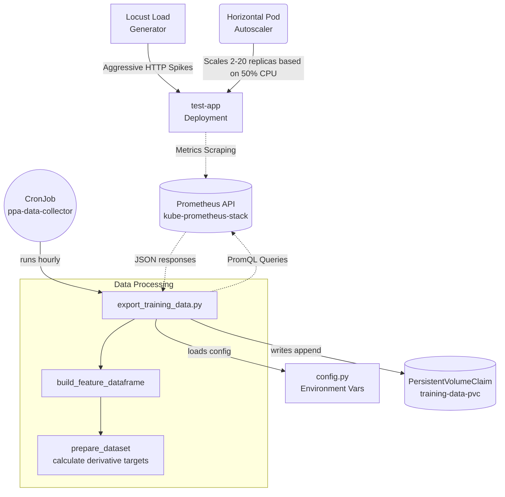

# Predictive Pod Autoscaler Data Collection Architecture

## Overview
The data collection pipeline for the Predictive Pod Autoscaler (PPA) is a key component configured as a Kubernetes CronJob. It acts as an event-driven extractor, pulling detailed runtime metrics from Prometheus at defined intervals, pre-processing, and generating features suitable for LSTM model training and subsequent autoscaler operator predictions.

## Architecture

At a high level, the extraction process is stateless, self-contained, and configured to scrape via internal cluster DNS:

## Features

An optimal 9-feature dimension is collected in line with the Phase 2 specification goals, structured into core load signals, state awareness features, unique indicators, momentum calculations, and generated cyclical signals. 

| Feature Category | Features |
| --- | --- |
| **Core Load** | `requests_per_second`, `cpu_usage_percent`, `memory_usage_bytes`, `latency_p95_ms` |
| **State** | `current_replicas` |
| **Indicators** | `active_connections`, `error_rate` |
| **Momentum** | `cpu_acceleration`, `rps_acceleration` |
| **Cyclical** | `hour_sin`, `hour_cos`, `dow_sin`, `dow_cos`, `is_weekend` |

The target calculations generated dynamically from the state are `rps_t3m`, `rps_t5m`, `rps_t10m` forecasting the target feature at time window advancements to account for Kubernetes cold-start periods (e.g. 3 minutes).

## Dynamic Load Generation & Variance
To successfully train the forecasting ML models, the training data requires extreme volatility and variance in replica counts.

- **Aggressive HPA Target**: The `test-app` is governed by a HorizontalPodAutoscaler targeted at `50% CPU Utilization`.
- **Compound Chaotic Spikes**: The clustered `Locust` traffic generator uses a `ChaoticLoadShape` to mimic real-world unpredictability. Stages jump dynamically from normal load (100 users) to flash bursts (800 users), dead drops (10 users), and massive spikes (1500 users). This ensures the CPU threshold is broken repeatedly and unpredictably.
- **Fixed Replica Profiling**: To decouple the model from learning the HPA's specific feedback loop, standalone tests (`scripts/fixed_replica_test.sh`) disable the HPA and lock replicas to fixed bounds (2, 5, 10, 20). The chaotic traffic is then pushed against these static capacities to establish pure scale-limit datasets.

## Automated Startup
The entire infrastructure, load generation, and monitoring stack has been codified into `ppa_startup.sh`. This orchestrates 10 sequential steps covering prerequisites, Minikube KVM provisioning, helm installations (Kube-Prometheus stack), and the injection of custom `Locust` scripts to guarantee deterministic data.

## Modules

The underlying stack is standard Python, utilizing `pandas` and `requests`. No sidecars or complex frameworks (e.g. Flask) are utilized inside this data-extractor pod. 

- `config.py`: Single source of truth. Contains core configurations dynamically parameterized (`TARGET_APP`, `PROMETHEUS_URL`) and the exhaustive map of `QUERIES` holding the raw robust PromQL patterns for calculation.
- `verify_features.py`: Independent troubleshooting script to locally poll against `PROMETHEUS_URL` and assert query matches data outputs, acting as a liveness probe on metrics readiness.
- `export_training_data.py`: Primary processor to load features via pandas dataframes dynamically over a stated window, evaluate targets natively through shifting constraints (`df.shift(-lag)`), safely append deduplicated blocks against long-running storage volumes, and format as `.csv`.
