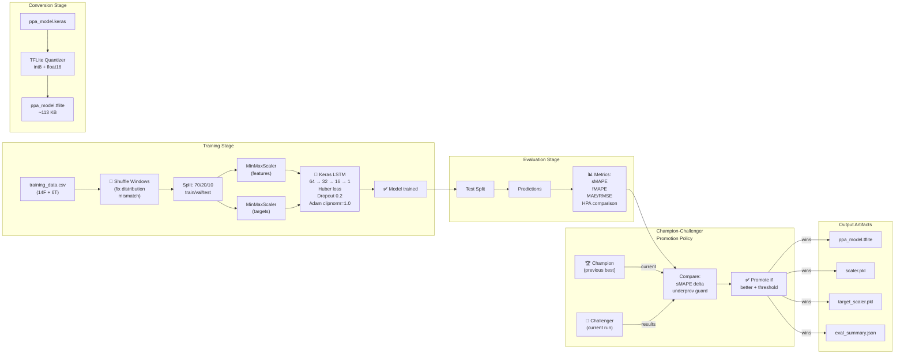
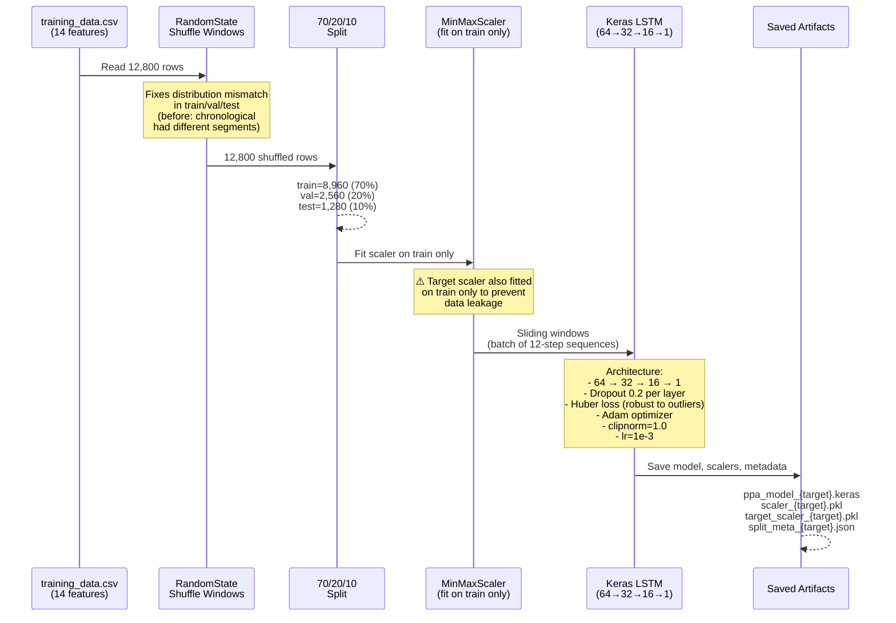
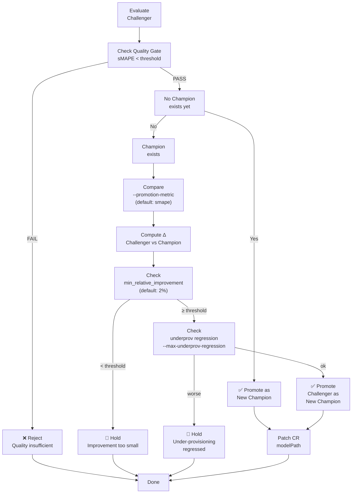
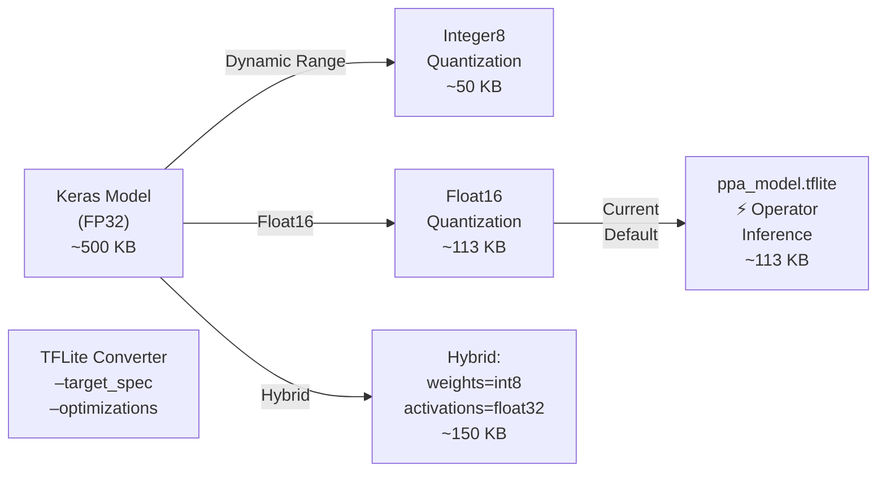

# ML Pipeline Architecture

**Last Updated:** 2026-03-09 · **Version:** 2.0 (Multi-Horizon with Champion-Challenger)

---

## Overview

The ML Pipeline is a **complete end-to-end system** for training LSTM models on historical Prometheus metrics, optimizing them for multi-horizon RPS forecasting, and promoting winning models to production via a champion-challenger policy.

The pipeline runs offline on a developer laptop and produces TFLite models that are deployed to the operator via a Kubernetes PersistentVolumeClaim.

---

## Architecture Diagram



---

## Training Pipeline

### Data Flow



### Key Design Decisions

| Decision | Rationale |
|---|---|
| **12-step rolling windows** | 12 × 30s operator samples = 6 min history. Matches operator's `LOOKBACK_STEPS`. |
| **Window shuffling before split** | Chronological split puts different segments (with different distributions) in val/test. Shuffling fixes distribution mismatch while preserving segment integrity within each window. |
| **Separate target scaler** | Target is fit on train split only to prevent leakage. Inverse-transforms model output [0,1] → raw RPS. |
| **Huber loss** | MSE is too sensitive to RPS outliers in traffic spikes. Huber is robust. |
| **Dropout + gradient clipping** | Stabilizes training with noisy metrics. Clipnorm=1.0 prevents gradient explosion. |
| **Patient early stopping** | patience=15, min_delta=1e-4. Prevents premature termination caused by val fluctuations. |
| **Target floor clipping** | Clamp RPS to ≥5.0 during training. Prevents model from learning nonsensical negative/near-zero predictions. |

### Hyperparameters (Configurable)

| Parameter | Default | CLI Flag | Notes |
|---|---|---|---|
| `--epochs` | 50 | `--epochs 50` | Max training iterations |
| `--batch-size` | 32 | `--batch-size 32` | Samples per gradient update |
| `--patience` | 15 | `--patience 15` | Early stopping patience (epochs) |
| `--target-floor` | 5.0 | `--target-floor 5.0` | Min RPS floor for clipping |
| `--test-split` | 0.1 | `--test-split 0.1` | Holdout test fraction (after 80/20 val) |

---

## Evaluation Pipeline

### Metrics Computed

| Metric | Formula | Use Case |
|---|---|---|
| **sMAPE** | `2 × |pred - actual| / (|pred| + |actual|)` | **Primary gate metric** — symmetric, handles near-zero well |
| **Filtered MAPE** | MAPE for rows where RPS > `low_traffic_threshold` (default 10) | Reveals accuracy on meaningful traffic (excludes noise) |
| **MAE** | `mean(\|pred - actual\|)` | Average absolute error in RPS |
| **RMSE** | `sqrt(mean((pred - actual)²))` | Penalizes large errors; influenced by outliers |

### Quality Gate

```yaml
Gate: sMAPE < threshold
  threshold: 35.0  # % — configurable via --quality-gate
  Fail: Model quality insufficient, don't promote
  Pass: Model is acceptable
```

### HPA Comparison

The evaluation compares PPA's **predictive scaling** vs HPA's **reactive scaling** on the same test data:

```
PPA Strategy:
  predicted_rps = model.predict(12-step window)
  desired_replicas = ceil(predicted_rps / capacity_per_pod)
  → scales BEFORE traffic arrives

HPA Strategy (Baseline):
  current_rps = actual_rps[t]
  desired_replicas = ceil(current_rps / capacity_per_pod)
  → scales AFTER traffic already arrived
```

**Computed Statistics:**
- Average replicas (PPA vs HPA)
- Over-provisioning rate (% time replicas > needed)
- Under-provisioning rate (% time replicas < needed)
- Wasted pod-capacity (pod-seconds over-provisioned)
- Replica savings (%)

---

## Champion-Challenger Policy

### Promotion Logic



### Configuration Flags

| Flag | Default | Description |
|---|---|---|
| `--promote-if-better` | false | Enable promotion (off by default) |
| `--champion-dir` | `model/champions` | Directory where champions are stored |
| `--promotion-metric` | `smape` | Which metric to optimize (smape, mape_filtered, mae) |
| `--promotion-gate` | 35.0 | Quality gate threshold (%) |
| `--min-relative-improvement` | 2.0 | Min % improvement to promote (%) |
| `--max-underprov-regression` | 5.0 | Max allowed under-prov regression (%) |
| `--promote-cr-name` | `test-app-ppa` | CR name to patch on promotion |
| `--promote-cr-namespace` | `default` | CR namespace to patch |

### Promotion Outputs

On promotion, artifacts are copied to `champion_dir/{target}/`:
```
champions/
├── rps_t3m/
│   ├── ppa_model.tflite        ← Latest champion
│   ├── scaler.pkl
│   ├── target_scaler.pkl
│   ├── eval_summary.json       ← Metrics snapshot
│   └── .timestamp              ← When promoted
├── rps_t5m/
└── rps_t10m/
```

When `--promote-cr-name` is set, the operator's CR is patched:
```bash
kubectl patch ppa test-app-ppa --type merge -p \
  "{\"spec\":{\"modelPath\":\"/models/test-app/ppa_model.tflite\", ...}}"
```

The operator detects the path change and reloads on the next 30s cycle.

---

## Conversion to TFLite

### Quantization Strategy



**Decision:** Float16 quantization (default)
- Smaller than unquantized but larger than int8
- Avoids quantization artifacts that hurt RPS prediction accuracy
- Still <150KB → easy to deploy to edge/minimal environments
- TFLite runtime supports on all K8s nodes

---

## Artifacts & File Structure

### Training Artifacts

```
model/artifacts/
├── ppa_model_rps_t3m.keras
├── ppa_model_rps_t5m.keras
├── ppa_model_rps_t10m.keras
├── scaler_rps_t3m.pkl
├── scaler_rps_t5m.pkl
├── scaler_rps_t10m.pkl
├── target_scaler_rps_t3m.pkl
├── target_scaler_rps_t5m.pkl
├── target_scaler_rps_t10m.pkl
├── split_meta_rps_t3m.json  (test indices, target, lookback)
├── split_meta_rps_t5m.json
├── split_meta_rps_t10m.json
├── eval_summary_rps_t3m.json
├── eval_summary_rps_t5m.json
├── eval_summary_rps_t10m.json
├── ppa_model_rps_t3m.tflite
├── ppa_model_rps_t5m.tflite
└── ppa_model_rps_t10m.tflite
```

### Champion Artifacts (Promoted)

```
model/champions/
├── rps_t3m/
│   ├── ppa_model.tflite
│   ├── scaler.pkl
│   ├── target_scaler.pkl
│   └── eval_summary.json
├── rps_t5m/
│   ├── ppa_model.tflite
│   ├── scaler.pkl
│   ├── target_scaler.pkl
│   └── eval_summary.json
└── rps_t10m/
    ├── ppa_model.tflite
    ├── scaler.pkl
    ├── target_scaler.pkl
    └── eval_summary.json
```

### PVC Deployment (Production)

```
/models/  (on PVC mounted by operator)
└── test-app/
    ├── ppa_model.tflite        ← Operator loads this
    ├── scaler.pkl              ← Feature scaler
    └── target_scaler.pkl       ← Target (RPS) scaler
```

---

## Multi-Horizon Training

The pipeline trains **three independent LSTM models** for three prediction horizons:

```
Horizon | Lookback | Prediction Window | Use Case
--------|----------|-------------------|------------------
rps_t3m | 12×30s   | 3 minutes ahead   | Immediate tactical scaling
rps_t5m | 12×30s   | 5 minutes ahead   | Medium-term load planning
rps_t10m| 12×30s   | 10 minutes ahead  | Strategic scaling buffer
```

Each model:
- Has its own MinMaxScaler (fitted independently on its training split)
- Has its own target scaler (inverse-transforms [0,1] → raw RPS)
- Is evaluated against its own test split
- Can have different sMAPE/MAE/RMSE performance
- Can be promoted independently to the operator

**Current best performer (as of 2026-03-09):**
- `rps_t10m`: sMAPE 16.7%, MAE 35.97 RPS → **✅ Deployed**

---

## See Also

- [ML Commands Reference](../reference/ml_commands.md) — Training, evaluation, and conversion CLI
- [Operator Architecture](./ml_operator.md) — How the models are deployed and used for live inference
- [Data Collection](./data_collection.md) — How training data is generated
