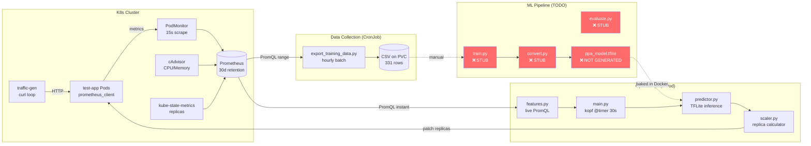
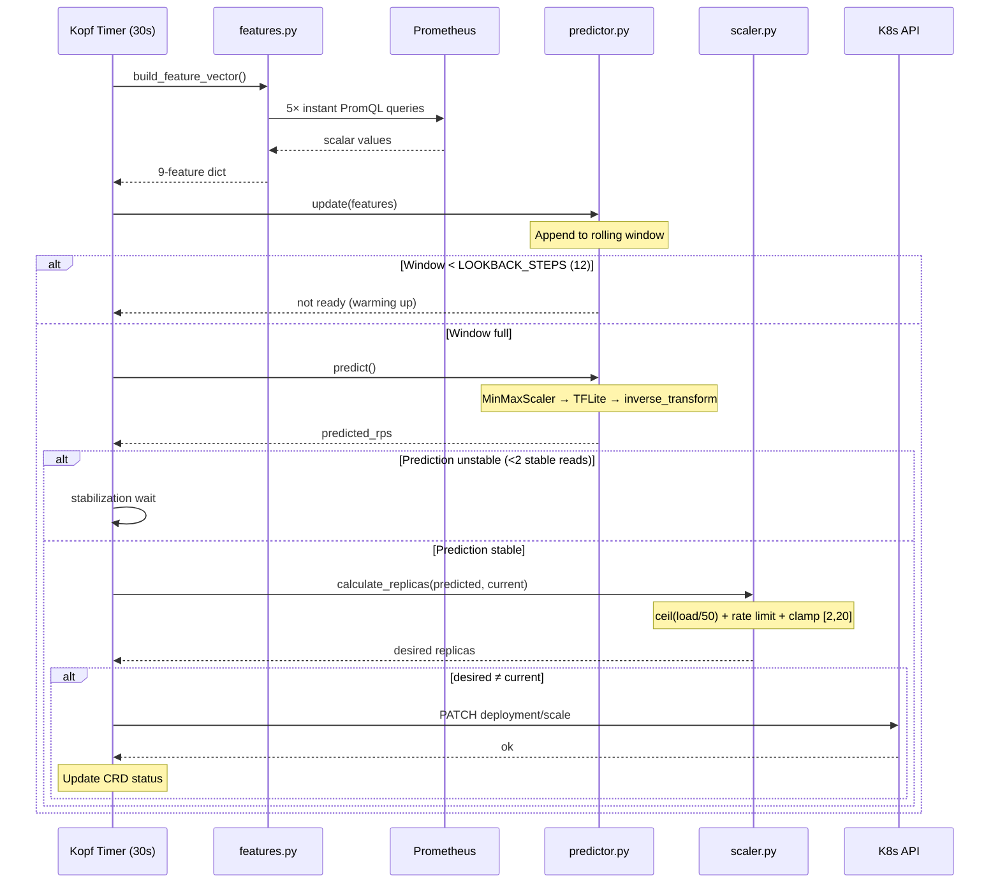

# 🔍 Predictive Pod Autoscaler — Implementation Audit

**Date:** 2026-03-05 · **Auditor Perspective:** Staff Engineer

---

## 1. PRD Main Points — Requirements Checklist

### 🎯 Main Goal

> Build a **predictive** pod autoscaler that uses LSTM-based ML to forecast load 5/10/15 minutes ahead and pre-scale Kubernetes deployments **before** traffic spikes arrive, replacing the reactive Horizontal Pod Autoscaler (HPA).

### Functional Requirements

| ID | Requirement | Priority |
|---|---|---|
| FR-DC-01 | Collect CPU & memory from Prometheus at 15s intervals | MUST |
| FR-DC-02 | Collect HTTP request rate, latency (P95/P99), error rate via eBPF | MUST |
| FR-DC-03 | Store ≥30 days of historical metrics for model training | MUST |
| FR-DC-04 | Handle metric collection failures gracefully | MUST |
| FR-DC-05 | Collect active connections & network throughput | SHOULD |
| FR-ML-01 | Predict load at t+5, t+10, t+15 minutes | MUST |
| FR-ML-02 | Achieve <15% MAPE on test data | MUST |
| FR-ML-03 | Retrain automatically every 7 days | MUST |
| FR-ML-04 | Inference latency <100ms | MUST |
| FR-ML-05 | Detect concept drift, trigger retraining >20% degradation | MUST |
| FR-ML-06 | Support both LSTM and Prophet for comparison | SHOULD |
| FR-K8S-01 | Controller updates replicas based on ML predictions | MUST |
| FR-K8S-02 | Enforce min/max replicas (default 1–20) | MUST |
| FR-K8S-03 | Rate limiting: max 2× scale-up per cycle | MUST |
| FR-K8S-04 | Log all scaling decisions with timestamp + prediction | MUST |
| FR-K8S-05 | Rollback if prediction accuracy drops below threshold | MUST |
| FR-K8S-06 | Support dry-run mode | SHOULD |
| FR-MON-01 | Expose prediction accuracy metrics to Prometheus | MUST |
| FR-MON-02 | Grafana dashboard: predictions vs actual | MUST |
| FR-MON-03 | Track scaling events: timestamp, trigger, outcome | MUST |
| FR-MON-04 | Alert when prediction error >25% for >5 minutes | MUST |
| FR-MON-05 | Explainability: why scaling decision was made | SHOULD |

### Non-Functional Requirements

| ID | Requirement |
|---|---|
| NFR-PERF-01 | ML prediction latency <100ms (P95) |
| NFR-PERF-02 | Controller reconciliation loop <30s |
| NFR-REL-01 | Controller uptime 99.5% |
| NFR-REL-02 | Graceful degradation: fall back to HPA if ML fails |
| NFR-REL-03 | Zero data loss on predictions/metrics |
| NFR-SEC-01 | K8s RBAC with least-privilege SA |
| NFR-SEC-02 | TLS for all external API calls |
| NFR-USE-01 | Installation via single Helm chart |
| NFR-USE-02 | Configuration via CRD |
| NFR-USE-03 | Documentation includes setup guide, troubleshooting, examples |

---

## 2. PRD-to-Implementation Traceability Matrix

| Req ID | Requirement | Status | Evidence |
|---|---|---|---|
| FR-DC-01 | CPU & memory from Prometheus | ✅ **Done** | [config.py](file:///run/media/vatsal/Drive/Projects/predictive_pod_autoscaler/data-collection/config.py#L16-L23) — `cpu_usage_percent` and `memory_usage_bytes` queries. PodMonitor scrapes at [15s intervals](file:///run/media/vatsal/Drive/Projects/predictive_pod_autoscaler/data-collection/test-app-deployment.yaml#L80). |
| FR-DC-02 | HTTP rate, latency, error rate | ⚠️ **Partial** | RPS + P95 latency + error_rate collected via `prometheus_client` in [app.py](file:///run/media/vatsal/Drive/Projects/predictive_pod_autoscaler/data-collection/test-app/app.py#L16-L32). **No eBPF/Pixie** — all metrics come from in-app instrumentation, not eBPF. P99 not collected. |
| FR-DC-03 | Store ≥30 days of historical metrics | ⚠️ **Partial** | Prometheus retention set to [30d](file:///run/media/vatsal/Drive/Projects/predictive_pod_autoscaler/ppa_startup.sh#L164). PVC for CSV [5Gi](file:///run/media/vatsal/Drive/Projects/predictive_pod_autoscaler/deploy/cronjob-data-collector.yaml#L50). **But current CSV has only 331 rows (~5.5h)**, far short of 30 days. |
| FR-DC-04 | Graceful failure handling | ✅ **Done** | [export_training_data.py:71](file:///run/media/vatsal/Drive/Projects/predictive_pod_autoscaler/data-collection/export_training_data.py#L71) returns empty Series on no data. [features.py:19](file:///run/media/vatsal/Drive/Projects/predictive_pod_autoscaler/operator/features.py#L19) returns `0.0` on query failure. |
| FR-DC-05 | Active connections & throughput | ⚠️ **Partial** | Active connections tracked in [app.py:29](file:///run/media/vatsal/Drive/Projects/predictive_pod_autoscaler/data-collection/test-app/app.py#L29) and collected in [config.py:38](file:///run/media/vatsal/Drive/Projects/predictive_pod_autoscaler/data-collection/config.py#L38). **Network throughput not collected.** |
| FR-ML-01 | Predict load at t+5/10/15 | ⚠️ **Partial** | Target columns [rps_t5/t10/t15](file:///run/media/vatsal/Drive/Projects/predictive_pod_autoscaler/data-collection/export_training_data.py#L15-L22) defined. Predictor returns single value, [not 3 horizons](file:///run/media/vatsal/Drive/Projects/predictive_pod_autoscaler/operator/predictor.py#L49-L69). |
| FR-ML-02 | <15% MAPE | ❌ **Missing** | [evaluate.py](file:///run/media/vatsal/Drive/Projects/predictive_pod_autoscaler/model/evaluate.py) is a TODO stub. No model trained, no MAPE measured. |
| FR-ML-03 | Auto-retrain every 7 days | ❌ **Missing** | No retraining pipeline, no scheduling. CronJob only collects data. |
| FR-ML-04 | Inference <100ms | ⚠️ **Partial** | TFLite used for inference in [predictor.py](file:///run/media/vatsal/Drive/Projects/predictive_pod_autoscaler/operator/predictor.py) — design supports fast inference, but **no model exists to benchmark**. |
| FR-ML-05 | Concept drift detection | ❌ **Missing** | No drift detection or accuracy monitoring code exists. |
| FR-ML-06 | LSTM + Prophet comparison | ❌ **Missing** | Only LSTM path scaffolded. No Prophet implementation. |
| FR-K8S-01 | Update replicas from predictions | ✅ **Done** | [scaler.py:46-65](file:///run/media/vatsal/Drive/Projects/predictive_pod_autoscaler/operator/scaler.py#L46-L65) patches deployment. [main.py:69-73](file:///run/media/vatsal/Drive/Projects/predictive_pod_autoscaler/operator/main.py#L69-L73) calls [scale_deployment()](file:///run/media/vatsal/Drive/Projects/predictive_pod_autoscaler/operator/scaler.py#46-67). |
| FR-K8S-02 | Min/max replicas | ✅ **Done** | [scaler.py:43](file:///run/media/vatsal/Drive/Projects/predictive_pod_autoscaler/operator/scaler.py#L43) — `max(MIN_REPLICAS, min(MAX_REPLICAS, desired))`. [config.py:9-10](file:///run/media/vatsal/Drive/Projects/predictive_pod_autoscaler/operator/config.py#L9-L10). |
| FR-K8S-03 | Rate limiting (2× max) | ✅ **Done** | [scaler.py:33-34](file:///run/media/vatsal/Drive/Projects/predictive_pod_autoscaler/operator/scaler.py#L33-L34) — `SCALE_UP_RATE_LIMIT=2.0`, `SCALE_DOWN_RATE=0.5`. |
| FR-K8S-04 | Log scaling decisions | ✅ **Done** | [main.py:72](file:///run/media/vatsal/Drive/Projects/predictive_pod_autoscaler/operator/main.py#L72) logs to stdout. Status subresource updated at [main.py:74-81](file:///run/media/vatsal/Drive/Projects/predictive_pod_autoscaler/operator/main.py#L74-L81). |
| FR-K8S-05 | Rollback on bad accuracy | ❌ **Missing** | No accuracy tracking or automatic fallback to HPA. |
| FR-K8S-06 | Dry-run mode | ❌ **Missing** | No dry-run flag or monitoring-only mode. |
| FR-MON-01 | Prediction accuracy to Prometheus | ❌ **Missing** | No custom Prometheus metrics exported by operator. |
| FR-MON-02 | Grafana dashboard | ❌ **Missing** | No dashboard JSON; no Grafana provisioning in deploy. |
| FR-MON-03 | Track scaling events | ⚠️ **Partial** | CRD status tracks [lastScaleTime, desiredReplicas](file:///run/media/vatsal/Drive/Projects/predictive_pod_autoscaler/deploy/crd.yaml#L37-L44). Not exposed as Prometheus time-series. |
| FR-MON-04 | Alert on >25% error | ❌ **Missing** | No alerting rules configured. |
| FR-MON-05 | Explainability | ❌ **Missing** | Logs show predicted load, but no structured rationale. |
| NFR-PERF-02 | Reconciliation <30s | ✅ **Done** | [config.py:16](file:///run/media/vatsal/Drive/Projects/predictive_pod_autoscaler/operator/config.py#L16) — `TIMER_INTERVAL = 30`. |
| NFR-REL-02 | HPA fallback | ❌ **Missing** | No fallback mechanism. |
| NFR-SEC-01 | Least-privilege RBAC | ✅ **Done** | [rbac.yaml](file:///run/media/vatsal/Drive/Projects/predictive_pod_autoscaler/deploy/rbac.yaml) — scoped to deployments/scale, pods, CRD, events. |
| NFR-USE-01 | Helm chart install | ❌ **Missing** | No Helm chart. Installation is manual `kubectl apply`. |
| NFR-USE-02 | CRD configuration | ✅ **Done** | [crd.yaml](file:///run/media/vatsal/Drive/Projects/predictive_pod_autoscaler/deploy/crd.yaml), [example CR](file:///run/media/vatsal/Drive/Projects/predictive_pod_autoscaler/deploy/predictiveautoscaler.yaml). |
| NFR-USE-03 | Documentation | ✅ **Done** | [ppa_commands.md](file:///run/media/vatsal/Drive/Projects/predictive_pod_autoscaler/docs/reference/ppa_commands.md), [working_queries.md](file:///run/media/vatsal/Drive/Projects/predictive_pod_autoscaler/docs/reference/working_queries.md), [architecture.md](file:///run/media/vatsal/Drive/Projects/predictive_pod_autoscaler/docs/architecture/architecture.md). |

### Summary Counts

| Status | Count | Percentage |
|---|---|---|
| ✅ **Done** | 11 | 38% |
| ⚠️ **Partial** | 6 | 21% |
| ❌ **Missing** | 12 | 41% |

---

## 3. Architecture Clarity

### 3.1 Current Architecture in Plain Language

The PPA system has **three pillars** plus supporting infrastructure:

**Pillar 1 — Data Collection Pipeline** (`data-collection/`)
A Kubernetes CronJob that runs hourly, queries Prometheus for 9 PromQL metrics, computes temporal features (cyclical time encoding) and prediction targets (shifted RPS), and appends deduplicated rows to a CSV on a PersistentVolumeClaim. This is a **batch** process — it does not feed the operator directly.

**Pillar 2 — ML Training Pipeline** (`model/`)
Currently **empty stubs**. The plan is: CSV → MinMaxScaler → sliding windows → Keras LSTM → TFLite conversion. No model exists. Training is manual, not triggered.

**Pillar 3 — Kopf Operator** (`operator/`)
A single-pod Python process using the Kopf framework. It watches `PredictiveAutoscaler` CRDs and on a 30-second timer:
1. Queries Prometheus **live** for 9 features
2. Feeds them into a TFLite LSTM model
3. Predicts future RPS
4. Applies stabilization (2 consecutive stable reads)
5. Calculates desired replicas with rate limiting
6. Patches the target Deployment via K8s API

**Supporting Infrastructure:**
- `test-app`: A custom Flask-like Python HTTP server with `prometheus_client` instrumentation (requests, latency, connections)
- [locustfile.py](file:///run/media/vatsal/Drive/Projects/predictive_pod_autoscaler/tests/locustfile.py): Phased load test simulating daily traffic cycles
- [ppa_startup.sh](file:///run/media/vatsal/Drive/Projects/predictive_pod_autoscaler/ppa_startup.sh): 10-step bootstrap script for the entire Minikube environment

### 3.2 Data Flow — End to End

### 3.3 Sequence Diagram — Operator Reconciliation Loop

### 3.4 Training vs Inference Boundaries

| Concern | Training (offline) | Inference (live) |
|---|---|---|
| **Data source** | CSV from PVC via [export_training_data.py](file:///run/media/vatsal/Drive/Projects/predictive_pod_autoscaler/data-collection/export_training_data.py) | Live Prometheus via [features.py](file:///run/media/vatsal/Drive/Projects/predictive_pod_autoscaler/operator/features.py) |
| **Feature count** | 14 features + 5 temporal + 6 targets = 25 columns | 9 features (no momentum, no error_rate) |
| **Framework** | Keras LSTM (TODO) | TFLite runtime |
| **Execution** | Manual / Notebook (no automation) | Kopf timer, every 30s |
| **Artifact handoff** | `.tflite` + `scaler.pkl` baked into Docker image | Loaded at operator startup |

> [!WARNING]
> **Feature mismatch**: Data collection uses **14 features** (includes `active_connections`, `error_rate`, `cpu_acceleration`, `rps_acceleration`, `is_weekend`) but the operator's [predictor.py](file:///run/media/vatsal/Drive/Projects/predictive_pod_autoscaler/operator/predictor.py) expects only **9 features**. This mismatch will cause training/inference incompatibility if not reconciled.

### 3.5 External Integrations

| Integration | How | Files |
|---|---|---|
| **Kubernetes API** | `kubernetes-client/python` — patch deployments/scale | [scaler.py](file:///run/media/vatsal/Drive/Projects/predictive_pod_autoscaler/operator/scaler.py) |
| **Prometheus** | HTTP REST API (`/api/v1/query`, `/api/v1/query_range`) | [features.py](file:///run/media/vatsal/Drive/Projects/predictive_pod_autoscaler/operator/features.py), [export_training_data.py](file:///run/media/vatsal/Drive/Projects/predictive_pod_autoscaler/data-collection/export_training_data.py) |
| **Kubernetes CRD** | `ppa.example.com/v1 PredictiveAutoscaler` | [crd.yaml](file:///run/media/vatsal/Drive/Projects/predictive_pod_autoscaler/deploy/crd.yaml) |
| **Kopf** | K8s operator framework, timer-based reconciliation | [main.py](file:///run/media/vatsal/Drive/Projects/predictive_pod_autoscaler/operator/main.py) |
| **TFLite** | On-device inference for LSTM model | [predictor.py](file:///run/media/vatsal/Drive/Projects/predictive_pod_autoscaler/operator/predictor.py) |
| **Grafana** | Port-forwarded, no provisioning automation | [ppa_startup.sh](file:///run/media/vatsal/Drive/Projects/predictive_pod_autoscaler/ppa_startup.sh) |
| **Pixie/eBPF** | 🚫 **Not integrated** despite PRD requirement | — |

---

## 4. Why Different Tech Was Used

| Technology | Where Used | Likely Reason | Trade-offs | Documented? | Confidence |
|---|---|---|---|---|---|
| **Python + Kopf** | Operator framework | Team has Python ML expertise; Kopf is simpler than Go-based Kubebuilder for a semester project. PRD lists both options. | Single-threaded GIL limits; higher memory vs Go. | Explicitly in [PRD §13.4](file:///run/media/vatsal/Drive/Projects/predictive_pod_autoscaler/docs/Predictive_Pod_Autoscaler_PRD.pdf), [phase2 architecture](file:///run/media/vatsal/Drive/Projects/predictive_pod_autoscaler/docs/planning/ppa_phase2_architecture.md#L9) | ✅ Documented |
| **TFLite** (not Flask API) | Model serving | PRD suggests Flask API, but Phase 2 plan explicitly chooses embedded TFLite for "no Flask, no KEDA, no sidecars" — reduces latency and deployment complexity. | Harder to swap models at runtime; no hot-reload. | Explicit in [phase2 doc](file:///run/media/vatsal/Drive/Projects/predictive_pod_autoscaler/docs/planning/ppa_phase2_architecture.md#L9) | ✅ Documented |
| **prometheus_client** (not eBPF/Pixie) | Test app instrumentation | eBPF requires Pixie CLI and kernel support on Minikube; simpler to instrument app directly with `prometheus_client`. | Fewer metrics (no per-endpoint breakdown, no network throughput). eBPF PRD requirement not met. | Inferred — no explicit rationale. Lessons in [ppa_commands.md:314](file:///run/media/vatsal/Drive/Projects/predictive_pod_autoscaler/docs/reference/ppa_commands.md#L314) hint at simplicity. | 🟡 High |
| **TensorFlow/Keras** | ML framework | PRD specifies TF 2.11+. Team went with the PRD recommendation. | Heavy dependency (~500MB). TFLite mitigates this at inference. | Explicit in [PRD §13.3](file:///run/media/vatsal/Drive/Projects/predictive_pod_autoscaler/docs/Predictive_Pod_Autoscaler_PRD.pdf) | ✅ Documented |
| **CronJob** (not sidecar/DaemonSet) | Data collection scheduling | Simple, Kubernetes-native batch scheduling. Avoids always-on processes for periodic data export. | Hourly granularity limits responsiveness. No real-time streaming. | Explicit in [data_collection_refactor.md](file:///run/media/vatsal/Drive/Projects/predictive_pod_autoscaler/docs/planning/data_collection_refactor.md#L28) | ✅ Documented |
| **Locust** (not K6) | Load testing | Python-native; team already uses Python everywhere. PRD lists both options. | Higher overhead than K6 for extreme loads. Adequate for test-app. | Inferred from uniform Python stack. PRD mentions both. | 🟡 High |
| **Minikube + KVM2** | Local K8s cluster | Hardcoded in startup script. KVM2 is Linux-native with near-bare-metal performance. | Not portable to macOS/Windows (Docker driver needed there). | Explicit in [ppa_commands.md:40](file:///run/media/vatsal/Drive/Projects/predictive_pod_autoscaler/docs/reference/ppa_commands.md#L40) | ✅ Documented |
| **No Helm chart** | Deployment | Project uses raw `kubectl apply`. Likely deferred — Phase 2 plan doesn't include Helm. | Manual multi-file apply; no rollback or parameterized deploys. | Inferred — absent from Phase 2 scope. PRD §16.3 shows Helm as target. | 🟠 Medium |

---

## 5. Output Summary

### 5.1 Top Architecture Risks

| Priority | Risk | Impact | Detail |
|---|---|---|---|
| **P0** | **No trained model exists** | System cannot run end-to-end | [model/train.py](file:///run/media/vatsal/Drive/Projects/predictive_pod_autoscaler/model/train.py), [convert.py](file:///run/media/vatsal/Drive/Projects/predictive_pod_autoscaler/model/convert.py), [evaluate.py](file:///run/media/vatsal/Drive/Projects/predictive_pod_autoscaler/model/evaluate.py) are all empty TODO stubs. `model/artifacts/` is empty. The operator will crash on startup trying to load `ppa_model.tflite`. |
| **P0** | **Feature mismatch between training and inference** | Model will produce garbage predictions | Data collection exports 14 features; operator predictor expects 9. Scaler and feature order must be identical between training and inference. |
| **P1** | **Insufficient training data** | Cannot train a viable LSTM | Only **331 rows** (~5.5 hours). PRD needs 30 days (43,200 rows at 1-min intervals). Phase 2 plan requires ≥5,000 rows. |
| **P1** | **No HPA fallback** | Single point of failure | If the ML model fails or produces bad predictions, there is no automatic fallback. PRD requires this (NFR-REL-02). |
| **P1** | **No observability for the operator itself** | Blind operation | No Prometheus metrics exported by the operator, no Grafana dashboard, no alerting rules. PRD has 5 MUST requirements for this (FR-MON-01 through FR-MON-04). |
| **P2** | **Dockerfile `COPY` path bug** | Docker build will fail | [Dockerfile:11-12](file:///run/media/vatsal/Drive/Projects/predictive_pod_autoscaler/operator/Dockerfile#L11-L12) uses `COPY ../model/artifacts/...` which is outside the build context. |
| **P2** | **No unit tests** | Regressions undetected | Phase 2 plan references `tests/test_predictor.py` and `tests/test_scaler.py` but they don't exist. Only Locust load test exists. |
| **P2** | **No CI/CD pipeline** | PRD requires GitHub Actions | No `.github/workflows/` directory; no automated testing or building. |

### 5.2 Main Goal Fit Score

## **32 / 100**

**Rationale:**

| Area | Weight | Score | Notes |
|---|---|---|---|
| Data Collection Pipeline | 20% | 16/20 | Infrastructure is operational, 9-feature queries work, CronJob defined. Short of data volume. |
| ML Model (training + inference) | 30% | 3/30 | Architecture scaffolded but zero implementation. No model, no evaluation, no automation. This is the heart of the project. |
| K8s Controller/Operator | 25% | 18/25 | Well-structured Kopf operator with rate limiting, stabilization, CRD, RBAC. Cannot run without a model. |
| Monitoring & Observability | 15% | 2/15 | Logging exists. No dashboards, no metrics export, no alerts. |
| Testing & Deployment | 10% | 3/10 | Locust exists. No unit tests, no Helm chart, no CI/CD. |

**Bottom line:** The "bones" of the system are well-designed — the operator architecture, CRD, RBAC, data collection, and feature engineering all follow best practices. But the **core differentiator** (the ML model that makes this "predictive" rather than "reactive") is completely unimplemented. The system cannot run end-to-end today.

### 5.3 Top 5 Next Actions

| # | Action | Impact | Effort | Rationale |
|---|---|---|---|---|
| 1 | **Accumulate training data** — run Locust + data export for ≥7 days to get 10K+ rows | 🔴 Critical | Low (time, not code) | Everything downstream depends on this. The CronJob + Locust infrastructure is already built. |
| 2 | **Implement `model/train.py`** — CSV → Keras LSTM → `.keras` + `scaler.pkl` | 🔴 Critical | Medium | Core deliverable of the project. Phase 2C plan is clear. Align on 9 vs 14 features first. |
| 3 | **Implement `model/convert.py`** — `.keras` → `.tflite` with quantization | 🔴 Critical | Low | Small script. Enables the operator to load the model. |
| 4 | **Reconcile feature mismatch** — decide on 9 or 14 features, align data collection ↔ operator ↔ training | 🟠 High | Low | Without this, any trained model will produce wrong results. |
| 5 | **Add operator observability** — export `ppa_prediction_accuracy`, `ppa_scaling_events` as Prometheus metrics, create Grafana dashboard JSON | 🟡 Medium | Medium | Needed for PRD compliance and operational trust. Without it, you're flying blind in production. |
