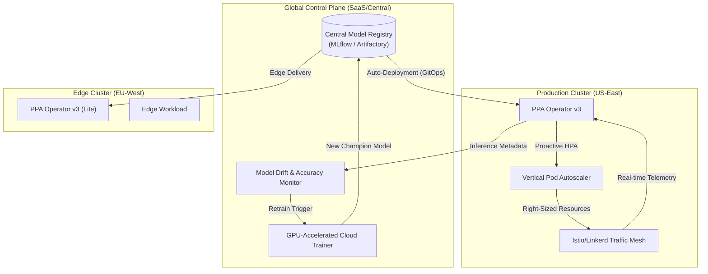

# PPA Vision: Final Architecture & Future Scope

This document outlines the evolutionary path from the current **v2.1 Distributed Inference** model to a **v3.0+ Enterprise-Grade Auto-Scaling Engine**.

---

## 🏗️ Target State: "Final" Architecture (v3.0)

The target architecture moves away from manual model syncing and basic PVCs toward a **Self-Optimizing Mesh**.

### Key Architectural Shifts:
1.  **Multi-Cluster Orchestration:** A single central "Brain" manages model versions across multiple physical or virtual clusters.
2.  **Model Drift Detection:** The system automatically compares `predicted_rps` vs `actual_rps` in real-time. If accuracy drops below a threshold, it triggers an automated retraining job.
3.  **HPA + VPA Synergy:** Predictive scaling handles the *number* of pods, while local VPA handles the *size* (CPU/Memory) of pods, creating a 3D scaling matrix.
4.  **Telemetry Mesh Integration:** Instead of just Prometheus, the operator hooks directly into Service Mesh (Istio) telemetry for sub-second precision.

---

## 🚀 Future Scope & Roadmap

### Phase 1: Intelligent Operations (Next 6 Months)
- [ ] **Automated Data Synthesis:** Use Generative Adversarial Networks (GANs) to simulate "Black Swan" events (e.g., Cyber Monday spikes) for better model robustness.
- [ ] **Multi-Model Ensembles:** Combine LSTM with **Prophet** or **Transformer-based** models to handle different types of seasonality (Daily vs. Seasonal).
- [ ] **Cost-Aware Scaling:** Integrate AWS/GCP spot instance pricing into the scaling logic. If costs are high, scale more conservatively.

### Phase 2: Autonomous Scaling (12+ Months)
- [ ] **Online Learning:** Transition from batch-training to **Online Learning**, where the model updates its weights incrementally as every new request arrives.
- [ ] **Natural Language Control (PPA Chat):** A Slack/Discord bot that allows engineers to ask: *"Why did we scale up at 4 PM?"* and receives an ML-driven explanation (Explainable AI).
- [ ] **Zero-Config Onboarding:** An auto-discovery agent that detects unscaled deployments and automatically suggests a PPA policy based on historical traffic patterns.

---

## 🎯 Conclusion
The "Final" vision for PPA is not just an autoscaler, but an **Autonomous Traffic Pilot** that treats infrastructure as a fluid, predictive resource rather than a reactive one.
