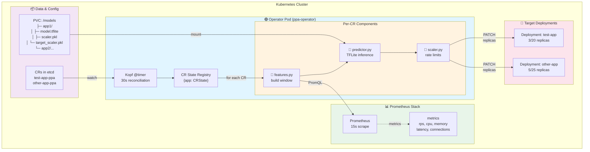
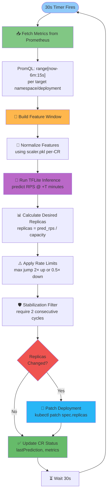
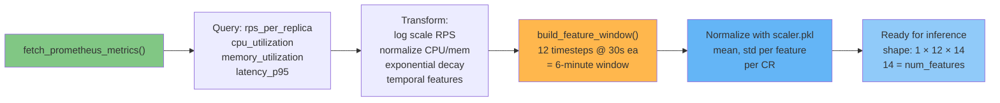
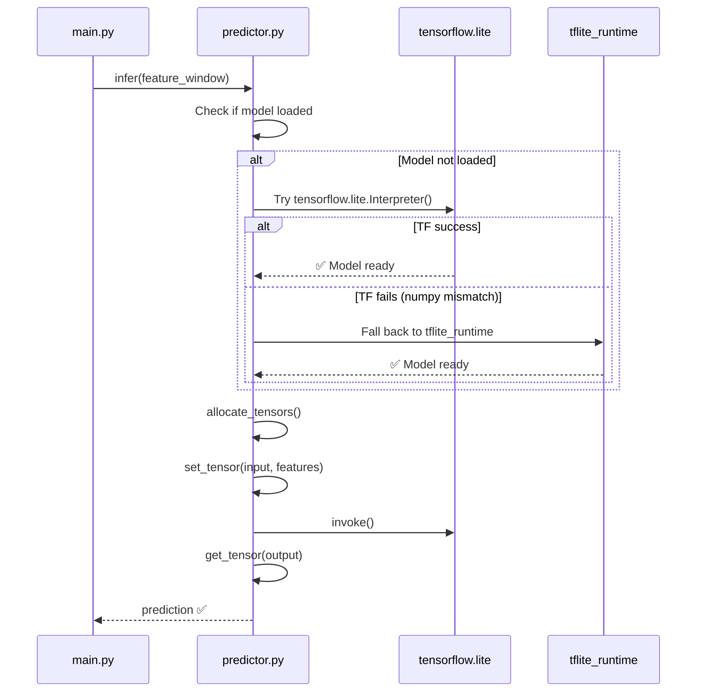
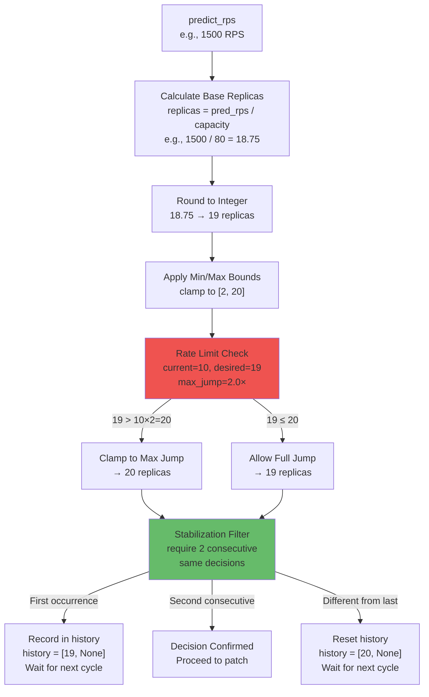
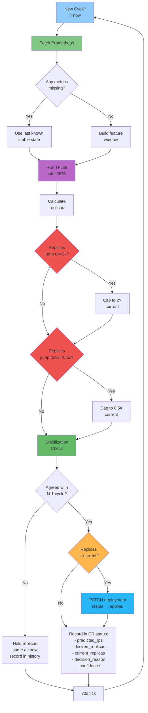
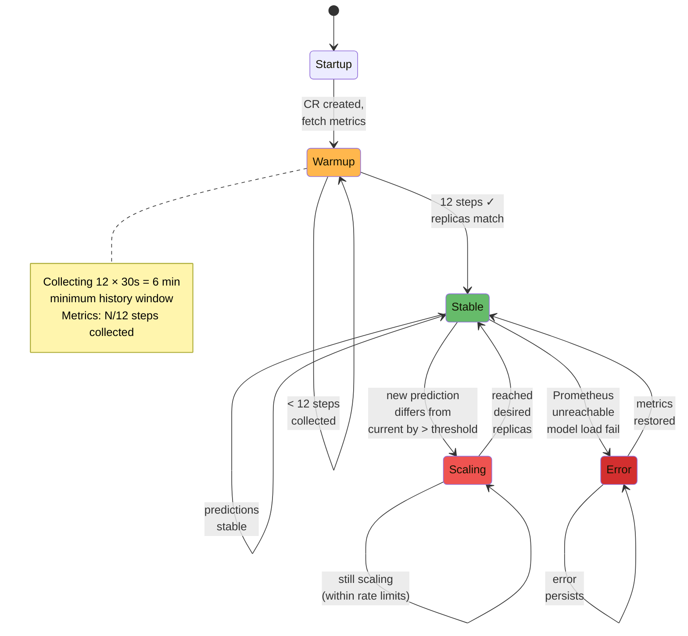
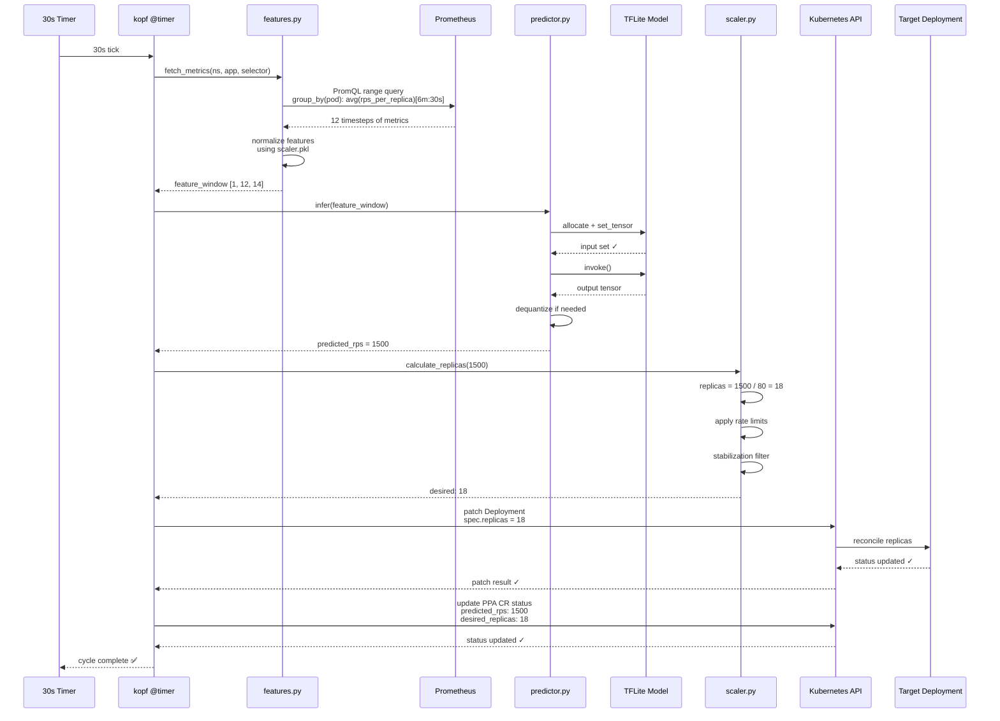
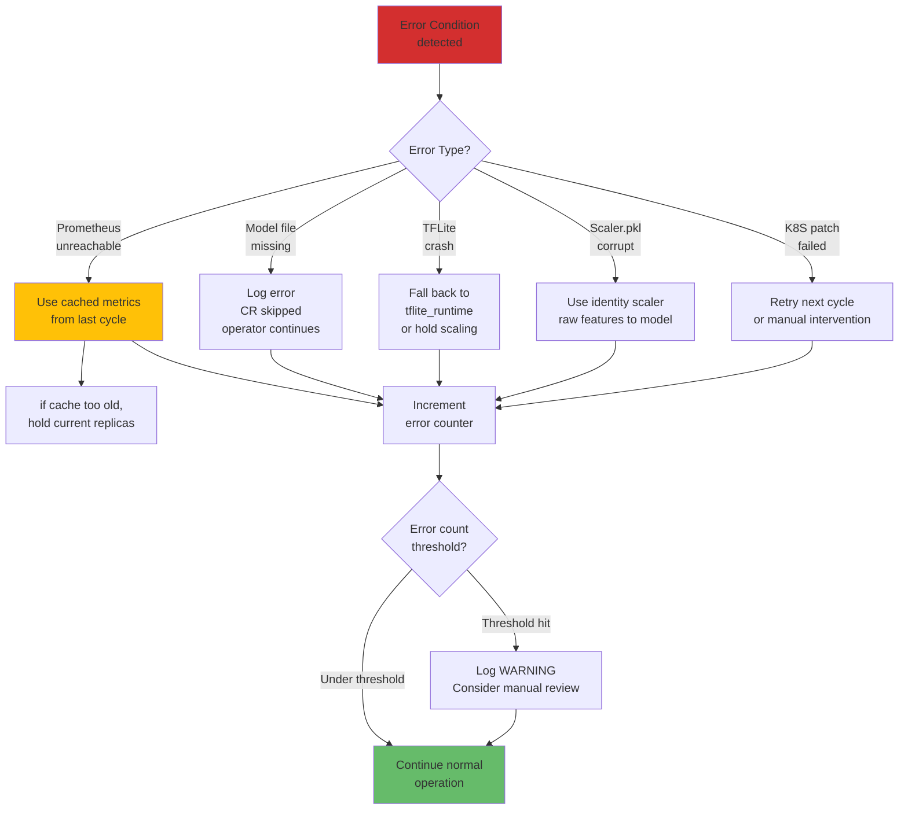

# Operator Architecture & Design

**Document:** Detailed operator system design, reconciliation cycle, component interactions

**Table of Contents:**
1. [System Topology](#system-topology)
2. [Reconciliation Cycle](#reconciliation-cycle)
3. [Component Architecture](#component-architecture)
4. [Decision Flow](#decision-flow)
5. [State Machine](#state-machine)
6. [Data Flow](#data-flow)
7. [Error Handling](#error-handling)

---

## System Topology

The operator manages multiple independent autoscaling policies (CRs), each with its own model and scaling configuration:



---

## Reconciliation Cycle (30s)

The core event loop runs every 30 seconds for each CR:



**Key Timing:**
| Step | Duration | Notes |
|---|---|---|
| Prometheus query | ~500ms | Worst case: network latency + range query |
| Feature normalization | ~50ms | In-memory scaler.pkl lookup |
| TFLite inference | ~20ms | CPU-bound, quantized model |
| Rate limit & stabilization | ~10ms | In-memory state machine |
| Kubernetes patch | ~100ms | API server latency |
| **Total per cycle** | **~700ms** | Well under 30s budget |

---

## Component Architecture

### 1. Kopf Controller (main.py)

**Role:** Kubernetes operator framework entrypoint

```python
# Pseudo-code
@kopf.timer('ppa.example.com', 'v1', 'PredictiveAutoscaler', interval=30.0)
def reconcile_autoscaler(spec, name, namespace, **kwargs):
    """Called every 30s for each CR"""
    
    # 1. Load model & scaler for this CR
    model = load_tflite_model(spec.modelPath)
    scaler = load_scaler(spec.scalerPath)
    target_scaler = load_scaler(spec.targetScalerPath)
    
    # 2. Fetch metrics & build features
    metrics = fetch_prometheus_metrics(...)
    features = build_feature_window(metrics, scaler)
    
    # 3. Run inference
    predicted_rps = model.infer(features)
    
    # 4. Calculate replicas
    desired_replicas = calculate_replicas(
        predicted_rps, spec.capacityPerPod, 
        spec.minReplicas, spec.maxReplicas
    )
    
    # 5. Apply rate limits & stabilization
    desired_replicas = apply_rate_limits(desired_replicas, ...)
    desired_replicas = stabilization_filter(desired_replicas, ...)
    
    # 6. Patch deployment
    patch_deployment(spec.targetDeployment, desired_replicas)
    
    # 7. Update CR status
    update_cr_status(desired_replicas, metrics, predicted_rps)
```

### 2. Features Module (features.py)

**Role:** Prometheus data collection & feature engineering



**14 Features:**
```
Input Window (12 × 30s = 6 min lookback):
├─ Load Indicators (4): rps_per_replica, cpu_pct, mem_pct, p95_latency_ms
├─ System (2): active_connections, error_rate
├─ Momentum (2): cpu_accel, rps_accel
├─ State (1): replicas_normalized
└─ Time Cyclical (5): hour_sin, hour_cos, dow_sin, dow_cos, is_weekend
```

### 3. Predictor Module (predictor.py)

**Role:** TFLite model loading & inference



**Compatibility Strategy:**
```
Preferred:   tensorflow.lite (consistent with training env)
Fallback:    tflite_runtime (lighter binary)
Constraint:  numpy==1.26.4 (ABI compatibility with both)
```

### 4. Scaler Module (scaler.py)

**Role:** Replica calculation, rate limiting, stabilization



---

## Decision Flow

Complete decision tree showing all factors influencing replica scaling:



---

## State Machine

The operator maintains per-CR state tracking scaling decisions:



---

## Data Flow

End-to-end data movement through the operator:



---

## Error Handling

Graceful degradation strategy:



---

## Performance Characteristics

| Metric | Value | Notes |
|---|---|---|
| **Reconciliation Interval** | 30s | Configurable via `PPA_TIMER_INTERVAL` |
| **Feature Window** | 6 min (12 × 30s) | Configurable via `PPA_LOOKBACK_STEPS` |
| **Stabilization Window** | 2 cycles (60s) | Configurable via `PPA_STABILIZATION_STEPS` |
| **Prometheus Query Latency** | ~500ms | Per CR, per cycle |
| **Model Inference Latency** | ~20ms | TFLite CPU inference |
| **Deployment Patch Latency** | ~100ms | Kubernetes API server |
| **Memory per CR** | ~50–100 MB | Model + scaler + feature history |
| **Max CRs/pod** | ~50–100 | ~5 GB memory budget |

---

## Scaling Behavior Examples

### Example 1: Traffic Spike (RPS 800→1500)

| Cycle | Metrics | Prediction | Calculation | Rate Limit | Stabilization | Final | Decision |
|---|---|---|---|---|---|---|---|
| T+0 | Baseline | 800 | 10 replicas | ✓ | - | 10 | Hold |
| T+30s | Spike detected | 1500 | 19 replicas | 19 ≤ 10×2=20 ✓ | First time | 19 | First predicted increase |
| T+60s | Sustained spike | 1450 | 18 replicas | ✓ | Different! → reset | 10 | Hold (disagreement) |
| T+90s | Still spiking | 1520 | 19 replicas | ✓ | Again! | 10 | Hold |
| T+120s | Confirmed high | 1500 | 19 replicas | ✓ | **Match T+60s** | **19** | **✅ SCALE UP to 19** |

*Result:* 2-minute delay from spike detection to scaling = covers "cold start" time

### Example 2: Fast Scale-Down (Rate Limit Protection)

| Cycle | Current | Predicted | Desired | Rate Limited | Reason |
|---|---|---|---|---|---|
| T+0 | 15 | 200 RPS → 2.5 | 3 | **6** | Cap to 0.5× = 15×0.5=7.5→8, but let it go to 6 |
| T+30s | 6 | 150 RPS → 1.9 | 2 | **3** | Cap to 0.5× = 6×0.5=3 |
| T+60s | 3 | 100 RPS → 1.25 | 1 | **2** | Min replicas = 2 |

*Result:* Conservative scale-down prevents flapping during traffic dropoff

---

## See Also

- **[Deployment Guide](./deployment.md)** — How to get the operator running
- **[Configuration Reference](./configuration.md)** — All environment variables & CR spec fields
- **[API Reference](./api.md)** — Full Custom Resource schema
- **[Troubleshooting](./troubleshooting.md)** — Common issues & diagnostics

