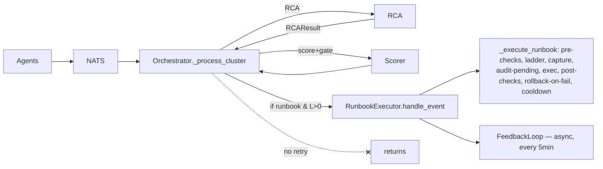
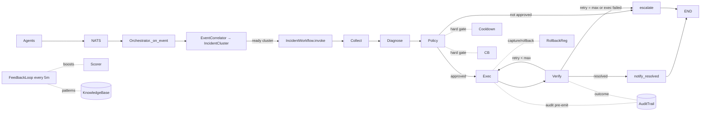

# NEXUS Incident-Workflow Re-architecture

Adopt the LangGraph incident-response spine (`collect → diagnose → policy →
execute → verify → resolve | retry | escalate`) from `src/aws/` into NEXUS,
keeping NEXUS's multi-agent correlation and governance primitives and mapping
them into graph nodes. Targets Kubernetes / Prometheus (NEXUS's domain), not
AWS-native. Adds synchronous verify-retry and a human approval pause/resume
that NEXUS lacks today.

The tradeoffs and three confirmed decisions are recorded in §9.

## 0. Scope callout

"Adopt the AWS pattern" means two different things; this design is explicit
about which:

1. **The pattern** — the LangGraph spine: `collect → diagnose → policy →
   execute → verify → (resolve | retry→execute | escalate)`. ← *adopted into
   NEXUS.*
2. **`src/aws/` itself** — the AWS-native serverless twin (boto3 tools,
   CloudWatch triggers, Lambda delivery). It already shares NEXUS's signal
   vocabulary — `lambda_error_rate_high`, `sqs_dlq_depth_high`, etc. are
   already in `nexus/bus/incident_event.py` `SignalType` and in
   `rca_engine.py`'s rule table.

**This design adopts the pattern into NEXUS; it does not merge `src/aws/` into
`src/nexus/`.** The two remain separate runtimes — NEXUS targets Kubernetes,
`src/aws/` targets AWS-native serverless — sharing only the `SignalType` /
`RCAResult` vocabulary. Reconciling or folding the AWS runtime into NEXUS is a
different, larger project; if that becomes a goal it gets its own spec.

## 1. Control loop, before and after

### Today — fire-and-forget dispatch, no synchronous verify-retry



`_process_cluster` (`src/nexus/reasoning/orchestrator.py:188`) does RCA →
confidence → publish → `executor.handle_event` → **returns**.
`RunbookExecutor` has post-checks + rollback *inside one runbook*
(`src/nexus/governance/runbook_executor.py:463-515`), but on a failed
post-check it rolls back and **ends** — no re-plan, no re-execute.
Verification-as-learning is deferred to the 5-minute `FeedbackLoop`. That is the
precise gap this design closes.

### After — one compiled LangGraph per incident cluster



**Preserved:** agents, correlator, cluster, RCA engine, scorer, policy engine,
cooldown, governance CB, approval queue, rollback registry, audit trail,
runbook library, executor's K8s action implementations, the learning plane.

**New:** the compiled graph replaces the orchestrator's RCA→dispatch middle;
the `verify` node + retry edge gives synchronous "did it actually fix it?";
`notify_resolved` closes an incident positively; `escalate` unifies the three
terminal conditions (policy-blocked, max-retries-failed, alert-only);
paused-approval state is persisted to SQLite so a pod restart can resume
another pod's pending approval.

**Retired:** `ActionLadder` as a standalone state machine and the
orchestrator's bespoke `_process_cluster` routing — both become graph node
bodies + conditional edges.

## 2. The spine: `IncidentWorkflow` graph

New module `src/nexus/reasoning/incident_workflow.py` compiles one graph. One
graph **instance** runs per ready `IncidentCluster` (state is per-incident, not
shared — matching the AWS model). Compiled once at module load;
`run_cluster(cluster)` is the single entry point the orchestrator calls.

### 2.1 State — `NexusGraphState`

Mirrors `aws/graph/state.py`'s `AgentState` but carries the cluster and NEXUS
types:

```python
class NexusGraphState(TypedDict, total=False):
    # ── input (set by orchestrator before invoke) ──
    cluster_id: str
    namespace: str
    primary_resource: str
    signal_types: set[str]
    severity: str
    trigger_event: IncidentEvent      # most-critical event for target/ctx

    # ── collect output ──
    context: dict                     # agent-rich context for this cluster

    # ── diagnose output ──
    rca: RCAResult                     # reuse the existing dataclass

    # ── policy output ──
    approved: bool
    approval_id: str | None
    policy_reason: str
    effective_level: int               # min(rca.healing_level, gate(confidence))
    cooldown_remaining_s: float

    # ── execute output ──
    runbook: Runbook | None
    action_result: dict               # {outcome, action_results, action_id, rolled_back}
    attempt_level: int                # ladder level actually run on this attempt

    # ── verify output ──
    resolved: bool
    retry_count: int
```

### 2.2 Nodes and exactly which existing module backs each

| Node | Body | Backs it (existing code) | Reads → Writes |
|---|---|---|---|
| **`collect`** | For each signal type in the cluster, call the owning agent's `collect_context` for richer per-resource context; assemble an LLM-friendly `context` dict | New thin wrapper calling agent `collect_context()` methods + `cluster.to_llm_context()` | `trigger_event`, `signal_types` → `context` |
| **`diagnose`** | RCA: LLM (provider-neutral) → structured `RCAResult`, rule-based fallback; inject `KnowledgeBase` memory of prior incidents for the same resource | `RCAEngine.analyze(cluster)` (unchanged) + `KnowledgeBase.get_working_patterns()` injected into prompt | `context`, `cluster_id` → `rca` |
| **`policy`** | Confidence calibration + healing-level gate; cooldown hard-gate; OPA policy (allowlist/blast-radius/confidence); governance-CB check; L3-approval staging | `ConfidenceScorer.score` + `gate`; `CooldownStore.is_in_cooldown`; `PolicyEngine.evaluate`; `GovernanceCircuitBreaker.is_open`; `HumanApprovalQueue.enqueue` | `rca`, `trigger_event` → `approved`, `approval_id`, `effective_level`, `policy_reason`, `cooldown_remaining_s` |
| **`execute`** | Resolve runbook by `rca.runbook_id`; run `RunbookExecutor._execute_runbook` (pre-checks → capture → audit-pending → action → post-checks → rollback-on-fail → set cooldown) | `RunbookLibrary.get(runbook_id)`; `RunbookExecutor._execute_runbook` (unchanged) | `rca`, `context`, `attempt_level` → `runbook`, `action_result` |
| **`verify`** | Re-confirm SLO restored; on fail, climb one ladder level and decide retry-vs-escalate | reuses `RunbookExecutor._run_post_checks`' polling loop (polls PromQL at 10s cadence up to `timeout_seconds`) | `action_result`, `runbook`, `retry_count` → `resolved`, `retry_count` |
| **`escalate`** | Emit terminal-incident alert (policy-blocked / max-retries / alert-only) → `Notifier`; always succeeds even if Notifier down | `Notifier` + `AuditTrail.update_outcome` | `approved`, `resolved`, `policy_reason` → `escalated` |
| **`notify_resolved`** | Emit positive-resolution event → `Notifier`; finalize audit success; persist outcome for learning | `Notifier` + `AuditTrail.update_outcome("success")` + `OutcomeStore` path | `rca`, `action_result` → `slack_sent` |

### 2.3 Conditional edges

- `policy → execute` if `approved`; else `policy → escalate`.
- `verify → notify_resolved` if `resolved`.
- `verify → execute` if `not resolved and retry_count < max_retries`.
- `verify → escalate` if `not resolved and retry_count >= max_retries`, or if
  `execute` itself failed (`action_result.outcome == "failed"`).

### 2.4 Retry semantics — climb the ladder

*(Confirmed decision — see §9.)*

On `verify` fail today, NEXUS rolls back and stops. This design **climbs the
ladder one level on each retry** because the L0–L3 levels exist exactly for
escalating response: an L1 restart that didn't resolve → next attempt may go
L2 (scale/canary-halt) if confidence permits, then L3, then escalate-to-human.

- `verify` returns `resolved` plus `next_level = min(effective_level + 1, 3)`.
- The retry edge routes back to `execute`, which re-resolves the runbook at
  `next_level`.
- `policy` re-evaluates on the next pass — if `next_level` needs approval
  (L3, confidence < 0.85), `policy` stages it in `HumanApprovalQueue`,
  returning `{approved: False, approval_id}`, and the graph **pauses**.
- `approve(approval_id)` (CLI / API) resumes the persisted graph state and
  re-enters `execute`.

After `max_retries` (config, default **2**), `verify → escalate`. Each retry
re-checks cooldown in `policy`, so a tight failure loop self-throttles.

### 2.5 Approval pause/resume — persisted

*(Confirmed decision — see §9.)*

Paused-approval state is persisted to SQLite so a pod restart can resume
another pod's pending approval (NEXUS aims for multi-replica active-active;
in-process state would be lost on restart).

- New `paused_workflows` table (managed by the `KnowledgeBase` SQLite handle
  or a dedicated small store — implementation detail, decided in the plan):
  `approval_id (PK)`, `cluster_id`, `state_json`, `paused_at`, `status`.
- `policy`'s enqueue path serializes the current `NexusGraphState` + graph
  checkpoint into `paused_workflows` keyed by `approval_id`.
- `HumanApprovalQueue.approve(approval_id)` deserializes the checkpoint and
  re-enters the graph at `execute` (with `human_approved=True` set on state so
  the L3 confidence gate is bypassed, per the existing policy fallback rule).
- On resume, a guard verifies the cluster is still live (not superseded by a
  newer cluster or already resolved); supersede strategies decided in the plan.
- `reject(approval_id)` transitions the row to `rejected` and routes the
  resumed graph to `escalate` with reason `human_rejected`.

## 3. End-to-end walkthrough — one concrete incident

**Scenario:** a bad deploy of `payments-api` in `prod` → restarts
(`pod_crashloop`) + 5xx surge (`high_error_rate`) correlated with a
`deploy_event`.

1. **Sense → publish.** `K8sAgent.sense()` emits
   `IncidentEvent(agent=k8s, signal_type=pod_crashloop, …)`. `NginxAgent`
   emits `high_error_rate`. `GitAgent` emits `deploy_event` (sha, author).
   Each publishes to `nexus.incidents.<agent>.<signal>` via `nats.publish`.
   (`base_agent.py:95`)
2. **Correlate.** `Orchestrator._on_event` → `EventCorrelator.ingest`. Three
   events in the same namespace within 60s → cluster `CL-<8hex>` forms at
   quorum (or `pod_crashloop` would immediate-emit). (`event_correlator.py:89`)
3. **Enter graph.** `Orchestrator` calls `run_cluster(cluster)` instead of
   `_process_cluster`. Initial `NexusGraphState` seeded with
   `trigger_event = cluster.most_critical_event`.
4. **collect.** For each signal type in the cluster, calls the owning agent's
   `collect_context` → re-pulls Prometheus (current rps, error_rate,
   restart_count) + the deploy's `changed_files` from `git_agent`. Builds
   `context = {current_rps, error_rate, restart_count, deploy_sha,
   changed_files, namespace, resource}`.
5. **diagnose.** `RCAEngine.analyze(cluster)` → Gemini produces
   `RCAResult(root_cause="bad deploy: new code path in payments-api",
   failure_class="bad_deploy", healing_level=2,
   runbook_id="runbook_high_error_rate_post_deploy_v1", confidence=0.83,
   source="gemini")`. Rule fallback covers if LLM is down. `KnowledgeBase`
   historical boost for this runbook folds in via `set_historical_boosts`.
6. **policy.** `ConfidenceScorer.score → 0.81`. `gate(0.81) = L2`.
   `effective_level = min(rca.healing_level=2, 2) = 2`. CooldownStore: not in
   cooldown. OPA: `scale_deployment` in `_L2_ALLOWED`, blast-radius
   single_deployment OK, governance CB closed. `approved = True`.
7. **execute (attempt 1, L2).**
   `RunbookExecutor._execute_runbook(runbook_high_error_rate_post_deploy_v1, …)`:
   - pre-checks (prometheus): error_rate confirms high ✓
   - `RollbackRegistry.capture` (previous replica count)
   - `AuditTrail.write_pending` (crash-safe row before action)
   - `_execute_action(scale_deployment)` → kube
     `patch_namespaced_deployment_scale`
   - `_run_post_checks` polls `rate(errors_total[2m]) < threshold` up to
     `timeout_seconds`
   - Suppose post-check fails (deploy bug persists) →
     `record_post_check_failure` (CB failures now 1) → `rollback_actions` run
     → audit updated `rolled_back`.
8. **verify (attempt 1).** `action_result.outcome == "rolled_back"` →
   `resolved=False`, `retry_count=1`, `next_level=3`.
9. **retry → execute (attempt 2, L3).** Policy re-evaluates at L3:
   `confidence 0.83 < 0.85` and L3 → `requires_approval=True`. Stages via
   `HumanApprovalQueue.enqueue` → serializes state to `paused_workflows` →
   returns `approval_id`. Node returns `{approved: False, approval_id}`.
10. **policy → escalate (approval request).** `escalate` node fires `Notifier`
    with "approval required: rollback for payments-api, sha=…". Graph pauses.
11. **Human approves** (CLI or `/approve/<id>`).
    `HumanApprovalQueue.approve(approval_id)` → deserializes checkpoint from
    `paused_workflows` → re-enters `execute` at L3 with `human_approved=True`.
12. **execute (attempt 2, L3 replayed).** `kubectl_rollout_undo` annotation
    patch → kube rollbacks to previous sha.
13. **verify (attempt 2).** post-checks pass → `resolved=True`.
14. **notify_resolved.** `Notifier` posts "resolved: payments-api rolled back
    to sha=…, error_rate restored". `AuditTrail.update_outcome("success")`.
    `FeedbackLoop._on_action_event` (subscribed to `nexus.actions.*`) records
    the signal-pattern success into `KnowledgeBase`.
15. **END.** Within the 5-minute window, `FeedbackLoop` recomputes
    `KnowledgeBase` deltas → adjusts confidence for this runbook going
    forward.

Versus today: steps 9–14 do not happen in a single incident's lifetime —
today, attempt 1 rolls back and the incident relies on a *new* cluster
(re-detected later) to get another shot, with no memory that L1/L2 already
failed. The retry-climb + approval-resume is the chief capability gain.

## 4. Disposition of every existing module

| Module | Disposition | Notes |
|---|---|---|
| `agents/*` (7) + `base_agent` + `manager` | **keep**, +1 optional `collect_context` method | detection path unchanged; collect node reuses their richer queries |
| `reasoning/event_correlator` | **keep** | trigger path unchanged; cluster → graph |
| `reasoning/incident_cluster` | **keep** | becomes graph input |
| `reasoning/rca_engine` | **keep** | body of `diagnose` |
| `reasoning/llm_provider` | **keep** | provider-neutral LLM under diagnose |
| `reasoning/confidence_scorer` | **keep** | body of `policy` |
| `reasoning/orchestrator` | **refactor** (no longer SOLE reasoner) | `_on_event`/NATS+correlator+flush stay; `_process_cluster` → `run_cluster(cluster)`; keep concurrency semaphore + dry_run |
| `governance/action_ladder` | **retire as FSM; merge into `policy`+`escalate`** | CB/approval/cooldown wiring move into nodes; `LadderDecision` becomes policy output |
| `governance/policy_engine` | **keep** | OPA+fallback, called from `policy` node |
| `governance/cooldown_store` | **keep** | hard gate inside `policy` |
| `governance/governance_cb` | **keep** | checked in `policy`, tripped by verify-fail (was `record_post_check_failure`) |
| `governance/approval_queue` | **keep + SQLite persist + resume-graph** | `approve()` now resumes a paused, persisted graph |
| `governance/runbook_executor` | **keep** (already does pre→capture→audit→exec→post→rollback→cooldown) | called by `execute` node; internal post-checks become verify's first pass |
| `governance/runbook` | **keep** | runbook YAML schema unchanged; `find_matching` still works for fallback when `rca.runbook_id` is None |
| `governance/rollback_registry` | **keep** | called inside `execute` on post-check fail |
| `governance/audit_trail` | **keep** | pre-emit + outcome finalization, now also from `notify_resolved`/`escalate` |
| `learning/*` (feedback, outcome_store, knowledge_base, advisor, ppa_tracker) | **keep** | depends on `nexus.actions.*` already; unaffected — verify outcomes feed it through audit |
| `bus/incident_event`, `bus/nats_client` | **keep** | contract unchanged |
| `predictive/*` (prescaler, anomaly, traffic_model) | **keep, untouched** | PPA scaling path, a separate concern; not part of incident healing |
| `observability/status_api`, `integration/notifier`, `integration/dashboard`, `sdk/*` | **keep** | notifier gets the approval-request + resolved payloads |
| `server.py` | **small edit** | `NexusServer.create` builds the compiled graph once; orchestrator gets it injected; the "build factory smaller" refactor from `ARCHITECTURE.md` is optional and out of scope |
| `src/aws/*` | **untouched** | separate AWS-native runtime; shared vocabulary only (see §0) |

## 5. Runtime boot changes (`server.py`)

`NexusServer.create` today builds correlator, rca, scorer, executor,
orchestrator. The change is minimal:

- After building the governance + reasoning components, build **one compiled
  `IncidentWorkflow`** passing them in as dependencies (the graph is pure
  orchestration over already-existing objects — no new infra).
- `NexusOrchestrator.__init__` takes an optional `workflow: IncidentWorkflow`;
  `_process_cluster` becomes `await self.workflow.run_cluster(cluster)`
  (guarded by the same semaphore, same dry_run).
- `HumanApprovalQueue` gains `resume(approval_id)` that re-invokes the
  persisted graph state for that incident.
- New env knobs in `ppa.config`: `NEXUS_WORKFLOW_ENABLED` (strangler-exit flag —
  start `False`, flip `True` once equivalent), `NEXUS_WORKFLOW_MAX_RETRIES`
  (default 2), `NEXUS_WORKFLOW_PAUSED_DB_PATH` (SQLite path for
  `paused_workflows`).

## 6. Safety invariants — what must not regress

These are load-bearing and become explicit node contracts:

- **Audit pre-emit** — every action writes `AuditTrail.write_pending` *before*
  `execute` mutates kube; neither the graph nor the executor changes this.
- **Cooldown hard gate** — `policy` returns `approved=False` on cooldown; the
  retry edge does not bypass it (each retry re-enters policy).
- **No autonomous L3** — L3 with confidence < 0.85 always stages in the
  approval queue; the resume path is the only way to non-human-approved L3 and
  it *requires* a human's `approve()`.
- **Governance CB** — tripped after 3 consecutive post-check fails; while
  OPEN, `policy` blocks all L1–L3 (only `emit_alert` L0 passes).
- **Rollback on verify-fail** — `execute` already rolls back on post-check
  fail; the graph's retry climbs *after* rollback, so each attempt starts from
  a clean pre-state.
- **Agent isolation** — agents still must not import `ppa/`; the graph lives in
  `nexus/reasoning/`, cross-plane stays via `nexus/bus/`.
- **No silent failures** — `escalate` always succeeds even if Notifier is down
  (mirrors AWS `escalate` "ALWAYS succeeds").

## 7. Testing strategy

- New unit tests: per-node (`collect`/`diagnose`/`policy`/`execute`/`verify`/
  `escalate`) with mocked NATS/Prometheus/k8s/LLM, asserting read/write of
  state fields — mirroring how `aws/graph/nodes/*` would be tested.
- New graph integration test: `run_cluster(fake_cluster)` end-to-end through
  all branches (resolve-first-try, retry-climb, approval-pause-resume,
  max-retry-escalate, policy-blocked-escalate) — reuses existing fixtures.
- Preserve existing tests by asserting the *customer-facing behavior*
  (governance outcomes, audit rows, cooldown, RBAC), not the obsolete
  `ActionLadder`/`_process_cluster` internal shapes — per `ARCHITECTURE.md`'s
  "update the test to assert customer-facing behavior" rule.
- Keep a `NEXUS_WORKFLOW_ENABLED=False` path green until the flag is retired,
  so revert is one env flip.
- New test: approval-resume across a simulated restart (serialize to
  `paused_workflows`, drop in-memory state, `approve()`, assert correct
  re-entry at `execute` with `human_approved=True`).

## 8. Out of scope

- Folding `src/aws/` into NEXUS (see §0).
- Touching `predictive/*` (PPA scaling is a separate concern).
- The `server.py` "smaller factory" refactor flagged in `ARCHITECTURE.md`.
- SDK, dashboard UI changes beyond new Notifier payloads.

## 9. Confirmed decisions

Three judgment calls were put to the user during brainstorm; outcomes:

1. **Retry semantics — climb the ladder on retry.** On verify-fail, the
   retry re-enters `execute` at one higher ladder level (L1→L2→L3→human),
   re-evaluated by `policy` each time. Chains into approval-pause at L3.
   *(Recommended option accepted.)* Alternative rejected: retry the exact same
   action up to `max_retries` (simpler, closer to AWS, but wastes the L0–L3
   ladder).
2. **Scope — pattern only; `src/aws/` stays separate.** Adopt the LangGraph
   pattern into NEXUS (K8s). Leave `src/aws/` as the separate AWS-native
   runtime. They share only the `SignalType`/`RCAResult` vocabulary.
   *(Confirmed.)*
3. **Approval storage — persisted to SQLite.** A paused (awaiting-approval)
   graph's state lives in `paused_workflows` (SQLite), so approvals survive pod
   restart. *(User chose this over the in-process default; supersedes the
   in-process recommendation.)* This is the deviation from a literal AWS copy:
   the AWS `memory/incidents.py` is in-process because Lambda invocations are
   independent; NEXUS is long-lived and aims for multi-replica, so persistence
   is warranted.

## 10. Open items for the implementation plan

- Exact schema + placement of the `paused_workflows` table (reuse the
  KnowledgeBase SQLite handle vs. a dedicated store) and the graph-checkpoint
  serialization format (LangGraph `get_state`/`update_state` vs. a custom
  JSON snapshot of `NexusGraphState`).
- Supersede strategy for a paused approval whose source cluster has since been
  resolved or replaced by a newer cluster (oldest-wins vs. newest-wins).
- `collect_context` default behavior for agents that don't override it
  (event context only, matching today's `_build_enriched_event`).
- `langgraph` dependency addition to `pyproject.toml` and whether NEXUS needs
  the LangGraph persistence/checkpoint backend or a lighter hand-rolled
  equivalent.
